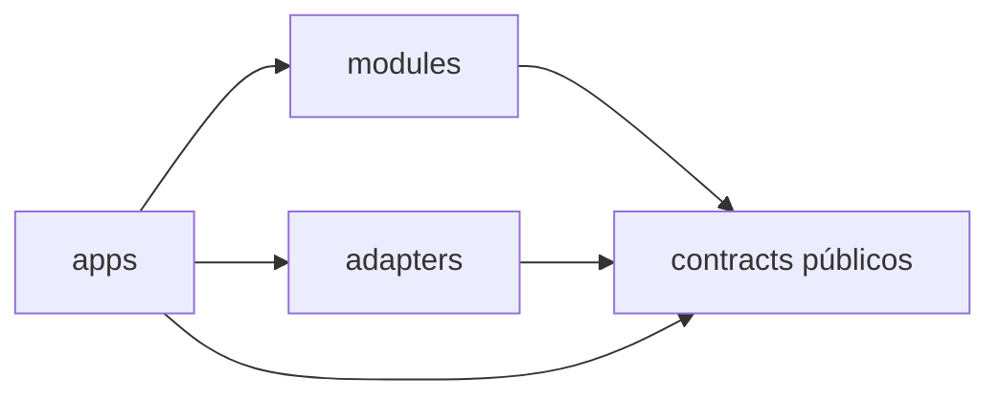

# Aplicações

Aplicações são composition roots. Elas montam capacidades de módulo em workflows executáveis sem absorver as responsabilidades desses módulos.

## `mapping-runtime`

`apps/mapping-runtime/` executa workflows de construção ou atualização de mapa de ponta a ponta a partir de sensores ao vivo, sessões gravadas, ou adapters de dataset.

É responsável por composição, configuração, ciclo de vida, wiring de dependências e ordem de execução. Não implementa algoritmos de state estimation, percepção visual, representação de pontos, associação, fusão, mapeamento, memória, construção de grafo, raciocínio ou consulta.

Conceitualmente:

```text
adapter de entrada
    -> state-estimation
    -> geometric-map
    -> visual-perception / point-representation
    -> sensor-association
    -> semantic-fusion
    -> semantic-map
    -> semantic-memory / scene-graph
    -> persistência
```

## `map-explorer`

`apps/map-explorer/` é a principal aplicação voltada a humanos para abrir e inspecionar mapas concluídos ou atualizados incrementalmente.

Suas responsabilidades públicas incluem:

- abrir um mapa por identidade estável;
- renderizar geometria 3D persistente;
- renderizar overlays e entidades semânticas;
- submeter consultas semânticas, espaciais e contextuais através do `query-engine`;
- focar o viewer nas regiões ou entidades retornadas;
- mostrar observações de origem, evidência e proveniência;
- expor relações de scene-graph sem se tornar dono da construção do grafo.

O explorer pode conter uma fronteira backend/API e um frontend web, mas essas camadas consomem contracts de aplicação em vez de internos privados de módulo.

## `cli`

`apps/cli/` fornece acesso scriptável a operações de aplicação para desenvolvimento, automação, inspeção, exportação e experimentos reprodutíveis.

O CLI deve expor as mesmas capacidades de nível de aplicação que outros clientes, quando praticável, em vez de introduzir lógica de negócio alternativa.

## Direção de dependência



Aplicações podem selecionar e conectar (wire) implementações. Módulos não devem depender de aplicações.
