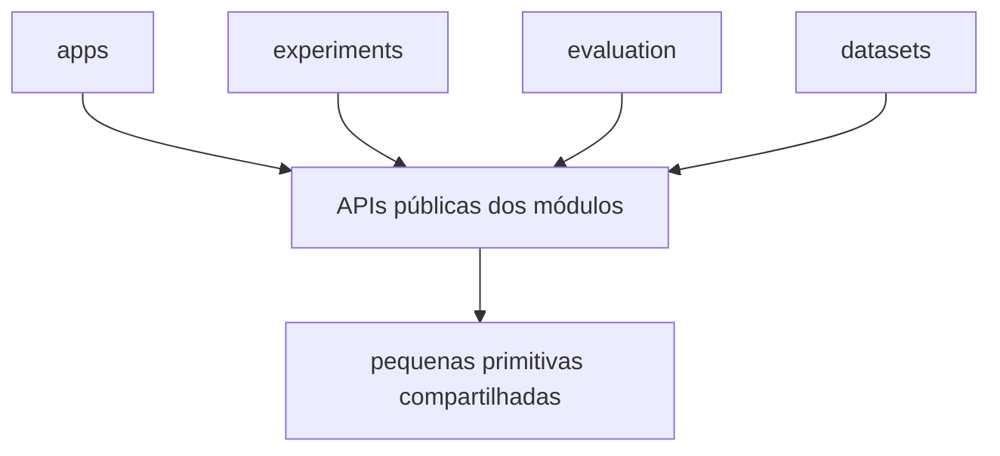
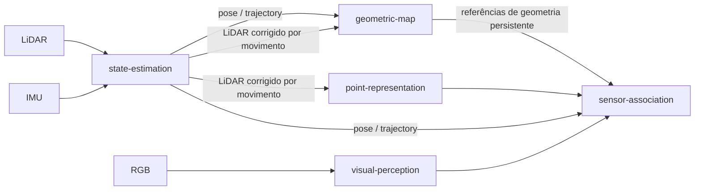

# Arquitetura do Repositório

`contextual-3d-mapping` é organizado como um **framework de pesquisa modular orientado a capacidades** para mapeamento 3D semântico e contextual de vocabulário aberto.

A arquitetura é projetada para que cada capacidade seja fácil de localizar, entender, modificar, testar, avaliar (benchmark) e substituir. Os princípios SOLID guiam o design de código e dependências nas fronteiras relevantes.

Para orientação em nível de implementação, leia também [`engineering-principles.md`](./engineering-principles.md) e o [`AGENTS.md`](../AGENTS.md) raiz.

## Prioridades arquiteturais

Quando dois designs são tecnicamente válidos, prefira o que melhora estas propriedades, nesta ordem:

1. legibilidade e compreensibilidade local;
2. responsabilidade e ownership explícitos;
3. baixo acoplamento;
4. testabilidade e substituibilidade;
5. extensibilidade em torno de pontos de variação comprovados;
6. abstração quando torna o design mais claro ou mais seguro.

## Topologia do repositório

O repositório é organizado em torno de aplicações executáveis, módulos de capacidade, datasets, experimentos, avaliação e documentação.

```text
contextual-3d-mapping/
├── apps/
│   ├── mapping-runtime/
│   ├── map-explorer/
│   └── cli/
├── modules/
│   ├── state-estimation/
│   ├── geometric-map/
│   ├── visual-perception/
│   ├── point-representation/
│   ├── sensor-association/
│   ├── semantic-fusion/
│   ├── semantic-map/
│   ├── semantic-memory/
│   ├── scene-graph/
│   ├── context-reasoning/
│   └── query-engine/
├── datasets/
├── evaluation/
├── experiments/
├── docs/
└── tests/
```

Quando primitivas de nível de repositório se tornarem necessárias, mantenha-as pequenas e estáveis em um pacote compartilhado. Integrações, contracts, configuração e helpers de persistência específicos de capacidade ficam com o módulo dono.

## Ownership de capacidades

Cada módulo possui uma capacidade coerente do sistema.

- `state-estimation`: observações LiDAR/IMU convertidas em pose, trajetória e frames LiDAR corrigidos por movimento.
- `geometric-map`: geometria persistente do mundo construída a partir de poses e observações geométricas.
- `visual-perception`: observações RGB convertidas em features visuais e semânticas estruturadas.
- `point-representation`: pontos LiDAR convertidos em representações 3D aprendidas.
- `sensor-association`: associação temporal e geométrica entre observações multimodais.
- `semantic-fusion`: fusão de evidência semântica multi-fonte, temporal e multi-view.
- `semantic-map`: informação semântica persistente de vocabulário aberto vinculada à geometria do mundo.
- `semantic-memory`: recuperação semântica e espacial sobre a informação mapeada.
- `scene-graph`: entidades, hierarquia e relações extraídas do estado mapeado.
- `context-reasoning`: inferência contextual com proveniência explícita.
- `query-engine`: interface unificada de consulta semântica, espacial e contextual.

Uma capacidade deve ter um dono óbvio. Resolva esse ownership antes da implementação quando uma feature parecer atravessar vários módulos.

## Fronteira do módulo

Um módulo é uma unidade de desenvolvimento independentemente compreensível e testável.

Um módulo típico pode evoluir para:

```text
modules/<module>/
├── README.md
├── src/
├── tests/
├── configs/
├── benchmarks/
└── docs/
```

Crie esses diretórios apenas quando servirem a uma responsabilidade real.

O módulo expõe uma API pública pequena. Consumidores usam essa API pública enquanto os detalhes de implementação permanecem locais ao módulo produtor.

## Regra de dependência

O formato principal de dependência é:

```text
consumidor -> API pública do produtor -> implementação do produtor
```

A composição de alto nível é feita por `apps/`, experimentos, ou código de orquestração explícito.

Dependências entre módulos devem permanecer explícitas e preferencialmente acíclicas.



Se dois módulos precisarem repetidamente de acesso substancial aos conceitos internos um do outro, reconsidere a fronteira de ownership.

## Fronteira de geometria

`state-estimation` possui a estimação de movimento, pose, estado de trajetória e observações LiDAR corrigidas por movimento.

Implementações concretas de odometria LiDAR-inercial satisfazem a capacidade pública de state-estimation permanecendo locais a esse módulo.

`geometric-map` possui a reconstrução persistente da geometria do mundo.



A geometria persistente tem um único dono autoritativo, `geometric-map`. Capacidades semânticas referenciam essa geometria através de tipos públicos estáveis.

## Fronteira semântica

`semantic-map` enriquece a geometria persistente com informação semântica.

`semantic-memory`, `scene-graph` e `context-reasoning` derivam estruturas de recuperação e estruturas contextuais de nível mais alto a partir da informação mapeada.

`query-engine` é a fronteira de consulta usada pelas aplicações para combinar recuperação semântica, espacial e contextual.

## Fronteira de aplicação

`apps/` contém composições executáveis de capacidades.

Os papéis iniciais de aplicação são:

- `mapping-runtime`: constrói e atualiza mapas a partir de observações ao vivo, gravadas ou de dataset;
- `map-explorer`: abre mapas persistidos, renderiza geometria e informação semântica, e interage com `query-engine`;
- `cli`: fornece automação não gráfica, inspeção, debugging, avaliação e workflows de exportação.

Aplicações selecionam implementações concretas, conectam entradas e saídas de módulos, gerenciam o ciclo de vida do runtime e expõem pontos de entrada voltados ao usuário.

Algoritmos de pesquisa permanecem de posse de seus módulos de capacidade.

## Ownership de integração

Coloque integrações externas junto à capacidade que possui seu comportamento.

Exemplos:

```text
modules/state-estimation/
    integração concreta de odometria LiDAR-inercial

modules/geometric-map/
    backend de geometria usado pelo mapeamento geométrico

modules/visual-perception/
    model runtime visual
```

Crie infraestrutura de integração de nível de repositório quando capacidades não relacionadas genuinamente compartilharem a mesma semântica de integração.

Essa localidade mantém a maior parte do código necessário para entender uma capacidade dentro de um único módulo.

## Contracts e primitivas compartilhadas

Crie um protocolo ou interface para uma fronteira de comportamento real ou ponto de variação, como:

- múltiplas implementações;
- substituibilidade intencional;
- comparações de pesquisa;
- isolamento de uma dependência cara ou externa;
- uma fronteira pública de módulo;
- testes em nível de contract com substitutos.

Contracts específicos de capacidade pertencem à capacidade que os define.

Por exemplo, um contract de point embedding pertence a `point-representation`, mesmo quando outro módulo o consome.

Tipos compartilhados de nível de repositório são reservados para conceitos estáveis que vários módulos precisam interpretar de forma idêntica, por exemplo:

```text
Timestamp
FrameId
Pose
RigidTransform
MapId
ArtifactId
Provenance
```

## Interpretação de SOLID

SOLID é aplicado como regra de design de código e fronteira.

- **Single Responsibility**: módulos e componentes têm um motivo coerente para mudar.
- **Open/Closed**: pontos de variação comprovados ganham novas implementações sem exigir mudanças nos consumidores.
- **Liskov Substitution**: implementações do mesmo contract público preservam os invariantes visíveis ao consumidor.
- **Interface Segregation**: interfaces são estreitas e orientadas ao consumidor.
- **Dependency Inversion**: orquestração de alto nível depende de capacidades estáveis, enquanto implementações concretas satisfazem essas capacidades.

## Fluxo de dados multimodal explícito

Informação importante necessária para interpretar ou reproduzir um resultado permanece explícita nas fronteiras de módulo, quando aplicável:

- timestamp;
- frame de coordenadas;
- identidade do sensor;
- unidades;
- proveniência de pose ou transform;
- identidade de calibração;
- identidade da observação de origem;
- confiança ou incerteza;
- proveniência de modelo/checkpoint quando necessária para reprodutibilidade.

Uma transformação típica deve ser legível como:

```text
observação
    -> validação de fronteira
    -> transformação da capacidade
    -> saída explícita
    -> próxima capacidade
```

Valide invariantes de fronteira antes do processamento downstream.

## Fronteira de persistência

A persistência segue o ownership de capacidade.

O estado persistente pode incluir geometria, semântica, observações, evidência, proveniência, índices e estruturas de nível de cena.

Uma implementação de armazenamento usada por uma capacidade permanece local a essa capacidade. Abstrações de armazenamento compartilhadas são introduzidas quando várias capacidades genuinamente exigem o mesmo comportamento estável.

Aplicações podem coordenar o carregamento e salvamento enquanto cada módulo permanece responsável pela semântica de seu estado persistido.

## Regra de implementação de pesquisa

A arquitetura pública é nomeada segundo as responsabilidades do projeto.

Algoritmos, repositórios externos, modelos, datasets e papers informam implementações concretas e são documentados como proveniência científica ao lado do módulo relevante.

Por exemplo:

```text
capacidade pública: PoseEstimator
implementação concreta: estimator baseado em FAST_LIO
```

Issues devem descrever o comportamento da capacidade, entradas, saídas, testes, restrições e critérios de aceitação. A documentação do módulo registra paralelos de implementação e referências de pesquisa quando cientificamente útil.

## Regra de abstração

Use uma abstração quando ela torna uma fronteira concreta, um cenário de substituição ou um ponto de variação mais claro.

Uma regra prática é:

```text
torne o caso comum óbvio;
torne a variação explícita onde a variação existe.
```

Comportamento local com uma única implementação direta deve permanecer direto. Abstrações compartilhadas emergem de conceitos comuns comprovados.

## Substituibilidade

Módulos podem ter múltiplas implementações, variantes de modelo, checkpoints, estratégias de armazenamento ou algoritmos, desde que preservem o comportamento público esperado pelos consumidores.

Proteja a substituibilidade com testes em torno dos contracts públicos e invariantes de fronteira.

## Fronteira de documentação

O `docs/` raiz documenta arquitetura, integração, políticas e decisões de nível de repositório.

Decisões algorítmicas e de implementação detalhadas pertencem a `modules/<module>/docs/`.

Uma mudança estrutural deve atualizar a documentação relevante na mesma alteração, para que futuros contribuidores possam recuperar tanto o design escolhido quanto sua justificativa.
