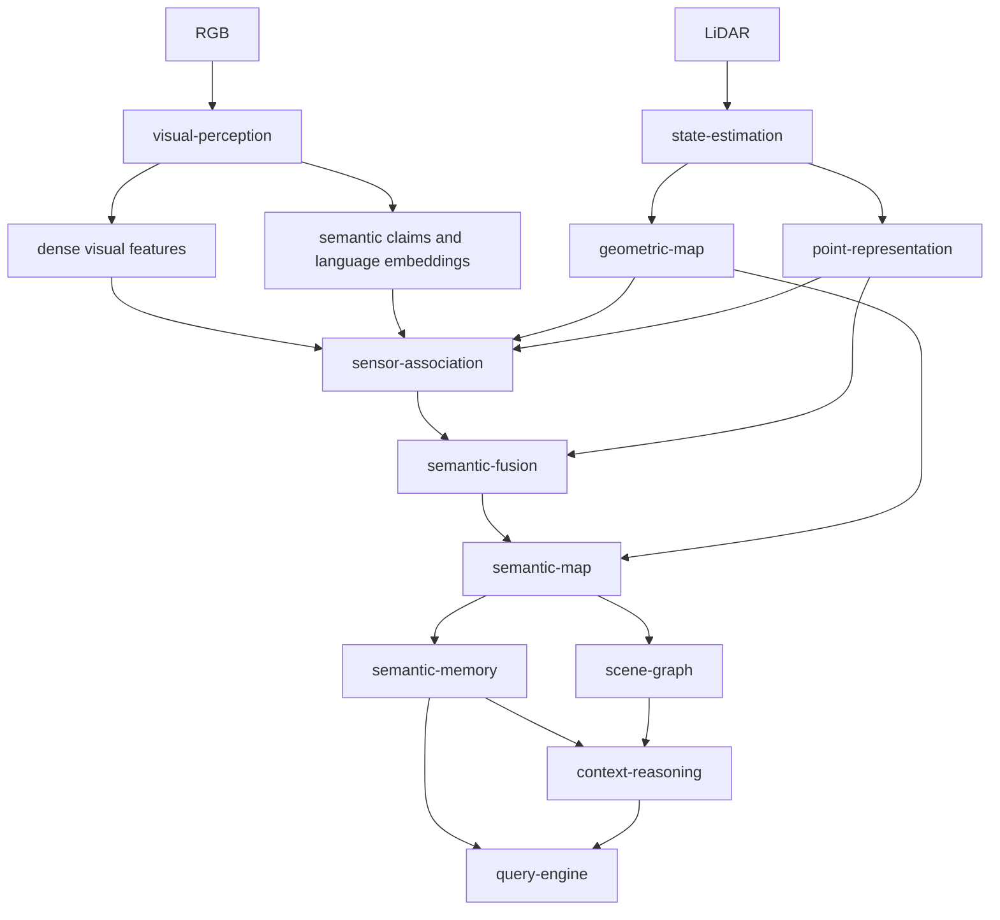

# Roadmap de geração de contexto para mapas 3D

Este documento organiza o trabalho necessário para evoluir o projeto de um pipeline que associa RGB, regiões e labels a geometria 3D para um sistema que também usa representações visuais densas, representações 3D aprendidas, fusão multi-observação e recuperação semântica open-vocabulary.

O objetivo não é reproduzir um artigo específico. A implementação continua modular e agnóstica a papers. A rastreabilidade científica permanece em `modules/visual-perception/docs/research-traceability.md` e na documentação de cada módulo.

## Objetivo final

O estado desejado do mapa é:

```text
geometria persistente
    + evidência visual 2D localizada
    + claims semânticos auditáveis
    + embeddings visual-language fundidos entre observações
    + representações 3D aprendidas por ponto/região
    + suporte espacial, visual e de representação
    + proveniência completa
    -> semantic-map
    -> semantic-memory
    -> scene-graph
    -> context-reasoning
    -> query-engine
```

A propriedade central é separar fontes de evidência. Um label, um embedding visual-language e um embedding 3D aprendido não são a mesma coisa e não devem ser combinados como se pertencessem automaticamente ao mesmo espaço vetorial.

## Revisão das issues abertas

A maior parte das capacidades necessárias já possuía issues. A revisão identificou alguns gaps entre a percepção 2D, a aprendizagem 3D e a geração de contexto persistente. Esses gaps agora possuem issues próprias.

| Capacidade | Issues principais | Estado da cobertura |
| --- | --- | --- |
| Dense visual features e alta resolução | #201, #219, #221 | Coberto |
| Contexto visual estruturado por frame | #202, #203, #204, #205, #206, #207, #214, #215, #216, #217, #218, #220 | Coberto |
| Contracts de point embeddings | #1, #2, #3, #4, #8, #19 | Coberto |
| Backbone 3D e inferência | #20, #21, #22, #23, #24, #25, #48, #49 | Coberto |
| Global/local/masked/sparse views | #13, #14, #15, #16, #17, #18 | Coberto |
| Student/teacher, EMA e self-distillation | #26, #27, #28, #29, #30 | Coberto |
| Prototypes, assignment e memory bank | #31, #32, #33, #34, #35, #36, #37 | Coberto |
| Treino reproduzível em hardware limitado | #42, #43, #44, #45, #46, #47 | Coberto |
| Cross-modal 2D -> 3D | #38, #39, #40, #41, #225, #232 | Gap preenchido |
| Uso de embedding 3D na fusão semântica | #226 | Gap preenchido |
| Persistência de point representations | #227 | Gap preenchido |
| Composição runtime com point representations | #230 | Gap preenchido |
| Persistência do suporte 3D no semantic-map | #231 | Gap preenchido |
| Fusão de embeddings visual-language | #222 | Coberto |
| Persistência de embeddings semânticos fundidos | #223 | Coberto |
| Busca open-vocabulary | #224 | Coberto |
| Avaliação do impacto no mapa final | #228, #234 | Gap preenchido |
| Integração end-to-end | #149, #232, #233 | Coberto |

## Nota sobre issues abertas que parecem parcialmente implementadas

A existência de uma issue aberta não significa necessariamente ausência total de código.

A #201 é o principal exemplo. A `main` já contém infraestrutura de alta resolução, incluindo `application/dense_evidence.py`, metadados de upsampling em `domain/feature_map.py` e um adapter aprendido em `infrastructure/adapters/feature_upsampling_backend.py`. Portanto, antes de reimplementar a #201, a ação correta é verificar seus critérios de aceite contra o estado atual e fechar ou reduzir o escopo restante.

A #221 deve continuar separada. Ela é uma comparação entre caminhos de upsampling e não deve bloquear o restante da arquitetura. O mapa pode avançar usando a melhor configuração já validada e depois trocar o upsampler apenas se a ablação justificar.

A #217 é mais crítica para integração. O pipeline visual produz embeddings por região, mas o objetivo dessa issue é garantir que eles sobrevivam ao retorno do pipeline e que suas referências sejam realmente resolvíveis por consumidores downstream.

## Arquitetura alvo



Há duas rotas diferentes de embeddings no sistema:

```text
rota visual-language
RGB -> visual-perception -> language-aligned embedding -> semantic-fusion -> semantic-map -> semantic-memory

rota 3D aprendida
LiDAR -> point-representation -> PointEmbedding -> semantic-fusion support -> semantic-map
```

A rota visual-language é adequada para busca por texto. A rota 3D aprendida é inicialmente usada como evidência de coerência geométrica e semântica. Elas não devem ser somadas ou promediadas diretamente sem uma relação de espaço vetorial explicitamente treinada e validada.

# Roadmap de implementação

## Fase 0: consolidar a evidência visual que já existe

Objetivo: garantir que o downstream receba evidência visual real, persistente e auditável antes de adicionar uma nova representação 3D.

Issues:

- #201, auditar implementação atual do caminho pixel-aligned e fechar o que já estiver concluído.
- #202 a #207, consolidar contexto estruturado, interpretação mask-aware, refinement, reconciliação e relações.
- #214 a #217, corrigir suporte semântico, inconsistências e persistência dos embeddings produzidos.
- #221, avaliar upsampling aprendido sem bloquear o restante do roadmap.

Gate de conclusão:

```text
VisualObservation
    -> regiões estáveis
    -> masks auditáveis
    -> claims com suporte e proveniência
    -> visual_embedding_ref resolvível
    -> language_embedding_ref resolvível
```

Não avançar para uso de embeddings visuais no mapa enquanto as referências apontarem para vetores que não podem ser recuperados.

## Fase 1: obter PointEmbedding 3D em inferência

Objetivo: fazer `point-representation` existir como módulo real antes de implementar treinamento completo.

Ordem recomendada:

1. #1, #2, #3 e #4, contracts e entrada canônica.
2. #8 e #9, lineage e batching.
3. #19, `PointEncoder` port.
4. #20, primeiro backbone 3D concreto.
5. #21, restaurar ordem por ponto.
6. #22 e #23, projeção e normalização do embedding público.
7. #24 e #25, device, precision e checkpoint provenance.
8. #48, API pública `encode(point_cloud)`.
9. #49, inferência em batch.
10. #55, PCA e inspeção de similaridade para validar visualmente o espaço aprendido.

Prioridade prática: usar primeiro um checkpoint compatível/pretrained para validar inferência. Não bloquear o mapa esperando um treino self-supervised completo.

Gate de conclusão:

```text
LiDAR
 -> PointEncoder
 -> one embedding per represented point
 -> stable point identity
 -> checkpoint/model provenance
```

O primeiro resultado útil é conseguir visualizar PCA das representações sobre uma nuvem real e verificar se superfícies e objetos apresentam estrutura coerente.

## Fase 2: colocar PointEmbedding no fluxo do mapa

Objetivo: fazer a representação 3D participar da geração de contexto sem ainda depender de novo treinamento cross-modal.

Issues:

- #137, contrato de associação cross-sensor.
- #138, observação semântica ancorada em geometria.
- #226, usar representação 3D como suporte independente na fusão.
- #227, persistir os embeddings alinhados à geometria.
- #230, integrar `point-representation` ao `mapping-runtime`.
- #231, preservar no `semantic-map` qual representação 3D sustentou a fusão.
- #233, validar o caminho persistido e reaberto.

Uso inicial recomendado para o PointEmbedding:

```text
claim visual: pallet
mask projetada cobre pallet + wall

point embeddings:
    região A -> grupo semelhante ao pallet
    região B -> grupo semelhante à parede

semantic-fusion:
    claim continua preservado
    região B recebe representation_support = weak/contradictory
    mapa evita tratar todo o footprint como igualmente confiável
```

O embedding 3D não deve apagar o claim visual. Ele deve adicionar uma fonte independente de suporte.

Gate de conclusão:

```text
geometry point/entity
    -> semantic contribution
    -> visual support
    -> spatial support
    -> learned-3D representation support
    -> fused semantic state
```

## Fase 3: implementar self-supervised 3D training

Objetivo: deixar de depender exclusivamente de checkpoints externos e aprender representações robustas ao domínio do projeto.

### 3.1 Views e correspondências

- #5, crop espacial.
- #6, voxel downsampling.
- #7, normalização de coordenadas.
- #13, global views.
- #14, local views.
- #15, masked views.
- #16, sparse views.
- #17, correspondências entre views.
- #18, pipeline de augmentation reproduzível.

A #16 é diretamente importante para LiDAR distante e variação de densidade.

### 3.2 Student/teacher

- #26, student.
- #27, teacher inicializado pelo student.
- #28, teacher sem gradiente.
- #29, EMA.
- #30, teacher targets apenas em correspondências válidas.

### 3.3 Prototypes e estabilidade

- #31, prototype head.
- #32, balanced assignment.
- #33, prototype alignment loss.
- #34, collapse metrics.
- #35, FIFO memory bank.
- #36, memory bank na normalização.
- #37, persistência do memory bank.

### 3.4 Infraestrutura de treino

- #42, configuração versionada.
- #43, optimizer/scheduler factories.
- #44, gradient accumulation.
- #45, mixed precision.
- #46, checkpoint/resume.
- #47, proveniência e reprodução.

Para a RTX 3060 8 GB, #44 e #45 são infraestrutura importante. O treino de representação não deve ser assumido viável com a configuração de hardware usada por trabalhos de larga escala. O roadmap deve permitir começar com inferência e checkpoints externos e só depois medir o treino local possível.

Gate de conclusão:

```text
dense / local / masked / sparse views
    -> student
    -> teacher EMA
    -> prototype targets
    -> stable SSL training
```

## Fase 4: criar a ponte 2D -> 3D por ponto

Objetivo: substituir a supervisão visual apenas por região por features visuais alinhadas a pontos LiDAR individuais durante o treino.

Issues:

- #201, dense feature support em coordenadas da imagem.
- #217, embeddings/artifacts realmente resolvíveis.
- #225, associação de dense features a pontos LiDAR.
- #38, aligned visual teacher target contract.
- #232, teste end-to-end da fronteira 2D -> 3D.

Fluxo desejado:

```text
RGB
 -> dense feature map
 -> calibrated LiDAR projection
 -> pixel (u, v)
 -> dense feature at (u, v)
 -> point-aligned teacher target
 -> point-representation training
```

Essa etapa não deve usar o embedding pooled da região como substituto para a feature por ponto. O embedding pooled continua útil para semântica de região e busca, mas o objetivo da distilação é preservar informação espacial mais fina.

Gate de conclusão:

```text
visible LiDAR point
    -> exact RGB projection
    -> valid dense feature target
    -> feature-space metadata
    -> training target with provenance
```

## Fase 5: cross-modal distillation

Objetivo: transferir informação do teacher visual para a representação 3D.

Issues:

- #39, projection head cross-modal separado do embedding público.
- #40, cosine loss somente sobre targets válidos.
- #41, composição das losses 3D e cross-modal.

Regra importante:

```text
public PointEmbedding
    !=
necessariamente o mesmo vetor usado pelo projection head cross-modal
```

O projection head pode mapear a representação 3D para o espaço do teacher durante o treino sem obrigar todo o resto do sistema a assumir que o embedding público pertence ao espaço visual-language.

Gate de conclusão:

- loss cross-modal finita e reproduzível;
- pontos sem correspondência não influenciam a loss;
- treino preserva provenance do teacher visual;
- comparação SSL-only vs SSL + cross-modal disponível.

## Fase 6: avaliar resolução visual pelo efeito real no 3D

Objetivo: escolher sampling/interpolation/learned upsampling pelo impacto na associação 2D -> 3D, não apenas pela aparência do mapa de features 2D.

Issues:

- #221, benchmark de learned feature upsampler.
- #234, benchmark específico sobre targets 2D -> 3D.

Comparação mínima:

```text
native patch grid
vs
nearest sampling
vs
bilinear sampling
vs
learned upsampling candidate
```

Medir:

- cobertura dos pontos projetados;
- contaminação nas fronteiras objeto/fundo;
- consistência entre observações do mesmo ponto/região;
- comportamento a longa distância;
- latência;
- VRAM.

Um upsampler não deve virar default apenas porque produz um mapa visualmente mais denso.

## Fase 7: memória semântica vetorial no mapa

Objetivo: fazer o mapa acumular uma representação semântica consultável entre múltiplos frames.

Issues:

- #222, fundir embeddings language-aligned entre observações.
- #223, persistir o embedding semântico fundido no semantic-map.
- #224, busca por linguagem no semantic-memory.

Fluxo:

```text
frame A -> region language embedding --+
frame B -> region language embedding --+--> semantic-fusion --> fused semantic embedding
frame C -> region language embedding --+                         |
                                                                  v
                                                            semantic-map
                                                                  |
                                                                  v
                                                            semantic-memory
                                                                  |
                                                           text query
```

Essa rota responde perguntas como:

```text
"onde há uma porta danificada?"
"onde há sinalização?"
"onde existem obstáculos semelhantes a pallets?"
```

Ela é diferente do uso do PointEmbedding 3D como suporte de coerência.

## Fase 8: avaliação no mapa final

Objetivo: impedir que melhorias intermediárias sejam apresentadas como melhoria do mapa sem medição end-to-end.

Issues:

- #50, robustez da representação 3D.
- #51 e #52, linear probing.
- #53, consistência e separação de embeddings.
- #54, custo de inferência.
- #197 a #200, avaliação visual e semântica.
- #228, ablação sobre qualidade final do mapa contextual.
- #149, validação completa de mapa consultável.

A #228 é o gate de pesquisa mais importante para decidir se os mecanismos novos realmente devem permanecer na configuração de referência.

Ablation mínima:

| Configuração | Visual claims | Fused language embeddings | 3D representation support |
| --- | --- | --- | --- |
| A | sim | não | não |
| B | sim | sim | não |
| C | sim | não | sim |
| D | sim | sim | sim |

Métricas prioritárias:

- semantic footprint leakage;
- estabilidade multi-view;
- unsupported-claim rate;
- abstention em regiões ambíguas;
- retenção de pequenos detalhes contextuais;
- recuperação open-vocabulary espacial;
- impacto sobre casos de objeto sobre superfície planar;
- comportamento com LiDAR distante/esparso.

# Ordem crítica recomendada

A ordem de maior retorno para o mapa, sem esperar todo o programa de treinamento, é:

```text
1. #217
   embeddings visuais deixam de ser descartados

2. #1 -> #25 -> #48
   primeiro PointEmbedding real em inferência

3. #226 + #227 + #230 + #231
   representação 3D começa a influenciar o mapa

4. #222 -> #223 -> #224
   memória semântica vetorial e consulta por linguagem

5. #13 -> #47
   self-supervised 3D training completo

6. #225 -> #38 -> #39 -> #40 -> #41
   cross-modal distillation 2D -> 3D

7. #228
   provar ganho no mapa final
```

A #221 e a #234 entram como decisões de qualidade do teacher visual. Elas são importantes, mas não devem impedir a primeira versão funcional de `point-representation` e da fusão 3D.

# O que não fazer

Não combinar vetores de espaços diferentes por média simples.

```text
DINO embedding
+
CLIP embedding
+
PTv3 embedding
```

não produz automaticamente um embedding mais rico. Cada espaço possui geometria e objetivo próprios.

Não usar o PointEmbedding como label. Um embedding 3D representa similaridade aprendida, não uma categoria textual explícita.

Não permitir que a nova representação 3D esconda erros 2D. Claims originais, masks e evidência visual precisam continuar auditáveis.

Não usar mais frames como substituto para qualidade geométrica de cada observação. A fusão temporal pode reduzir ruído, mas uma máscara ruim continua sendo evidência espacial ruim.

Não mudar backbone, upsampler, prompt e fusion policy na mesma ablação. Cada contribuição precisa ser isolável.

# Definição de concluído

Este roadmap pode ser considerado concluído quando um run reproduzível conseguir produzir o seguinte estado para uma região ou entidade do mapa:

```text
SemanticEntity
    geometry_ref
    semantic_claims[]
    fused_language_embedding_ref
    point_representation_support
    visual_support
    spatial_support
    multi_view_agreement
    observations[]
    evidence_refs[]
    provenance
```

E quando uma consulta puder retornar o resultado espacial juntamente com a evidência que sustenta a interpretação.

Exemplo:

```text
query: "entrada com dano estrutural"

result:
    semantic entity: opening-42
    geometry: map/chunk-8/region-12
    semantic evidence: structural damage
    visual observations: frame-102, frame-118, frame-131
    language embedding similarity: 0.x
    multi-view agreement: ...
    learned-3D representation support: corroborated
    provenance: resolvível
```

O resultado final não é apenas uma nuvem de pontos com labels. É uma memória 3D em que geometria, semântica, representações aprendidas, múltiplas observações e proveniência permanecem separadas, combináveis e auditáveis.

## Manutenção

A issue #229 acompanha a manutenção deste roadmap. Quando uma fase mudar de dependências, uma nova capacidade for adicionada ou uma issue for dividida, este documento deve ser atualizado em vez de criar roadmaps paralelos.