# Pipeline end-to-end do contextual-3d-mapping

Este documento acompanha a informação desde os pixels de um frame RGB até a evidência semântica ancorada em geometria 3D. A pergunta central em todas as etapas é:

> Neste ponto da pipeline, que informação existe, de onde ela veio, como foi transformada e o que será enviado para a próxima etapa?

A documentação local de cada módulo continua sendo a fonte de verdade para detalhes internos. Este documento conecta essas fronteiras em um único fluxo e marca explicitamente o que está implementado, o que existe apenas no primeiro slice e o que permanece planejado.

## Sumário

### Pipeline principal

1. [Entrada RGB](#1-entrada-rgb)
2. [Region Discovery](#2-region-discovery)
3. [Region Merge / Consolidation](#3-region-merge--consolidation)
4. [Dense Feature Extraction](#4-dense-feature-extraction)
5. [Mask + Dense Features / Pooling](#5-mask--dense-features--pooling)
6. [Region Evidence](#6-region-evidence)
7. [Language-Aligned Evidence](#7-language-aligned-evidence)
8. [Scene Context](#8-scene-context)
9. [Region Semantics](#9-region-semantics)
10. [Hypothesis Support](#10-hypothesis-support)
11. [Selective Refinement](#11-selective-refinement)
12. [Reconciliation intra-frame](#12-reconciliation-intra-frame)
13. [Relations](#13-relations)
14. [VisualObservation](#14-visualobservation)
15. [Geometria 3D / LiDAR / geometric-map](#15-geometria-3d--lidar--geometric-map)
16. [Pose + Calibration](#16-pose--calibration)
17. [Sensor Association](#17-sensor-association)
18. [PointVisualAssociation](#18-pointvisualassociation)
19. [Semantic Fusion](#19-semantic-fusion)
20. [Semantic Map / Semantic Memory](#20-semantic-map--semantic-memory)

### Referência e visão transversal

- [Exemplo completo: acompanhando uma porta da imagem até o mapa 3D](#exemplo-completo-acompanhando-uma-porta-da-imagem-até-o-mapa-3d)
- [Diferenças conceituais que não devem ser misturadas](#diferenças-conceituais-que-não-devem-ser-misturadas)
- [Responsabilidade por tecnologia](#responsabilidade-por-tecnologia)
- [Rastreabilidade](#rastreabilidade-como-responder-de-onde-veio-este-conhecimento)
- [Influência da literatura versus implementação](#influência-da-literatura-versus-implementação-do-projeto)
- [Onde aprofundar cada parte](#onde-aprofundar-cada-parte)

## Pipeline geral

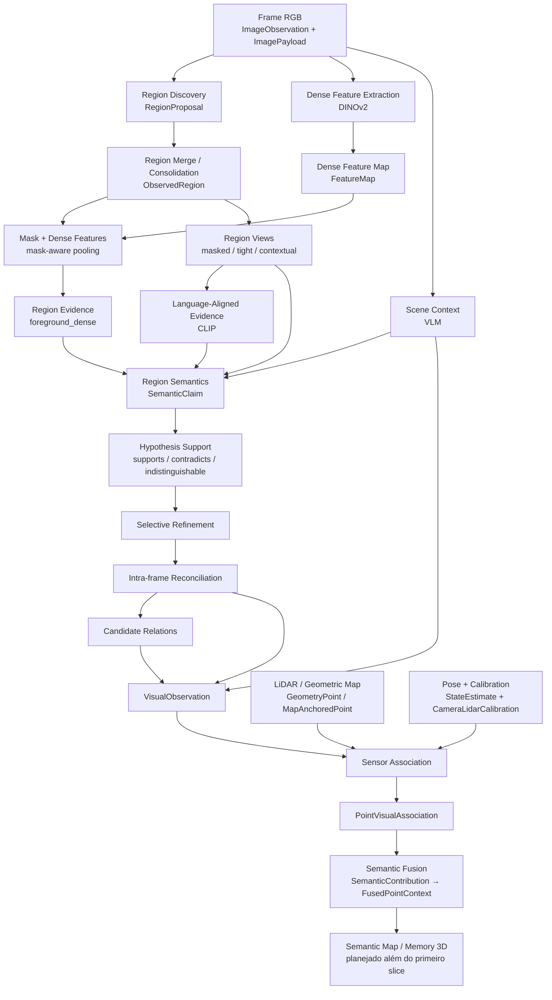

## Como ler os diagramas locais

Cada etapa abaixo começa com um Mermaid reduzido chamado **Onde esta etapa está na pipeline**. O nó em destaque é a etapa explicada naquela seção. O diagrama mostra pelo menos quem fornece sua entrada e quem consome sua saída, sem repetir toda a pipeline geral.

## Estado de implementação

| Capacidade | Estado atual | Observação |
| --- | --- | --- |
| `visual-perception` | implementado | pipeline canônico, contracts, backends reais/fakes, auditoria e benchmarks |
| `state-estimation` | implementado no primeiro slice | contracts e integração FAST-LIO existem |
| `geometric-map` | implementado no primeiro slice | geometria persistente e referências estáveis existem |
| `sensor-association` | implementado | projeção, suporte válido, oclusão, associação de região e rejeições explícitas |
| `semantic-fusion` | implementado no nível de ponto | fusão determinística de múltiplas contribuições e suporte espacial |
| `semantic-map` | planejado | ainda sem implementação pública concreta |
| `semantic-memory` | planejado | capacidade arquitetural reservada |
| `scene-graph` | planejado | capacidade arquitetural reservada |
| `context-reasoning` | planejado | capacidade arquitetural reservada |
| `query-engine` | planejado | capacidade arquitetural reservada |

Os exemplos usam uma única cena didática para permitir seguir a mesma evidência de ponta a ponta:

```text
frame_152
640 x 480

corredor interno
+ porta vermelha
+ extintor próximo à porta
+ marca/pichação em uma superfície
```

Os ids e números são ilustrativos. Os nomes de contracts, estágios e responsabilidades correspondem ao código atual.

## 1. Entrada RGB

### Onde esta etapa está na pipeline

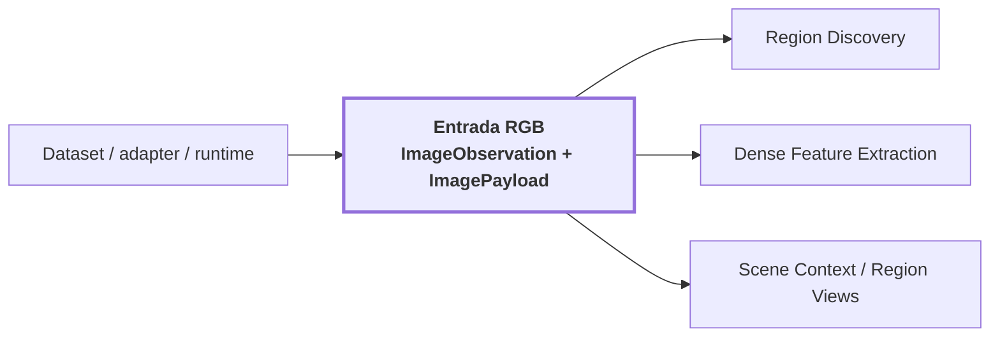

### Objetivo

A pipeline não começa com uma imagem genérica. Ela começa com duas representações complementares:

- `ImageObservation`, identidade, resolução, encoding e referência auditável ao artifact de imagem;
- `ImagePayload`, pixels RGB concretos resolvidos em memória para os modelos processarem.

A separação evita que contracts públicos dependam de NumPy, PIL, Torch ou do formato de um dataset específico.

### O que recebe

```text
ImageObservation
{
    width
    height
    encoding
    image: SourceArtifactReference
    source: ObservationReference
}

ImagePayload
{
    pixels: RGB[H, W, 3]
    width
    height
}
```

`ObservationReference` concentra identidade, sensor, sequência, timestamp, frame e calibração de origem.

### O que acontece

1. resolução e encoding são validados;
2. o payload precisa ter shape `(H, W, 3)`;
3. identidade, timestamp, sensor e frame permanecem ligados ao dado visual;
4. o artifact original continua rastreável pela proveniência.

### Exemplo

```text
ImageObservation
{
    width: 640
    height: 480
    encoding: "rgb8"
    source.observation_id: "frame_152"
    source.sensor_id: "camera_front"
    source.sequence_index: 152
    source.frame_id: "camera"
}

ImagePayload
{
    pixels.shape: (480, 640, 3)
}
```

### O que sabe e o que ainda não sabe

Sabe qual observação está sendo processada, de qual sensor veio, quando ocorreu, em qual frame existe e quais são seus pixels. Ainda não sabe onde estão os objetos, qual região é uma porta, qual pixel corresponde a qual ponto LiDAR ou onde qualquer coisa está em XYZ.

### Saída

```text
ImagePayload
    ├──> Region Discovery
    ├──> Dense Feature Extraction
    └──> Scene Context / Region Views
```

## 2. Region Discovery

### Onde esta etapa está na pipeline

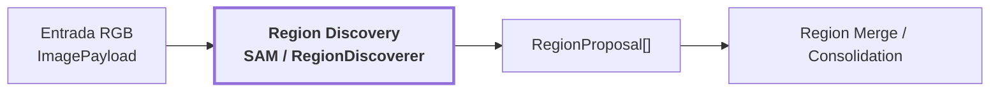

### Objetivo

Responder uma pergunta geométrica:

> Quais áreas visuais coerentes podem valer a pena analisar separadamente?

Ele não responde "isto é uma porta". No perfil real de referência, `RegionDiscoverer` é atendido por SAM ViT-H e produz propostas class-agnostic.

### O que acontece

1. a imagem pode ser dividida em tiles e escalas;
2. o backend produz candidatos locais;
3. cada candidato possui `mask`, `bounding box` e confiança geométrica;
4. coordenadas locais são remapeadas para a imagem original;
5. propostas inválidas podem ser rejeitadas;
6. as restantes tornam-se `RegionProposal`.

### Exemplo

```text
RegionProposal
{
    proposal_id: "proposal_27"
    mask: <pixels da porta e parte do batente>
    box: (302, 76, 426, 394)
    geometric_confidence: 0.94
    source: "sam"
    tile: ...
}
```

Duas proposals sobrepostas ainda não significam duas entidades físicas.

### Saída

```text
RegionProposal[]
      ↓
Region Merge / Consolidation
```

## 3. Region Merge / Consolidation

### Onde esta etapa está na pipeline

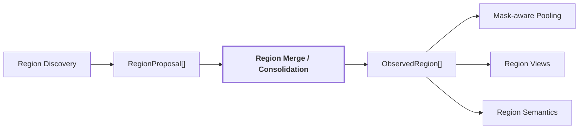

### Objetivo

Consolidar propostas geométricas redundantes ou sobrepostas em uma unidade 2D canônica chamada `ObservedRegion`, preservando de quais proposals ela surgiu.

### Exemplo visual

```text
proposal_27        proposal_31

   ████             ██████
   ████             ██████
   ████      +      ██████

          ↓ merge

       region_12
         █████
         █████
         █████
```

### Payload

```text
ObservedRegion
{
    region_id
    mask
    box
    geometric_confidence
    contributing_proposal_ids
    claims[]
    visual_embedding_ref?
    language_embedding_ref?
    evidence[]
}
```

Neste ponto, `claims` e `evidence` ainda podem estar vazios. A região é uma unidade geométrica estável, não uma entidade 3D.

## 4. Dense Feature Extraction

### Onde esta etapa está na pipeline

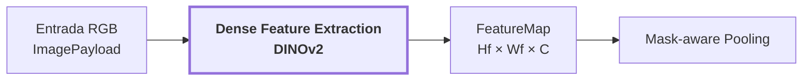

### Objetivo

DINOv2 transforma posições visuais da imagem em vetores que preservam aparência e estrutura visual. Ele não retorna labels como `door`, `wall` ou `chair`.

A configuração de referência usa DINOv2-base, com maior aresta 448 e patch size 14 no input efetivamente processado.

### Transformação

```text
patches                      embeddings DINOv2

[p1][p2][p3][p4]             [e1][e2][e3][e4]
[p5][p6][p7][p8]    ->       [e5][e6][e7][e8]
[p9][pA][pB][pC]             [e9][eA][eB][eC]
```

Cada `eN` é um vetor C-dimensional:

```text
e7 = [0.12, -0.74, 0.31, ..., 0.08]
```

Esse vetor descreve visualmente aquela posição condicionada pelo contexto do frame, não uma classe explícita.

### Saída

```text
FeatureMap
{
    data: [Hf, Wf, C]
    stride_x
    stride_y
    dimension
    model_id
    checkpoint
    representation: PATCH_GRID
    interpolation
    preprocessing
    valid_support
}
```

## 5. Mask + Dense Features / Pooling

### Onde esta etapa está na pipeline

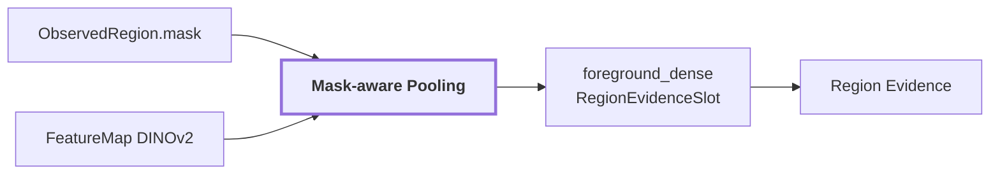

### Objetivo

A máscara responde "onde está a região". O dense feature map responde "como cada posição é representada visualmente". O pooling combina os dois para produzir uma representação visual agregada da região.

### Exemplo

```text
Dense feature map

[e1][e2][e3][e4]
[e5][e6][e7][e8]
[e9][eA][eB][eC]

Mask da region_12

 0   0   1   1
 0   0   1   1
 0   0   0   0

seleciona e3, e4, e7, e8
        ↓ pooling

region_embedding
[0.18, -0.72, 0.31, ..., 0.45]
```

O vetor pesado fica em artifact; a região guarda referência para ele.

### Saída

```text
RegionEvidenceSlot
{
    slot: foreground_dense
    region_id: region_12
    state: available
    artifact_ref: ...
    space: EmbeddingSpace(...)
    crop_box: ...
    transform: ...
    mask_ref: ...
    support_ratio: ...
}
```

## 6. Region Evidence

### Onde esta etapa está na pipeline

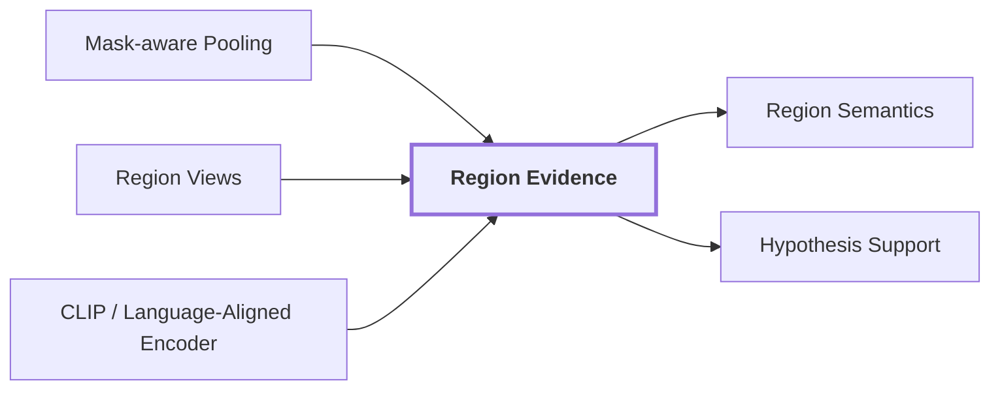

### Objetivo

Uma região não é bem representada por um único vetor. Uma máscara apertada favorece o sujeito, mas perde contexto. Um crop amplo preserva o entorno, mas pode diluir o sujeito. O projeto preserva múltiplos slots complementares.

### Slots reais

```text
foreground_dense
masked_subject
tight_crop
contextual_crop
scene_conditioned
```

### Intuição

```text
foreground_dense
    máscara sobre dense features DINOv2

masked_subject
    sujeito isolado, fundo suprimido

tight_crop
    objeto + entorno imediato

contextual_crop
    objeto + região mais ampla da cena

scene_conditioned
    evidência condicionada ao contexto global
```

Cada slot declara seu estado `available`, `missing` ou `failed`, seu preprocessing, geometria, artifact e `EmbeddingSpace`. Espaços incompatíveis não devem ser comparados silenciosamente.

## 7. Language-Aligned Evidence

### Onde esta etapa está na pipeline

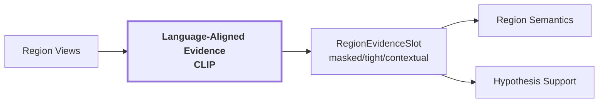

### Objetivo

DINOv2 e CLIP resolvem problemas diferentes:

```text
DINOv2
    imagem -> representação visual

CLIP
    imagem/crop -> espaço compartilhado com texto
    texto       -> mesmo espaço compartilhado
```

### Exemplo

```text
crop da porta
    ↓ CLIP image encoder
[0.04, -0.21, ..., 0.17]

"door"
    ↓ CLIP text encoder
[0.05, -0.19, ..., 0.14]

           ↓ cosine similarity
```

A similaridade de cosseno é uma medida no espaço declarado, não uma probabilidade nem uma confiança calibrada.

## 8. Scene Context

### Onde esta etapa está na pipeline

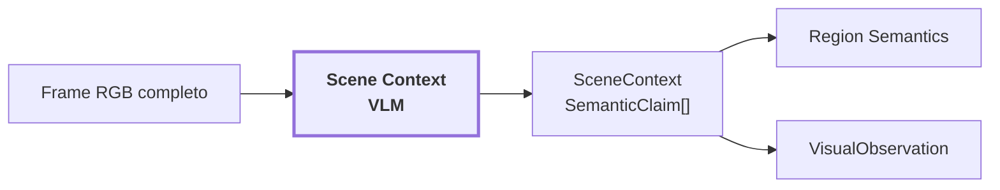

### Objetivo

Interpretar o frame completo e produzir claims globais que ajudem a desambiguar regiões sem fingir que esses claims possuem geometria 2D ou 3D própria.

A configuração de referência usa Qwen2.5-VL-3B-Instruct em 4-bit.

### Exemplo

```text
frame_152
    ↓ VLM

scene_type: "indoor corridor"
environment: ...
layout: ...
visibility: ...
```

### Saída

```text
SceneContext
{
    claims: SemanticClaim[]
}
```

## 9. Region Semantics

### Onde esta etapa está na pipeline

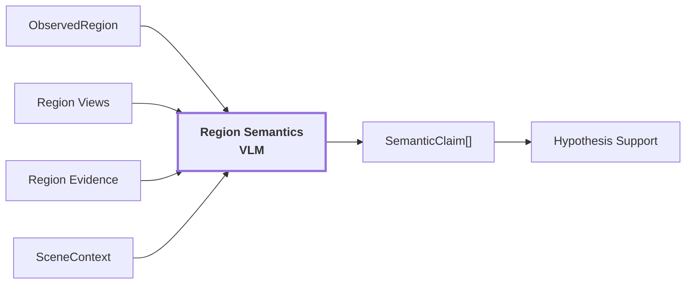

### Objetivo

Adicionar interpretações semânticas auditáveis à geometria 2D da região.

### Exemplo

```text
region_12

primary label:
    value = "door"
    role = primary
    category = "door"
    region_kind = thing
    confidence = 0.90

alternative:
    value = "doorway"
    role = alternative

attribute:
    value = "red"

condition:
    value = "closed"
```

### Distinções importantes

```text
ObservedRegion.geometric_confidence
    qualidade geométrica da máscara/box

SemanticClaim.confidence
    score bruto informado pelo produtor semântico

SemanticSupport.calibrated_confidence
    score calibrado, apenas quando existe calibração válida
```

`confidence=None` significa que nenhum score foi fornecido. Não equivale a zero.

## 10. Hypothesis Support

### Onde esta etapa está na pipeline

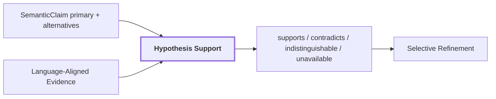

### Objetivo

Evitar que uma hipótese do VLM vire verdade simplesmente porque foi escrita como label. O estágio mede sinais independentes usando evidência language-aligned.

### Exemplo

```text
hipótese primary: "door"
hipótese alternative: "doorway"

contextual_crop -> CLIP image embedding
"door"         -> CLIP text embedding
"doorway"      -> CLIP text embedding

score(door)    = 0.241
score(doorway) = 0.228
margin         = 0.013
```

Se a margem ficar abaixo do piso configurado, o sinal pode ser `indistinguishable`. Isso evita transformar ruído de similaridade em uma decisão falsa.

### Payload

```text
HypothesisSupportSignal
{
    source
    hypothesis
    slot
    status
    score?
    margin?
    space?
    reason?
}
```

## 11. Selective Refinement

### Onde esta etapa está na pipeline

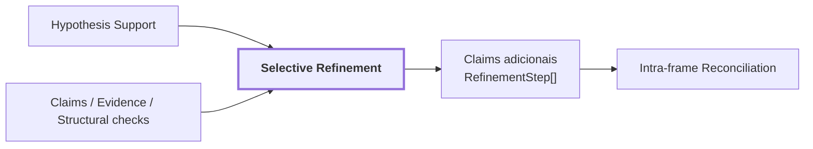

### Objetivo

Reanalisar somente regiões que têm uma razão explícita de evidência e somente quando o novo passe oferece evidência diferente da usada anteriormente.

### Razões implementadas

```text
missing_semantics
unsupported_primary
competing_hypotheses
contradictory_claims
region_kind_contradiction
abstained_support
failed_calibration
evidence_slot_unavailable
insufficient_foreground
small_region
```

`small_region` é um modificador de risco e não deve disparar um novo passe sozinho.

### Exemplo

```text
VLM: "wooden pallet"
mask: pallet + grande área de parede
mask_fill_ratio baixo
        ↓
reason = insufficient_foreground
        ↓
escalation_views adicionam nova evidência
        ↓
nova interpretação é anexada
```

Nada é sobrescrito silenciosamente. O histórico permanece append-only.

## 12. Reconciliation intra-frame

### Onde esta etapa está na pipeline

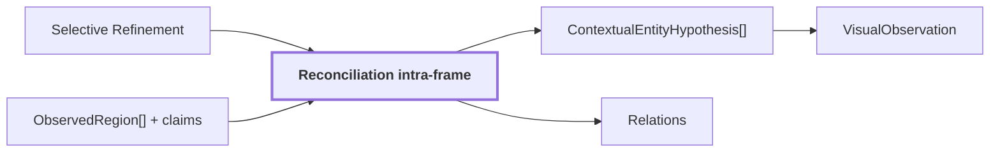

### Objetivo

Resolver redundância semântica dentro do mesmo frame sem declarar identidade persistente em 3D.

Exemplo:

```text
region_12 -> "door"
region_17 -> "red door panel"
```

Essas regiões podem formar uma hipótese contextual conjunta, mas:

```text
mesmo frame
    ≠
mesma entidade física confirmada em 3D
```

Nenhuma região precisa ser removida e nenhuma geometria 3D é inventada nesta etapa.

## 13. Relations

### Onde esta etapa está na pipeline

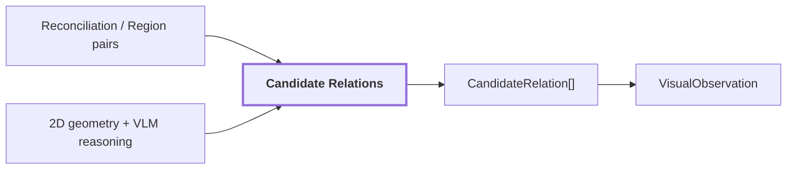

### Objetivo

Registrar relações candidatas entre regiões do mesmo frame sem promovê-las diretamente a relações métricas 3D.

Exemplos:

```text
fire extinguisher --near--> door

graffiti --on--> surface
```

Relações de profundidade física não devem ser inferidas apenas da imagem quando a geometria 3D ainda não foi consultada.

## 14. VisualObservation

### Onde esta etapa está na pipeline

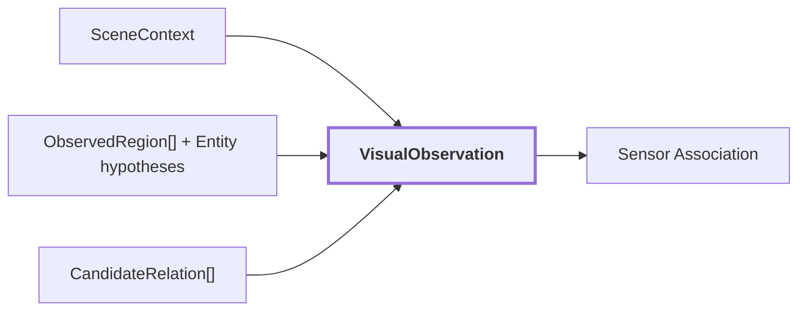

### Objetivo

`VisualObservation` é a saída canônica 2D de `visual-perception`. Ela reúne tudo que foi inferido sobre um único frame sem fingir que a imagem já virou mapa 3D.

### Contract

```text
VisualObservation
{
    source: ObservationReference
    image_width
    image_height
    scene_context: SceneContext
    regions: ObservedRegion[]
    relations: CandidateRelation[]
    entity_hypotheses: ContextualEntityHypothesis[]
    schema_version
    coordinate_convention
}
```

A versão atual do schema é `3`.

### Ponto central

```text
VisualObservation
    = observação visual estruturada de UM frame

VisualObservation
    ≠ mapa semântico 3D
```

## 15. Geometria 3D / LiDAR / geometric-map

### Onde esta etapa está na pipeline

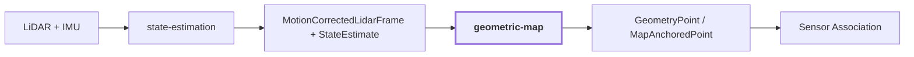

### Objetivo

Fornecer a geometria autoritativa do mundo. `visual-perception` não cria coordenadas XYZ.

### Contract de ponto persistente

```text
GeometryPoint
{
    reference: GeometryReference
    coordinates_m: (x, y, z)
    source_coordinates_m
    source_observation
    provenance
}
```

`GeometryReference` fornece uma identidade estável dentro do mapa.

### Exemplo

```text
map_point_92814

map_id = corridor_02_map
geometry_id = map_point_92814
coordinates_m = (4.21, 1.33, 0.87)
```

## 16. Pose + Calibration

### Onde esta etapa está na pipeline

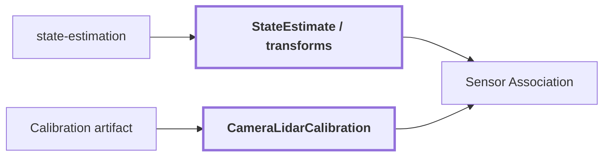

### Objetivo

Criar a ponte matemática entre um ponto 3D e o sistema de pixels da câmera.

### Calibração

```text
CameraLidarCalibration
{
    calibration_id
    artifact
    model
    fx, fy, cx, cy
    lidar_to_camera
    mirror_xi?
    distortion_k1, distortion_k2
    distortion_p1, distortion_p2
    front_hemisphere_only
}
```

Modelos suportados:

```text
pinhole
equidistant_fisheye
mei
```

### Transformação

```text
P_world = (4.21, 1.33, 0.87)
        ↓ map -> camera
P_camera = (x_c, y_c, z_c)
        ↓ camera model + intrinsics
(u, v) = (354, 221)
```

A sincronização temporal também é parte da validade da associação. Uma boa calibração espacial não corrige frames capturados em instantes incompatíveis.

## 17. Sensor Association

### Onde esta etapa está na pipeline

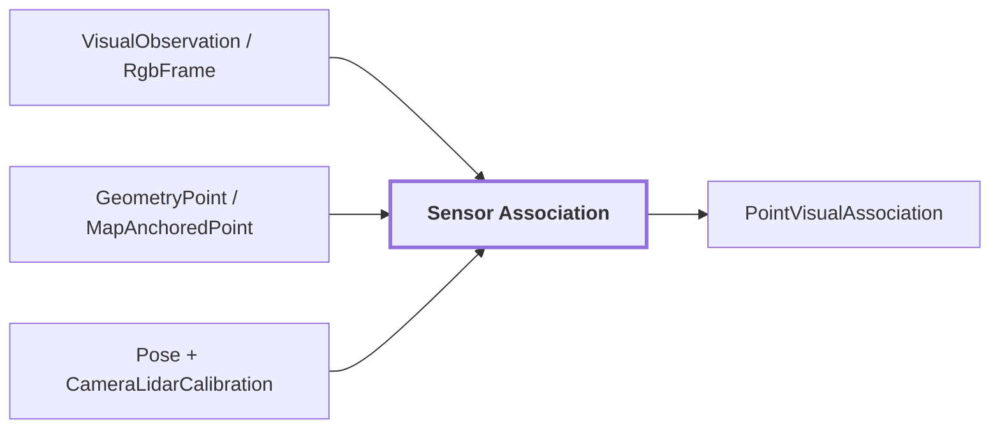

### Objetivo

Responder, para cada ponto 3D candidato:

> Se este ponto fosse observado por esta câmera neste instante, onde cairia na imagem e qual evidência visual válida o cobre?

### Fluxo

```text
ponto XYZ
    ↓
transform para frame da câmera
    ↓
projeção pelo modelo calibrado
    ↓
pixel (u,v)
    ↓
frente da câmera?
    ↓
dentro da imagem?
    ↓
suporte óptico válido?
    ↓
oclusão
    ↓
qual máscara contém (u,v)?
    ↓
cor + region_id + label + feature_reference
```

### Rejeições explícitas

```text
associated
behind_camera
outside_image
outside_valid_support
occluded
```

Depois da projeção e da oclusão, o membership de máscara liga o ponto à região visual que cobre o pixel.

## 18. PointVisualAssociation

### Onde esta etapa está na pipeline

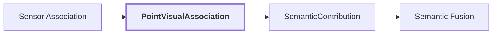

### Objetivo

Materializar a ligação auditável entre geometria persistente e evidência RGB de uma observação específica.

### Contract

```text
PointVisualAssociation
{
    geometry: GeometryReference
    lidar_observation: ObservationReference
    rgb_observation: ObservationReference
    calibration: CameraLidarCalibration
    status: AssociationStatus
    pixel?
    color_rgb?
    region_id?
    label?
    feature_reference?
}
```

### Mudança de domínio

```text
antes:
    region_12 existe em pixels

agora:
    map_point_92814 existe em XYZ
    e recebeu evidência proveniente de region_12
```

## 19. Semantic Fusion

### Onde esta etapa está na pipeline

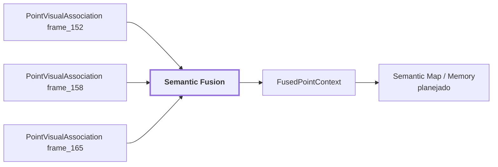

### Objetivo

Transformar várias classificações do mesmo ponto persistente em um contexto semântico fundido, preservando as contribuições concorrentes.

### Exemplo

```text
frame_152 -> map_point_92814 -> door
frame_158 -> map_point_92814 -> doorway
frame_165 -> map_point_92814 -> door

            ↓ semantic fusion

FusedPointContext
{
    label: door
    agreement: 2 / 3
    contributions: 3
}
```

### Entrada

```text
SemanticContribution
{
    observation_id
    timestamp_ns
    region_id
    label
    confidence?
    calibrated_confidence?
    support_state?
    visual_support?
    region_quality?
}
```

A regra atual prioriza confiança calibrada, depois confiança bruta, `visual_support`, `region_quality` e desempates determinísticos. Os sinais não são combinados arbitrariamente como se já houvesse uma calibração universal.

### Suporte espacial

`measure_spatial_support` mede quanto a vizinhança 3D concorda com o label do ponto. Se faltarem vizinhos suficientes, retorna `None`, não zero.

## 20. Semantic Map / Semantic Memory

### Onde esta etapa está na pipeline

```mermaid
flowchart LR
    A["FusedPointContext"] --> B["Semantic Map"]:::current
    C["Geometric Map"] --> B
    B --> D["Semantic Memory"]
    B --> E["Scene Graph"]
    D --> F["Context Reasoning / Query Engine"]
    E --> F

    classDef current stroke-width:3px,font-weight:bold;
```

### Estado atual

`semantic-map`, `semantic-memory`, `scene-graph`, `context-reasoning` e `query-engine` ainda são capacidades planejadas. O diagrama mostra a posição arquitetural pretendida, não um schema já implementado.

### Objetivo planejado

Deixar de pensar apenas em classificações de frames e pontos isolados e passar a representar conhecimento persistente do ambiente.

```text
observações 2D independentes
        ↓
associações ponto ↔ região
        ↓
fusão por geometria
        ↓
estado semântico persistente
        ↓
memória / entidades / relações / consulta
```

Uma futura representação persistente deve continuar respondendo:

```text
qual posição ocupa?
quais pontos geométricos a sustentam?
quais frames a observaram?
quais regiões 2D originaram a hipótese?
quais labels concorreram?
quais evidências contradisseram?
qual calibração foi usada?
```

## Exemplo completo: acompanhando uma porta da imagem até o mapa 3D

```mermaid
flowchart TD
    A["frame_152 RGB"] --> B["SAM proposals"]
    B --> C["region_12"]
    A --> D["DINOv2 FeatureMap"]
    C --> E["Mask-aware pooling"]
    D --> E
    E --> F["foreground_dense"]
    C --> G["Region Views"]
    G --> H["CLIP evidence"]
    A --> I["SceneContext / VLM"]
    F --> J["Region Semantics"]
    H --> J
    I --> J
    J --> K["Hypothesis Support / Refinement"]
    K --> L["VisualObservation"]

    M["map_point_92814 XYZ"] --> N["Sensor Association"]
    O["Pose + Calibration"] --> N
    L --> N
    N --> P["PointVisualAssociation"]
    P --> Q["SemanticContribution"]
    Q --> R["FusedPointContext"]
```

### A. Entrada

```text
frame_152
640 x 480
corredor + porta vermelha + extintor
```

### B. Region discovery

```text
frame_152
    ↓ SAM
proposal_27
proposal_31
```

### C. Merge

```text
proposal_27 + proposal_31
        ↓
     region_12
```

### D. Dense features

```text
frame RGB
    ↓ DINOv2
FeatureMap [Hf, Wf, C]
```

### E. Pooling

```text
region_12.mask + FeatureMap
        ↓
foreground_dense embedding
```

### F. Language-aligned evidence

```text
masked_subject / tight_crop / contextual_crop
        ↓ CLIP
language-aligned artifacts
```

### G. Semântica

```text
Region Views
+ SceneContext
+ Region Evidence
        ↓ Qwen2.5-VL

primary = door
alternative = doorway
attribute = red
condition = closed
```

### H. Support

```text
"door" vs "doorway"
        + CLIP evidence
        ↓
HypothesisSupportSignal[]
```

### I. Saída 2D

```text
VisualObservation frame_152
{
    scene_context,
    regions: [region_12, region_13, ...],
    relations,
    entity_hypotheses
}
```

### J. Ponto 3D

```text
map_point_92814
XYZ = (4.21, 1.33, 0.87)
```

### K. Projeção

```text
XYZ world
    ↓ pose / transform
XYZ camera
    ↓ camera model
pixel = (354,221)
```

### L. Membership

```text
region_12.mask contém (354,221)
        ↓
sim
```

### M. Associação

```text
PointVisualAssociation
{
    geometry: map_point_92814,
    rgb_observation: frame_152,
    pixel: (354,221),
    region_id: region_12,
    label: door,
    feature_reference: ...,
    calibration: ...
}
```

### N. Novas observações

```text
frame_152 -> door
frame_158 -> doorway
frame_165 -> door
```

### O. Fusão

```text
SemanticContribution(frame_152, door)
SemanticContribution(frame_158, doorway)
SemanticContribution(frame_165, door)
            ↓
FusedPointContext
{
    label: door,
    agreement: 0.667,
    contributions: 3
}
```

## Diferenças conceituais que não devem ser misturadas

### Pixel

Amostra discreta da imagem.

```text
(u,v) = (354,221)
```

### Patch

Bloco de pixels usado pelo Vision Transformer para gerar um token visual.

```text
14 x 14 pixels no input DINOv2 de referência
        ↓
1 token espacial
```

### Mask

Conjunto de pixels pertencentes a uma proposal ou região 2D.

### Region

Unidade 2D canônica com id, mask, box, proveniência geométrica, claims e evidências.

```text
ObservedRegion
```

### Dense feature

Vetor visual associado a uma posição do `FeatureMap`.

### Region embedding

Agregação de várias dense features ou codificação de uma view da região.

### Language-aligned embedding

Vetor em um espaço no qual imagem e texto podem ser comparados.

### SemanticClaim

Afirmação auditável e tipada sobre uma região ou cena.

```text
LABEL("door")
ATTRIBUTE("red")
CONDITION("closed")
```

### VisualObservation

Pacote 2D completo de um único frame.

### PointVisualAssociation

Ligação rastreável entre uma `GeometryReference` 3D e evidência visual de uma observação específica.

### FusedPointContext

Escolha semântica atual para um ponto persistente depois de considerar múltiplas contribuições.

### Entidade 3D persistente

Conceito futuro de nível superior. Não é equivalente a `ObservedRegion`, `PointVisualAssociation` nem `FusedPointContext`.

## Responsabilidade por tecnologia

```text
SAM / RegionDiscoverer
    = geometria 2D candidata

DINOv2
    = representação visual densa

mask-aware pooling
    = representação visual agregada da região

CLIP / LanguageAlignedEncoder
    = evidência visual comparável a linguagem

Qwen2.5-VL / MultimodalReasoner
    = interpretação e contexto semântico

Hypothesis Support
    = verificação independente de hipóteses

sensor-association
    = ligação geométrica 2D ↔ 3D

semantic-fusion
    = integração de múltiplas observações sobre a mesma geometria

semantic-map
    = persistência semântica de alto nível, ainda planejada
```

## Rastreabilidade: como responder "de onde veio este conhecimento?"

```mermaid
flowchart TD
    A["FusedPointContext"] --> B["SemanticContribution"]
    B --> C["PointVisualAssociation"]
    C --> D["GeometryReference"]
    C --> E["rgb_observation + lidar_observation"]
    C --> F["calibration + pixel + region_id"]
    F --> G["VisualObservation"]
    G --> H["ObservedRegion"]
    H --> I["SemanticClaim[]"]
    H --> J["RegionEvidenceSlot[]"]
    J --> K["artifact_ref + EmbeddingSpace + preprocessing"]
    H --> L["contributing_proposal_ids"]
```

Para o que já está implementado, deve ser possível rastrear:

```text
qual frame contribuiu
qual região foi usada
qual máscara originou a associação
qual feature artifact foi referenciado
qual interpretação foi produzida
qual ponto 3D recebeu a evidência
qual calibração foi usada
quantas contribuições sustentam o label fundido
quais contribuições discordam
```

A futura entidade de alto nível deve preservar essa cadeia, não substituí-la por um novo schema opaco.

## Influência da literatura versus implementação do projeto

A arquitetura pública do projeto não é definida por um único paper. As referências influenciam ideias e avaliações, mas os contracts documentados são decisões do próprio repositório.

### VLMaps

`Visual Language Maps for Robot Navigation`, arXiv:2210.05714.

Ideia relevante:

```text
features visuais/linguísticas 2D
    + geometria 3D
    ↓
representação espacial consultável
```

O projeto compartilha a motivação de ancorar evidência visual em geometria, mas não implementa a grade top-down de VLMaps.

### CLIP-Fields

`CLIP-Fields: Weakly Supervised Semantic Fields for Robotic Memory`, RSS 2023.

A influência conceitual está na separação entre observações 2D, evidência visual/linguística e memória espacial persistente. O projeto não implementa o neural field de CLIP-Fields.

### Online Knowledge Integration for 3D Semantic Mapping

arXiv:2411.18147.

A decomposição entre geometria, aquisição semântica e integração de conhecimento ajuda a justificar a separação de ownership entre `geometric-map`, percepção, fusão, scene graph e raciocínio.

### Vernata

`Vernata: Self-Supervised Learning of LiDAR Point Representations`, arXiv:2608.06919.

O trabalho mostra o valor de associar features 2D densas a pontos LiDAR para supervisão cross-modal. O projeto atual não implementa o treinamento Vernata, mas calibração e projeção corretas são a ponte necessária para qualquer transferência consistente de evidência 2D para 3D.

## Onde aprofundar cada parte

- `modules/visual-perception/docs/pipelines.md`, pipeline interna de percepção visual.
- `modules/visual-perception/docs/model-backends.md`, SAM, DINOv2, CLIP e Qwen de referência.
- `modules/visual-perception/docs/dense-evidence.md`, resolução e evidência densa.
- `modules/visual-perception/docs/artifacts.md`, vetores e artifacts pesados.
- `modules/visual-perception/docs/api-contracts.md`, contracts públicos.
- `modules/visual-perception/docs/integration.md`, tradução de `VisualObservation` para consumidores downstream.
- `modules/sensor-association/README.md`, projeção, suporte válido e oclusão.
- `modules/semantic-fusion/README.md`, ranking de contribuições e suporte espacial.
- `docs/system-flow.md`, composição entre módulos.
- `docs/architecture.md`, ownership e regras arquiteturais.
