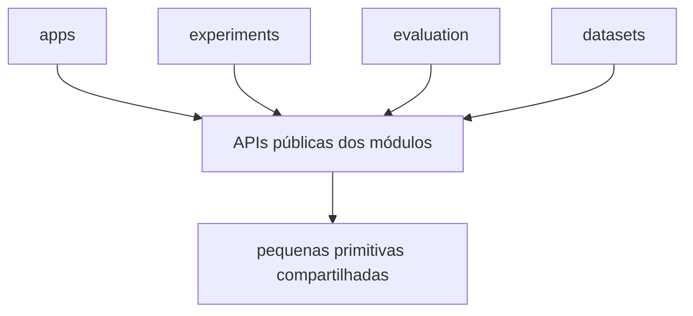

# Princípios de Engenharia

Este documento registra decisões de implementação de nível de repositório que devem permanecer estáveis conforme os módulos de pesquisa individuais evoluem.

O projeto otimiza para legibilidade, manutenibilidade, fluxo de dados explícito, substituibilidade e reprodutibilidade científica, preservando fronteiras fortes entre capacidades de pesquisa.

## Estilo arquitetural

O repositório usa uma **arquitetura modular orientada a capacidades**.

A principal unidade de organização é uma capacidade com responsabilidade clara, fronteira pública, testes, configuração e documentação local.

Um leitor deve conseguir entender uma capacidade principalmente abrindo seu módulo.

O padrão estrutural preferido é:

```text
repositório
    -> aplicações executáveis
    -> módulos de capacidade
    -> pequenas primitivas compartilhadas
```

Dentro de uma capacidade, use a menor estrutura interna que comunique o comportamento com clareza.

## Por que esta arquitetura serve ao projeto

As principais fontes de mudança são:

- algoritmos;
- modelos aprendidos;
- integrações de sensor;
- representações geométricas e semânticas;
- datasets;
- experimentos;
- estratégias de persistência;
- composição de runtime.

A arquitetura, portanto, favorece:

1. entender uma capacidade localmente;
2. substituir implementações por trás de comportamento estável;
3. transformações explícitas entre observações multimodais;
4. experimentos que podem selecionar e comparar implementações;
5. ownership de código de pesquisa em nível de módulo;
6. fronteiras de integração pequenas e estáveis.

## Ownership de capacidades

Todo comportamento significativo tem um dono óbvio.

O ownership atual é:

- `state-estimation`: pose, trajetória e observações LiDAR corrigidas por movimento;
- `geometric-map`: geometria persistente do mundo;
- `visual-perception`: observações visuais e semânticas estruturadas a partir de RGB;
- `point-representation`: representações aprendidas para pontos LiDAR;
- `sensor-association`: associação temporal e geométrica RGB/LiDAR;
- `semantic-fusion`: consolidação de evidência semântica entre fontes, views e tempo;
- `semantic-map`: estado semântico persistente vinculado à geometria do mundo;
- `semantic-memory`: estruturas de recuperação semântica e espacial;
- `scene-graph`: entidades, hierarquia e relações;
- `context-reasoning`: inferência contextual com proveniência;
- `query-engine`: composição de consulta semântica, espacial e contextual.

Resolva o ownership antes da implementação sempre que uma nova feature parecer atravessar várias capacidades.

## Localidade de implementação

Coloque código específico de capacidade junto ao módulo que o possui.

Isso inclui:

- runtimes de terceiros;
- código de conversão;
- carregamento de modelo;
- implementações específicas de backend;
- helpers de persistência;
- configuração de módulo;
- suporte a treino e inferência.

Exemplos:

```text
modules/state-estimation/
    runtime baseado em FAST_LIO

modules/geometric-map/
    implementação específica de Open3D

modules/visual-perception/
    model runtime e pré-processamento
```

Isso mantém o código necessário para entender uma capacidade fisicamente próximo.

## Fronteira pública do módulo

Cada módulo expõe a menor superfície pública útil.

Consumidores dependem de:

- tipos de dados públicos documentados;
- funções ou classes públicas documentadas;
- protocolos explícitos para pontos de variação reais;
- pontos de entrada estáveis do módulo.

Objetos de modelo internos, caches, estruturas exclusivas de treino, detalhes de armazenamento e objetos específicos de backend permanecem detalhes de implementação do módulo dono.

A fronteira de compatibilidade é a API pública.

## Política de código compartilhado

Código compartilhado de nível de repositório é reservado para conceitos que são ao mesmo tempo de posse global e semanticamente estáveis.

Bons candidatos incluem:

- timestamps;
- identificadores de frame de coordenadas;
- poses e rigid transforms;
- identificadores de mapa e artifact;
- primitivas simples de proveniência.

Tipos específicos de capacidade ficam com seu módulo. Um formato de embedding aprendido, estrutura de tensor de modelo, ou schema de backend permanece de posse da capacidade que o define.

Quando um pacote compartilhado é introduzido, prefira uma estrutura pequena como:

```text
shared/
├── geometry/
├── time/
└── types/
```

Promova um conceito para código compartilhado somente depois que seu significado for estável entre os consumidores.

## SOLID como orientação de design

SOLID guia o design de código e dependências.

### Single Responsibility

Um componente representa uma responsabilidade coerente e um motivo principal para mudar.

Divida comportamento quando as responsabilidades evoluem independentemente.

### Open/Closed

Exponha pontos de variação estáveis onde múltiplas implementações existem ou são intencionalmente comparadas.

Exemplos típicos do projeto incluem múltiplos métodos de fusão, pose estimators, point encoders, storage backends, ou variantes de pesquisa.

### Liskov Substitution

Implementações do mesmo contract público preservam o mesmo comportamento visível ao consumidor.

Invariantes relevantes para substituição devem ser documentados e testados, incluindo unidades, frames, ordenação, semântica de erro e suposições de ciclo de vida.

### Interface Segregation

Interfaces são modeladas em torno da necessidade de um único consumidor.

Por exemplo, leitura e escrita de mapa podem ser contracts separados quando os consumidores diferem.

### Dependency Inversion

Orquestração de alto nível depende de capacidades estáveis, enquanto implementações concretas satisfazem essas capacidades.

Exemplo:

```text
mapping runtime -> PoseEstimator <- estimator baseado em FAST_LIO
```

Isso mantém tecnologia externa volátil por trás de uma responsabilidade estável do projeto.

## Limiar de abstração

Introduza uma abstração quando ela torna uma fronteira concreta ou ponto de variação mais claro.

Gatilhos comuns são:

- múltiplas implementações;
- um experimento de comparação planejado;
- isolamento de uma dependência cara ou externa;
- uma fronteira de módulo que exige um contract estável;
- testes em nível de contract com substitutos.

Para comportamento local com uma única implementação direta, prefira código direto e construção direta.

## Fluxo de dados explícito

Transformações importantes devem ser visíveis:

```text
observação de entrada
    -> validação de fronteira
    -> transformação específica da capacidade
    -> tipo de saída explícito
    -> próxima capacidade
```

Para dados multimodais de robótica, preserve metadados relevantes como:

- timestamp;
- identidade do sensor;
- frame de coordenadas;
- unidades;
- identidade de calibração;
- proveniência de transform;
- identidade da observação de origem;
- confiança ou incerteza;
- proveniência de modelo/checkpoint quando necessária para reprodutibilidade.

Um consumidor downstream deve conseguir determinar como uma observação foi produzida e como ela é interpretada espacial e temporalmente.

## Validação de fronteira

Valide suposições quando os dados cruzam uma fronteira de módulo.

Exemplos importantes são:

- compatibilidade de frame de coordenadas;
- sincronização de timestamp;
- validade de transform;
- dimensões de tensor e embedding;
- atributos de ponto suportados;
- compatibilidade de versão de mapa;
- proveniência exigida por fusão ou avaliação.

Falhe cedo com diagnósticos acionáveis quando um invariante for violado.

## Ownership de configuração

Um módulo possui os parâmetros que controlam seu algoritmo interno.

Uma aplicação ou experimento possui os parâmetros que selecionam implementações e compõem módulos.

Isso cria uma distinção simples:

```text
parâmetro de algoritmo -> config do módulo
escolha de composição  -> config de app ou experimento
```

Prefira configuração tipada e explícita quando praticável. Documente defaults que afetam materialmente os experimentos.

## Regra de implementação de pesquisa

A arquitetura pública é nomeada segundo as capacidades do projeto.

A proveniência científica pertence à documentação de implementação e de módulo.

Exemplo:

```text
capacidade: PoseEstimator
implementação: estimator baseado em FAST_LIO
notas de pesquisa: modules/state-estimation/docs/
```

A mesma regra se aplica a VLMs, point encoders, métodos de fusão, técnicas de scene-graph, datasets e tecnologias de armazenamento.

Issues devem definir o comportamento observável da capacidade, entradas, saídas, restrições, testes e critérios de aceitação. A documentação do módulo pode então registrar qual trabalho de pesquisa informou a implementação.

## Regras de legibilidade

Prefira código que comunique intenção localmente.

Use:

- nomes de capacidade descritivos;
- call paths curtos;
- tipos de fronteira explícitos;
- arquivos focados quando as responsabilidades são distintas;
- comentários para raciocínio não óbvio;
- documentação de módulo para justificativa de design.

Prefira nomes precisos como:

```text
PointEncoder
PoseEstimator
ObservationMatcher
TemporalFusion
SemanticMapReader
```

em vez de nomes genéricos quando uma responsabilidade mais específica é conhecida.

## Direção de dependência

A direção de dependência segue o ownership de capacidade e as APIs públicas.

Em nível de repositório:



Para uso entre módulos:

```text
consumidor -> API pública do produtor
```

Mantenha essas dependências explícitas e acíclicas sempre que praticável.

Quando dois módulos precisam de acesso substancial aos conceitos internos um do outro, reconsidere a fronteira de ownership.

## Estratégia de testes

Testes protegem o comportamento público e a reprodutibilidade científica.

Use:

- testes unitários para transformações determinísticas;
- testes de contract para implementações intercambiáveis;
- testes de integração para fronteiras de módulo;
- testes de aplicação representativos para composição end-to-end;
- benchmarks para componentes sensíveis a runtime, memória e acurácia;
- fixtures de regressão para modos de falha conhecidos.

Testes devem tornar o refactoring interno seguro, focando em comportamento observável e invariantes estáveis.

## Documentação como parte da arquitetura

Uma decisão de design está completa quando sua justificativa é recuperável.

Decisões de nível de repositório pertencem ao `docs/` raiz.

Decisões específicas de módulo pertencem a `modules/<module>/docs/`.

Mudanças em ownership, contracts públicos, direção de dependência ou estrutura do repositório devem atualizar a documentação relevante na mesma alteração.

## Checklist de decisão estrutural

Antes de aceitar uma mudança estrutural, verifique:

1. Existe um dono óbvio para o comportamento?
2. Um leitor consegue entender a mudança majoritariamente dentro daquele módulo dono?
3. Entradas, saídas e invariantes são explícitos?
4. A fronteira pública expõe apenas o que os consumidores precisam?
5. Detalhes de implementação externos estão contidos localmente?
6. Unidades, frames, timestamps e proveniência estão explícitos onde necessário?
7. O comportamento pode ser testado através de sua fronteira pública?
8. As implementações pretendidas podem ser substituídas sem alterar consumidores não relacionados?
9. A direção de dependência é clara e preferencialmente acíclica?
10. Esta é a menor estrutura que comunica o design com clareza?

Um design que satisfaz esses pontos está alinhado com a direção de engenharia do repositório.
