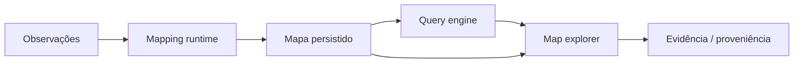

# Ciclo de Vida do Mapa

Este documento define o ciclo de vida de nível de repositório de um mapa, sem prescrever algoritmos internos ou tecnologias concretas de armazenamento.

## 1. Ingestão de observações

Sensores ao vivo, sessões gravadas e datasets são traduzidos por adapters em contracts estáveis do projeto. Identidade da fonte bruta, timestamps, frames de coordenadas, referências de calibração e proveniência devem ser preservados.

## 2. Estimação de movimento e geometria

`state-estimation` fornece estimativas de movimento e observações LiDAR corrigidas. `geometric-map` usa saídas compatíveis com o contract para construir geometria persistente do mundo.

## 3. Enriquecimento semântico

Representações visuais e de pontos aprendidas são associadas à geometria, fundidas entre observações, e anexadas ao mapa semântico através de referências de geometria estáveis.

## 4. Memória e contexto

A informação semântica mapeada alimenta a memória semântica, a construção do scene-graph, o raciocínio contextual e os índices de consulta.

## 5. Persistência

Um mapa é persistido como uma coleção lógica de artifacts relacionados, em vez de um único formato de arquivo obrigatório.

Um manifest de mapa deve ser capaz de referenciar pelo menos:

```text
MapManifest
├── identidade do mapa
├── frame de coordenadas
├── bounds
├── trajectory
├── artifacts de geometria
├── artifacts semânticos
├── observações
├── scene graph
├── índices
└── proveniência
```

Bancos de dados concretos, object stores, formatos de point-cloud e implementações de índice permanecem adapters.

## 6. Reabrir e consultar

Um mapa persistido pode ser aberto sem reexecutar o pipeline de mapeamento original. `query-engine` fornece recuperação semântica, espacial, relacional e contextual sobre o estado de mapa disponível.

## 7. Explorar e inspecionar evidência

`map-explorer` consome geometria, overlays semânticos, resultados de consulta, observações e proveniência. Um resultado de consulta deve permanecer rastreável até a evidência e os artifacts de mapa que o sustentam.



## Critério de completude

O repositório está completo de ponta a ponta quando uma entrada de RGB, LiDAR e movimento compatível com o contract pode ser processada em um mapa 3D semântico/contextual persistente, reaberta mais tarde, consultada através de interfaces públicas, visualizada espacialmente, e rastreada de volta até as observações e proveniência que a sustentam.
