# Walkthrough com dados reais da pipeline

Este documento complementa [`end-to-end-pipeline.md`](./end-to-end-pipeline.md) com dados e imagens produzidos por uma execução real do pipeline. O objetivo é mostrar como os conceitos descritos na documentação aparecem de fato nos artifacts, sem substituir a documentação dos módulos nem transformar um único run em ground truth.

A referência principal desta página é o run `20260910T115810Z`, revisão `7001803`, usando o frame `corridor-02-000`. Para acompanhar uma região concreta ao longo de features, semântica e suporte de hipótese, usamos `region-2c84165423b25fc3`.

## Sumário

1. [Proveniência do exemplo](#1-proveniência-do-exemplo)
2. [Entrada RGB real](#2-entrada-rgb-real)
3. [Region discovery e filtros](#3-region-discovery-e-filtros)
4. [Regiões canônicas após merge](#4-regiões-canônicas-após-merge)
5. [Dense features e pooling](#5-dense-features-e-pooling)
6. [Evidência CLIP multi-contexto](#6-evidência-clip-multi-contexto)
7. [Scene context real](#7-scene-context-real)
8. [Semântica real de uma região](#8-semântica-real-de-uma-região)
9. [Hypothesis support real](#9-hypothesis-support-real)
10. [Reconciliação e relações](#10-reconciliação-e-relações)
11. [VisualObservation real](#11-visualobservation-real)
12. [Debug real da associação 2D→3D](#12-debug-real-da-associação-2d3d)
13. [Diagnóstico real da fusão semântica](#13-diagnóstico-real-da-fusão-semântica)
14. [Mapa de artifacts](#14-mapa-de-artifacts)
15. [O que ainda é ilustrativo ou planejado](#15-o-que-ainda-é-ilustrativo-ou-planejado)

## Visão geral

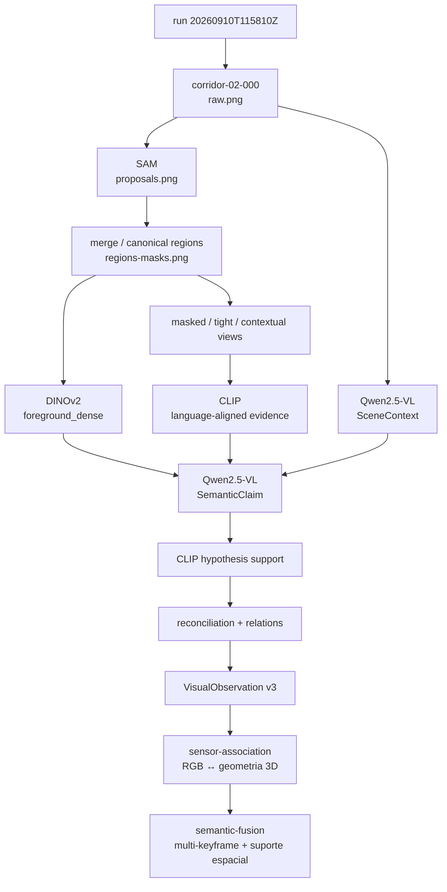

As imagens desta página não são cópias em `docs/assets/`. Elas apontam diretamente para os artifacts versionados dentro do run. Isso mantém a documentação ligada à origem dos dados e evita que uma screenshot duplicada continue parecendo atual depois que o benchmark mudar.

## 1. Proveniência do exemplo

### Onde esta etapa está na pipeline


A execução escolhida é:

```text
run_id: 20260910T115810Z
git_revision: 7001803
quality_profile: research_quality
frames: 3
frame de referência desta página: corridor-02-000
resolução: 640 x 480
GPU budget: 8.0 GB
pico observado no run: 4.57 GB
```

Arquivos de origem:

- [`summary.md`](../modules/visual-perception/benchmarks/results/samples/20260910T115810Z/summary.md)
- [`manifest.json`](../modules/visual-perception/benchmarks/results/samples/20260910T115810Z/manifest.json)
- [`diagnostics.json`](../modules/visual-perception/benchmarks/results/samples/20260910T115810Z/frames/corridor-02-000/diagnostics.json)
- [`observation.json`](../modules/visual-perception/benchmarks/results/samples/20260910T115810Z/frames/corridor-02-000/observation.json)
- [`embeddings.npz`](../modules/visual-perception/benchmarks/results/samples/20260910T115810Z/frames/corridor-02-000/embeddings.npz)

A configuração real deste run usa SAM ViT-H, DINOv2-base, CLIP ViT-L/14 e Qwen2.5-VL-3B-Instruct em 4-bit. Os crops de região usados pelo reasoner são `masked_subject`, `tight_crop` e `contextual_crop`.

## 2. Entrada RGB real

### Onde esta etapa está na pipeline

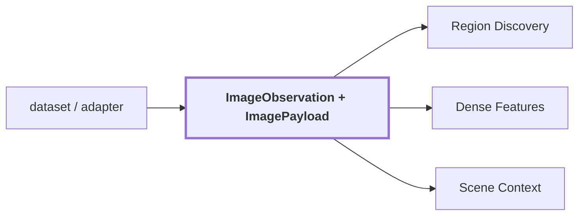

O frame real usado nesta página é:


O `observation.json` preserva a identidade da observação que originou a análise:

```json
{
  "schema_version": 3,
  "source": {
    "observation_id": "corridor-02-000",
    "dataset_id": "corridor02",
    "sequence_id": "seq-0",
    "sensor_id": "camera_1",
    "sequence_index": 0,
    "timestamp": {
      "nanoseconds": 1000000,
      "clock_id": "rosbag"
    },
    "frame_id": "camera_1_optical_frame",
    "calibration_id": null
  },
  "image_width": 640,
  "image_height": 480
}
```

Aqui ainda não existe label, entidade ou posição 3D. O valor importante é que todos os resultados posteriores conseguem voltar até `corridor-02-000`.

## 3. Region discovery e filtros

### Onde esta etapa está na pipeline

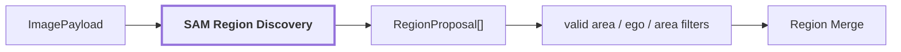

As proposals reais produzidas para o frame podem ser inspecionadas diretamente:


O frame também possui artifacts explícitos para a área fisheye válida e para a máscara do ego-veículo:

| Área válida | Ego-veículo |
| --- | --- |
|  |  |

O `diagnostics.json` mostra o efeito quantitativo do estágio:

```text
proposal_count: 75
merged_proposal_count: 47
region_count: 40
regions_with_multiple_proposals: 5

rejected_proposals:
  ego_vehicle_overlap: 13
  below_min_relative_area: 9
  outside_valid_area: 6
```

Esse dado torna uma diferença importante observável. `75 proposals` não significam `75 objetos`. Antes mesmo da semântica, parte das proposals é rejeitada e parte é consolidada.

## 4. Regiões canônicas após merge

### Onde esta etapa está na pipeline

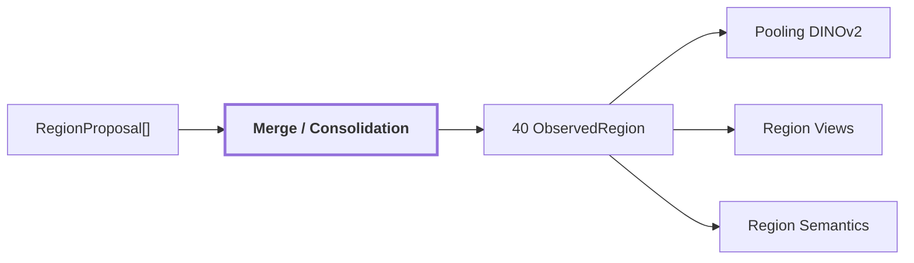

Três visualizações do mesmo resultado ajudam a separar geometria de semântica:

| Máscaras canônicas | Bounding boxes | Overlay final |
| --- | --- | --- |
|  |  |  |

O frame terminou com `40` regiões canônicas. A confiança geométrica não colapsou em um único valor:

```text
geometric_confidence
count: 40
min: 0.9277539253
max: 1.0
mean: 0.9788180351
median: 0.9824641347
distinct_values: 34
degenerate: false
```

Isso contrasta com a confiança semântica bruta deste run, que veremos adiante.

## 5. Dense features e pooling

### Onde esta etapa está na pipeline

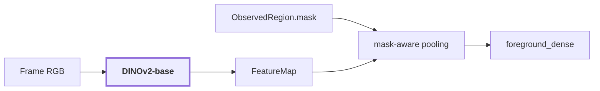

A configuração usada no run foi:

```text
backend: dinov2
checkpoint: facebook/dinov2-base
input_resolution: 448
upsampling: nearest
```

Para tornar a etapa concreta, podemos seguir `region-2c84165423b25fc3`. O slot persistido para o pooling DINOv2 é:

```text
slot: foreground_dense
state: available
region_id: region-2c84165423b25fc3
crop_box: [480, 5, 535, 305]
preprocessing: mask_aware_pooling:pixel_nearest_highres
artifact_ref: visual-region-2c84165423b25fc3
mask_ref: mask-region-2c84165423b25fc3
support_ratio: 1.0
mask_fill_ratio: 0.4477575758

EmbeddingSpace:
  model_id: dinov2
  checkpoint: facebook/dinov2-base
  dimension: 768
  modality: visual_dense
  normalized: true
```

O vetor de 768 dimensões não é colocado inline em `observation.json`; ele está no artifact [`embeddings.npz`](../modules/visual-perception/benchmarks/results/samples/20260910T115810Z/frames/corridor-02-000/embeddings.npz). O JSON preserva a referência, o espaço vetorial, a geometria usada e o preprocessing.

## 6. Evidência CLIP multi-contexto

### Onde esta etapa está na pipeline

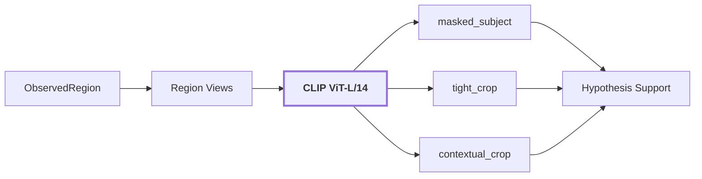

Para a mesma região, os slots reais mostram que foreground e contexto são evidências separadas, não um único embedding chamado genericamente de contexto:

```text
masked_subject
  preprocessing: neutral_masked_crop:expansion=0.0
  artifact_ref: language-subject-region-2c84165423b25fc3
  model: openai/clip-vit-large-patch14
  dimension: 768
  modality: language_aligned

tight_crop
  preprocessing: crop:expansion=0.0
  artifact_ref: language-region-2c84165423b25fc3
  model: openai/clip-vit-large-patch14
  dimension: 768
  modality: language_aligned

contextual_crop
  produzido pelo mesmo espaço CLIP
  contexto expandido conforme a configuração multi_context
```

No run, `context_expansion` é `0.25`. O ponto importante é que cada view mantém identidade própria e pode discordar semanticamente das demais.

## 7. Scene context real

### Onde esta etapa está na pipeline

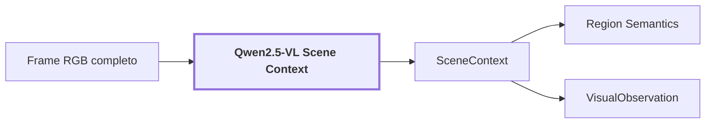

O modelo produziu estes claims globais para `corridor-02-000`:

```text
scene_type: corridor
scene confidence: 0.85
environment: indoor
layout: long hallway with doors on both sides
lighting: dim, artificial lights
visibility: clear, but dimly lit
navigability: moderate, some obstacles like a suitcase
```

O produtor e sua proveniência também foram preservados:

```text
producer: qwen_vl
checkpoint: Qwen/Qwen2.5-VL-3B-Instruct
prompt_version: v7
stage: scene_context
```

Esses valores são **saída do modelo**, não ground truth. O trecho `some obstacles like a suitcase`, por exemplo, deve ser lido como uma hipótese auditável. A existência de uma resposta estruturada não a transforma automaticamente em fato do mundo.

## 8. Semântica real de uma região

### Onde esta etapa está na pipeline

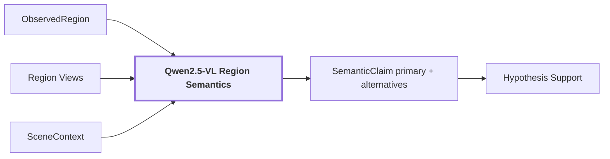

Para `region-2c84165423b25fc3`, a resposta real do modelo foi essencialmente:

```json
{
  "label": "wooden panel",
  "confidence": 0.9,
  "alternatives": [
    {"label": "wooden door", "confidence": 0.8}
  ],
  "category": "door",
  "kind": "thing",
  "attributes": ["smooth", "shiny"],
  "condition": "new",
  "material": "wood",
  "description": "a wooden panel that appears to be part of a door."
}
```

Depois do parser, a identidade principal continua distinguível da alternativa:

```text
primary:
  label: wooden panel
  confidence: 0.9
  category: door
  region_kind: thing

alternative:
  label: wooden door
  confidence: 0.8

attributes:
  smooth
  shiny

condition:
  new

material:
  wood
```

A qualidade geométrica dessa região é `0.97944176197052`. Esse valor não deve ser confundido com `0.9`, que é o score semântico bruto emitido pelo Qwen.

No frame inteiro, a confiança semântica bruta revela um problema importante:

```text
semantic_confidence
count: 40
missing: 0
min: 0.9
max: 0.9
mean: 0.9
median: 0.9
distinct_values: 1
stddev: 0.0
degenerate: true
```

Portanto, neste run, `0.9` não oferece poder discriminativo entre regiões. É exatamente por isso que o pipeline preserva sinais independentes e não trata esse número como confiança calibrada.

## 9. Hypothesis support real

### Onde esta etapa está na pipeline

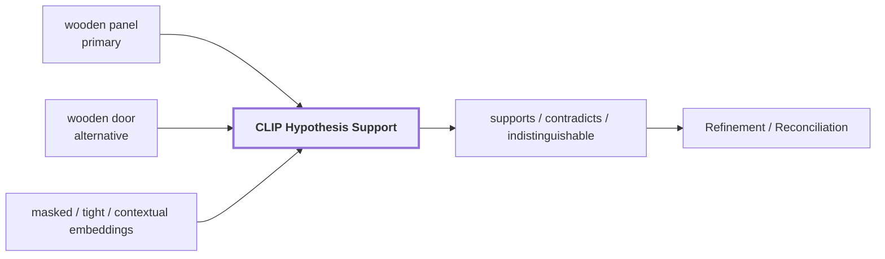

Esta região é útil porque as diferentes views **não concordam entre si**. Os valores abaixo são reais do artifact, e são similaridades/margens no espaço CLIP, não probabilidades.

| Hipótese | Slot | Status | Score | Margem |
| --- | --- | --- | ---: | ---: |
| `wooden panel` | `masked_subject` | contradicts | 0.154144 | -0.039176 |
| `wooden panel` | `tight_crop` | contradicts | 0.224522 | -0.011447 |
| `wooden panel` | `contextual_crop` | supports | 0.194337 | 0.019575 |
| `wooden door` | `masked_subject` | supports | 0.193320 | 0.039176 |
| `wooden door` | `tight_crop` | supports | 0.235969 | 0.011447 |
| `wooden door` | `contextual_crop` | contradicts | 0.174762 | -0.019575 |

Isso mostra por que um único crop não é suficiente para representar a região. O sujeito isolado e o crop justo favorecem `wooden door`; a view contextual favorece `wooden panel`.

No frame completo, o diagnóstico contabiliza:

```text
supports: 72
contradicts: 27
indistinguishable: 21
regions_with_unsupported_primary: 5
regions_with_ambiguous_identity: 2
competing_assertions: 24
```

A categoria `indistinguishable` é necessária porque uma margem pequena não deve ser forçada a virar suporte ou contradição.

## 10. Reconciliação e relações

### Onde esta etapa está na pipeline

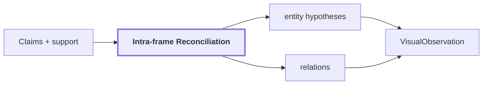

O `diagnostics.json` torna visível quanto trabalho contextual ocorreu neste frame:

```text
reconciled_regions: 30
entity_groups: 5
regions_in_entity_groups: 31
supported_entity_groups: 3
distinct_raw_labels: 8
distinct_canonical_concepts: 7

semantic_relations:
  covers: 4
  part_of: 4

geometric_relations: 210
```

A soma das `210` relações geométricas com `8` relações semânticas resulta nas `218` relações reportadas no `summary.md` para `corridor-02-000`.

Esses grupos continuam sendo hipóteses intra-frame. Eles não devem ser interpretados como tracking de uma entidade física persistente entre frames.

## 11. VisualObservation real

### Onde esta etapa está na pipeline

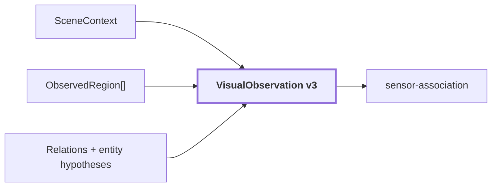

O artifact completo está em [`observation.json`](../modules/visual-perception/benchmarks/results/samples/20260910T115810Z/frames/corridor-02-000/observation.json). Para este frame, ele reúne:

```text
schema_version: 3
coordinate_convention: top-left-origin,half-open-xyxy
image: 640 x 480
regions: 40
scene_type: corridor
relations: 218
interpretation_failures: 0
audit: pass, com 42 warnings
```

A imagem abaixo permite confrontar a estrutura serializada com o que foi efetivamente rotulado:


O overlay não deve ser lido como verdade final. Ele mostra **o que o pipeline afirmou naquele run**, incluindo possíveis erros de classificação, fragmentação de superfície e hipóteses concorrentes.

## 12. Debug real da associação 2D→3D

### Onde esta etapa está na pipeline

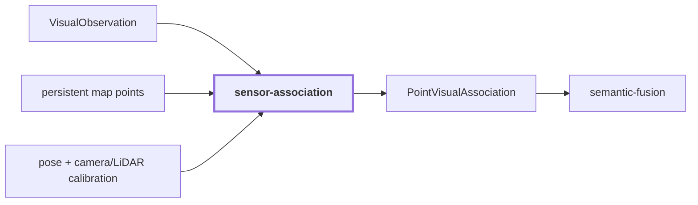

O run visual acima não persiste um `PointVisualAssociation` real para cada linha da mesma forma que persiste `VisualObservation`. Para não fabricar um exemplo, esta seção usa o debug real documentado no `corridor-02` pelo módulo [`sensor-association`](../modules/sensor-association/README.md).

O comportamento observado que motivou `associate_map_points` foi:

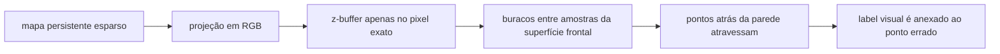

No `corridor-02`, isso aparecia como classificação **através das paredes**, inclusive pontos na altura da parede recebendo o label `ceiling`.

A correção documentada foi mudar a oclusão do mapa persistente para células de pixels com consulta da vizinhança `3x3`, comparando profundidade no eixo óptico. A política é deliberadamente conservadora: perder alguns pontos na borda de uma descontinuidade é preferível a contaminar o fundo com o contexto da superfície frontal.

Outro debug real veio da estratégia anterior de colorir o scan e anexá-lo ao mapa. Ela criava duas amostragens próximas da mesma superfície, uma do mapa e outra do scan, produzindo os pontos cinzas "fantasmas" ao lado dos pontos contextualizados. A associação ancorada no mapa elimina essa duplicação conceitual: a evidência passa a ser anexada à geometria persistente autoritativa.

## 13. Diagnóstico real da fusão semântica

### Onde esta etapa está na pipeline

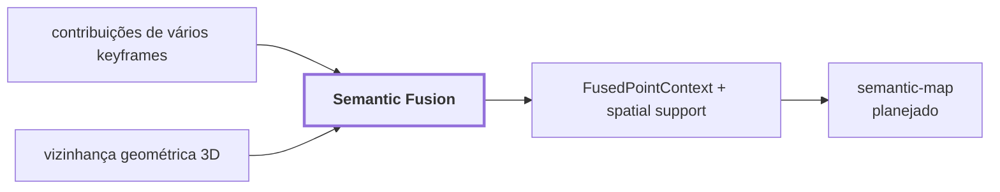

O módulo [`semantic-fusion`](../modules/semantic-fusion/README.md) documenta uma medição real sobre um trecho de `30 s` do `corridor-02`. O subconjunto de erro conhecido era formado por pontos `ceiling` abaixo da altura onde estavam os `ceiling tiles`.

| Sinal | Pontos marcados | Erros alcançados | Razão de concentração |
| --- | ---: | ---: | ---: |
| suporte espacial `< 34%` | 20,3% | 35,2% | 1,73 |
| concordância entre keyframes `< 50%` | 12,3% | 34,4% | 2,80 |
| ambos abaixo de `50%` | **9,7%** | **33,2%** | **3,42** |

A combinação dos dois sinais é mais precisa porque eles medem falhas diferentes:

```text
fronteira geométrica legítima
    suporte espacial pode ser baixo
    mas keyframes ainda concordam

vazamento semântico/projeção errada
    suporte espacial baixo
    + keyframes frequentemente discordam
```

Isso é mais informativo que simplesmente aceitar o último label observado no ponto.

## 14. Mapa de artifacts

### Onde esta etapa está na pipeline

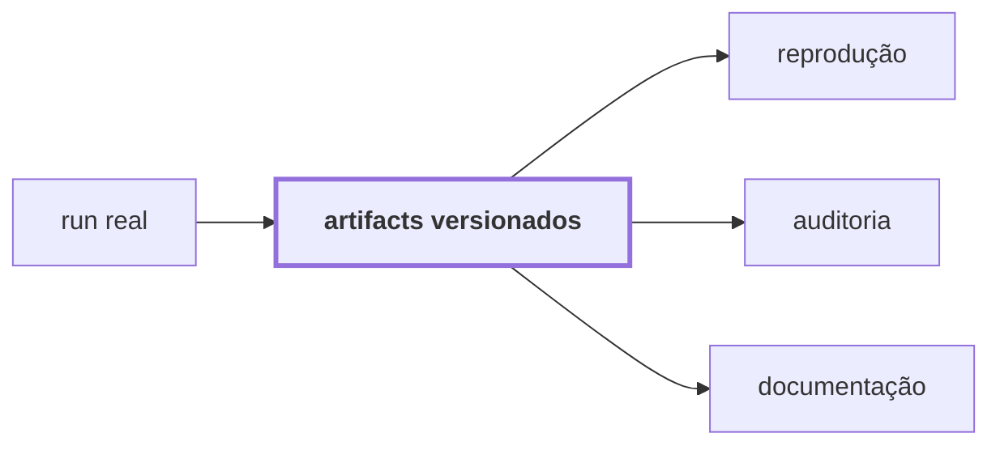

| Artifact | O que representa |
| --- | --- |
| [`raw.png`](../modules/visual-perception/benchmarks/results/samples/20260910T115810Z/frames/corridor-02-000/raw.png) | pixels de entrada do frame |
| [`proposals.png`](../modules/visual-perception/benchmarks/results/samples/20260910T115810Z/frames/corridor-02-000/proposals.png) | proposals produzidas pelo region discovery |
| [`valid-area-mask.png`](../modules/visual-perception/benchmarks/results/samples/20260910T115810Z/frames/corridor-02-000/valid-area-mask.png) | suporte fisheye considerado válido |
| [`ego-mask.png`](../modules/visual-perception/benchmarks/results/samples/20260910T115810Z/frames/corridor-02-000/ego-mask.png) | área ocupada pelo próprio veículo |
| [`regions-masks.png`](../modules/visual-perception/benchmarks/results/samples/20260910T115810Z/frames/corridor-02-000/regions-masks.png) | máscaras das regiões canônicas |
| [`regions-boxes.png`](../modules/visual-perception/benchmarks/results/samples/20260910T115810Z/frames/corridor-02-000/regions-boxes.png) | bounding boxes das regiões canônicas |
| [`regions-labels.png`](../modules/visual-perception/benchmarks/results/samples/20260910T115810Z/frames/corridor-02-000/regions-labels.png) | labels produzidos pelo pipeline |
| [`regions-overlay.png`](../modules/visual-perception/benchmarks/results/samples/20260910T115810Z/frames/corridor-02-000/regions-overlay.png) | composição visual para inspeção humana |
| [`observation.json`](../modules/visual-perception/benchmarks/results/samples/20260910T115810Z/frames/corridor-02-000/observation.json) | `VisualObservation` serializada, claims, relations e provenance |
| [`diagnostics.json`](../modules/visual-perception/benchmarks/results/samples/20260910T115810Z/frames/corridor-02-000/diagnostics.json) | métricas e contagens diagnósticas do frame |
| [`embeddings.npz`](../modules/visual-perception/benchmarks/results/samples/20260910T115810Z/frames/corridor-02-000/embeddings.npz) | vetores pesados referenciados pelo JSON |
| [`manifest.json`](../modules/visual-perception/benchmarks/results/samples/20260910T115810Z/manifest.json) | configuração, modelos, fingerprint, lifecycle e provenance do run |

## 15. O que ainda é ilustrativo ou planejado

### Onde esta etapa está na pipeline

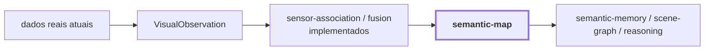

Esta página substitui exemplos artificiais por dados reais onde há artifacts auditáveis disponíveis. Ela deliberadamente **não inventa** um `map_point_92814`, uma projeção `(354, 221)` ou uma entidade `entity_42` como se fossem outputs medidos deste run.

Hoje podemos mostrar com artifacts reais:

```text
RGB
-> proposals
-> regiões canônicas
-> evidência DINOv2
-> evidência CLIP
-> scene context
-> SemanticClaim
-> hypothesis support
-> reconciliation / relations
-> VisualObservation
```

Para a parte 3D, existem implementação e diagnósticos reais de `sensor-association` e `semantic-fusion`, inclusive os bugs medidos no `corridor-02`, mas ainda não há nesta referência visual um único artifact versionado que una a mesma `region-2c84165423b25fc3` a um ponto 3D específico e depois a uma entidade persistente de `semantic-map`.

Quando esse artifact existir, esta página deve continuar o mesmo fio condutor em vez de criar um exemplo fictício. O próximo exemplo deve preservar explicitamente:

```text
observation_id
region_id
GeometryReference
pixel projetado
calibration_id
AssociationStatus
SemanticContribution[]
FusedPointContext
provenance completa
```

Até lá, [`end-to-end-pipeline.md`](./end-to-end-pipeline.md) continua sendo a explicação conceitual completa, e esta página é a camada de evidência concreta do que já foi medido e persistido.
