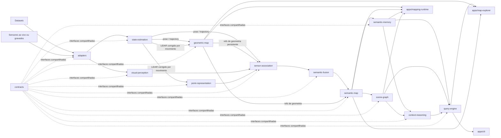
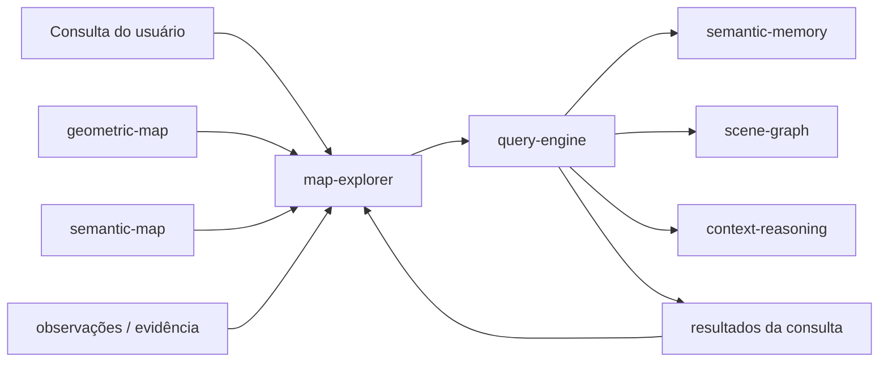

# Fluxo do Sistema

Este documento mostra o fluxo de nível de repositório entre módulos e aplicações. Ele representa intencionalmente composição e movimento de dados entre fronteiras, não algoritmos internos.

Setas entre módulos representam troca através de contracts compatíveis, não dependências diretas de implementação.



## Fluxo de mapeamento

O fluxo de mapeamento converte observações de sensor ou dataset em estado geométrico, semântico e contextual persistente.

```text
observações de entrada
    -> state estimation
    -> geometria persistente
    -> representações aprendidas e visuais
    -> sensor association
    -> semantic fusion
    -> semantic map
    -> semantic memory / scene graph
    -> raciocínio contextual e índices
```

`mapping-runtime` é o ponto de entrada de composição para esse fluxo. Ele não substitui nenhum módulo e não possui seus algoritmos.

## Fluxo de consulta e exploração

Depois que um mapa existe, a interação em tempo de consulta não exige reexecutar a state estimation. Aplicações consomem o estado de mapa persistente e as interfaces públicas de consulta.



Um resultado pode identificar uma entidade, região, posição, referência de geometria, relação, observação, item de evidência ou registro de proveniência. A aplicação pode então focar a região 3D correspondente e expor as observações que sustentam o resultado.

## Fluxo de persistência

A persistência é uma fronteira transversal (cross-cutting), não um estágio de pesquisa sequencial. Contracts públicos de armazenamento permitem que estado de mapa, observações, evidência e índices sobrevivam ao término do processo e sejam reabertos por outra aplicação.

Formatos concretos de armazenamento e tecnologias de banco de dados permanecem adapters.

## Interpretação

`evaluation/`, `experiments/` e `tests/` são intencionalmente não representados como estágios sequenciais. Eles são consumidores transversais que podem exercitar módulos individuais ou composições completas independentemente.

Um workflow pode substituir, isolar ou omitir estágios quando seus contracts permitirem essa composição. Poses de ground-truth fornecidas por dataset, por exemplo, podem substituir um state estimator ao vivo em um experimento sem alterar os contracts públicos downstream.
