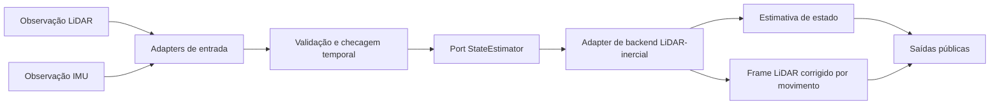
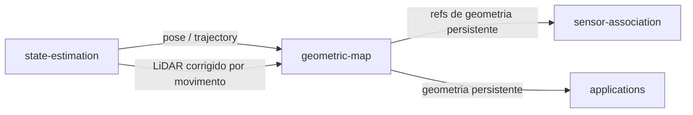
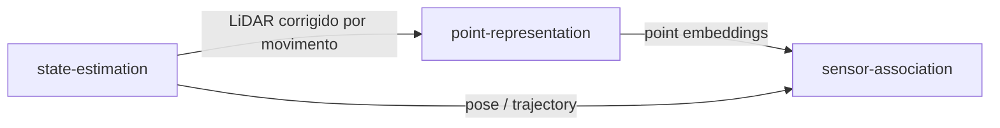
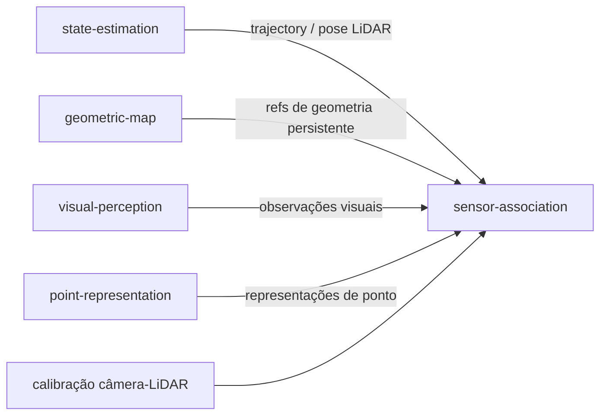

# Arquitetura do State Estimation

`state-estimation` é a fronteira geométrica de movimento entre observações brutas de LiDAR/IMU e o processamento downstream de mapeamento 3D persistente e semântico.

## Fluxo interno



O adapter de backend é substituível. FAST-LIO é o alvo inicial de integração concreta, mas nenhum consumidor downstream deve depender de mensagens, estruturas de configuração, tipos ROS ou estado interno específicos do FAST-LIO.

## Saídas públicas

Espera-se que o módulo exponha informação compatível com o contract, conceitualmente equivalente a:

```text
StateEstimate
├── timestamp
├── pose
├── velocity?
├── covariance?
├── coordinate_frame
├── validity
└── provenance

MotionCorrectedLiDARFrame
├── timestamp
├── points
├── coordinate_frame
├── pose_reference
└── provenance
```

Os schemas exatos são definidos por issues de implementação, não por este documento.

## Fronteira com geometric-map

`geometric-map` possui a geometria persistente do mundo. Ele consome informação de pose/trajectory compatível com o contract e observações LiDAR corrigidas por movimento vindas de `state-estimation`.



`state-estimation`, portanto, não possui a reconstrução persistente, o chunking de mapa, o armazenamento de mapa, a indexação espacial ou a visualização.

## Fronteira com point-representation

`point-representation` consome geometria de pontos e produz point embeddings aprendidos. Não deve possuir odometria, estimação de pose, fusão de IMU, deskewing de scan, estimação de trajectory, ou ownership do mapa geométrico persistente.



## Fronteira com sensor-association

`state-estimation` pode fornecer a trajectory da plataforma e a informação de pose do lado LiDAR necessárias para o alinhamento multimodal. Ele não calibra a câmera em relação ao LiDAR e não gera correspondências ponto-para-pixel ou ponto-para-feature.



## Isolamento do backend externo

A integração inicial do backend deve ser isolada em código de infrastructure. O adapter é responsável por traduzir entradas e saídas de runtime externas para os contracts do módulo.

Preocupações específicas de backend incluem:

- tipos de mensagem de middleware;
- ciclo de vida do processo;
- nomes de tópico de sensor;
- extrinsics LiDAR-IMU;
- arquivos de configuração do backend;
- diagnósticos de runtime;
- instalação de dependências externas.

Nenhuma dessas preocupações deve vazar para o domain ou para módulos downstream.
