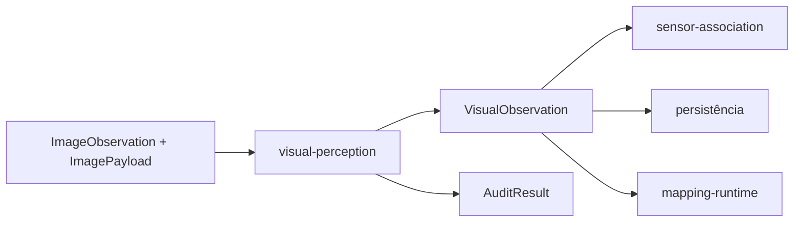
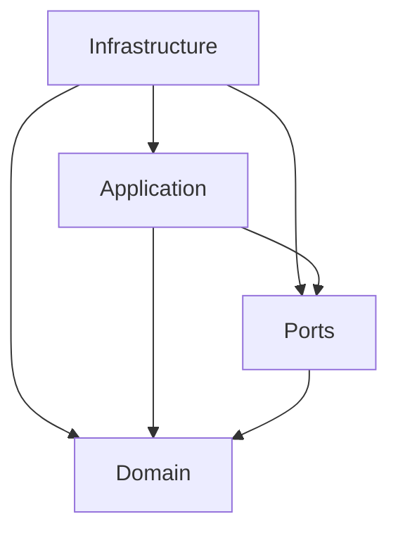

# Arquitetura

Este documento explica **onde cada responsabilidade pertence, como as dependências devem
fluir e em quais arquivos uma mudança arquitetural deve começar**.

Para a ordem concreta dos estágios, consulte [pipelines.md](pipelines.md). Para os tipos
que atravessam a API pública, consulte [api-contracts.md](api-contracts.md).

## O módulo em 30 segundos

`visual-perception` transforma uma observação RGB canônica em evidência visual 2D
estruturada, semântica e auditável.



O módulo é responsável por:

- geometria visual 2D, masks, boxes e regiões;
- features densas e embeddings por região;
- embeddings alinhados à linguagem;
- contexto global da cena;
- claims semânticos de região, e o suporte independente que os sustenta ou contradiz;
- reconciliação intra-frame de conceitos e de superfícies fragmentadas;
- relações candidatas no plano da imagem, geométricas e semânticas;
- auditoria e proveniência da evidência produzida.

Uma linha divisória interna organiza tudo isso: **antes do merge de regiões o módulo
decide o que existe; depois dele, apenas o que aquilo significa**. Nenhum estágio
semântico altera mask, box, identidade ou ordem de região.

O módulo termina no domínio visual 2D. Ele **não** calibra sensores, estima pose,
projeta pixels no LiDAR, confirma relações em 3D, funde observações temporais em um mapa
persistente nem constrói scene graphs.

## Fronteira do módulo

```text
adapters / aplicação
        |
        v
ImageObservation + ImagePayload
        |
        v
visual-perception
        |
        +--> VisualObservation
        +--> AuditResult
        +--> RegionInterpretationFailure[]
        |
        v
sensor-association / persistência / mapping-runtime
```

Dados de origem, como dataset, sequência, sensor, timestamp, frame e artifact, chegam ao
módulo por contracts compartilhados. Não crie versões locais desses conceitos dentro de
`visual-perception`.

A entrada de datasets, ROS bags ou outras fontes pertence aos adapters. A associação
entre evidência 2D e geometria 3D pertence a `sensor-association`. Fusão temporal,
representação de mapa, memória, scene graph e reasoning pertencem aos módulos downstream.

## Organização interna

```text
src/visual_perception/
├── domain/           # conceitos, tipos e invariantes do domínio visual
├── ports/            # interfaces mínimas para capacidades substituíveis
├── application/      # regras, transformações e orquestração do pipeline
├── infrastructure/
│   ├── adapters/     # backends reais e isolamento de bibliotecas externas
│   ├── fakes/        # implementações determinísticas sem GPU
│   ├── integration/  # fronteiras com outros módulos e runtimes
│   └── serialization.py
└── config.py          # configuração validada e reproduzível
```

### `domain/`

É dono dos conceitos que precisam continuar verdadeiros independentemente de backend ou
runtime, como:

- geometria de imagem;
- regiões e propostas;
- embeddings e referências;
- claims semânticos;
- relações candidatas;
- auditoria;
- erros e proveniência.

Se uma regra precisa ser verdadeira mesmo usando fakes, outro checkpoint ou outro
runtime, ela provavelmente pertence ao domínio.

### `ports/`

Define as capacidades substituíveis usadas pela aplicação:

- `RegionDiscoverer`;
- `DenseFeatureExtractor`;
- `LanguageAlignedEncoder`;
- `MultimodalReasoner`.

Um port descreve **o que o pipeline precisa**, não como uma biblioteca específica faz a
inferência. Tensors, classes de framework e exceptions específicas do backend não devem
atravessar essa fronteira.

### `application/`

Contém as transformações e políticas do pipeline. Exemplos:

- tiling;
- merge de regiões;
- pooling de features;
- semântica de regiões;
- contexto de cena;
- suporte de hipótese por evidência independente;
- calibração e abstenção;
- refinamento seletivo dirigido por razão;
- reconciliação contextual intra-frame;
- relações candidatas, geométricas e semânticas;
- fusão multi-fonte;
- auditoria;
- cache e lifecycle.

A aplicação depende de `domain/` e `ports/`. Ela não deve selecionar checkpoints nem
importar diretamente runtimes de terceiros.

### `infrastructure/`

Conecta o módulo ao mundo externo.

`infrastructure/adapters/` contém implementações concretas dos ports. A factory
[`create_perception_ports`](../src/visual_perception/infrastructure/adapters/factory.py)
é o único ponto de composição entre `ModuleConfig` e backends concretos.

`infrastructure/integration/` contém fronteiras cujo tipo de entrada ou saída pertence a
outro módulo, como adapters RGB, mapping runtime, persistência e `sensor-association`.

## Direção das dependências

A regra de dependência é simples:



Na prática:

- `domain/` não conhece adapters, frameworks de ML ou integração;
- `ports/` não conhece implementações concretas;
- `application/` conhece contracts, não bibliotecas específicas;
- `infrastructure/` pode conhecer bibliotecas externas e traduzir seus resultados para
  os contracts do módulo;
- consumidores externos devem depender da API pública de `visual_perception`, não de
  detalhes internos.

## Quero adicionar X: onde isso pertence?

| Quero adicionar ou alterar | Local principal | Regra |
| --- | --- | --- |
| Novo conceito visual ou nova invariável | `domain/` | Deve continuar válido independentemente do backend. |
| Nova capacidade substituível de inferência | `ports/` | Crie um contract mínimo antes da implementação concreta. |
| Novo algoritmo entre estágios existentes | `application/` | Deve operar sobre contracts do módulo. |
| Nova política de merge, pooling, refinamento ou auditoria | `application/` | Não acople a um checkpoint específico. |
| Novo modelo para uma capability existente | `infrastructure/adapters/` | Implemente o port existente. |
| Trocar checkpoint ou backend selecionado | `config.py`, `application/execution_profile.py`, `infrastructure/adapters/factory.py` | Não altere `pipeline.py` apenas para trocar modelo. |
| Integração com outro módulo | `infrastructure/integration/` | Mantenha tipos externos fora de `domain/` e `application/`. |
| Novo campo público em `VisualObservation` | `domain/` + serialização + testes | Trate como mudança de contract e avalie versionamento. |
| Novo estágio canônico | `application/pipeline.py` | Só quando a capacidade realmente altera o fluxo do módulo. |
| Nova configuração de algoritmo | `config.py` | Deve participar de fingerprint quando afeta resultados. |

## Exemplos de mudanças corretas

### Trocar SAM por outro segmentador

Não crie um novo pipeline. Implemente `RegionDiscoverer`, adicione a composição do
adapter e exponha a seleção por configuração.

```text
novo backend
    -> infrastructure/adapters/
    -> RegionDiscoverer
    -> factory.py
    -> config.py
    -> benchmark/testes
```

### Alterar como masks viram embeddings

A responsabilidade é uma transformação do pipeline e começa em
[`application/pooling.py`](../src/visual_perception/application/pooling.py), não no
adapter de DINO.

### Consumir `VisualObservation` em outro módulo

A adaptação pertence à fronteira de integração. Não faça o domínio de
`visual-perception` importar tipos do consumidor.

## Mudanças arquiteturalmente erradas

Evite:

- selecionar modelos ou checkpoints dentro de `pipeline.py`;
- importar `torch`, `transformers` ou tipos equivalentes em contracts públicos;
- criar uma segunda representação de timestamp, frame ou artifact;
- transformar uma `RegionProposal` diretamente em entidade semântica 3D;
- tratar uma `CandidateRelation` como relação espacial confirmada;
- armazenar vetores grandes diretamente em `VisualObservation` quando existe uma
  referência estável para o artifact;
- introduzir uma nova estratégia de pipeline apenas para trocar uma implementação de
  port.

## Invariantes de coordenadas

Toda máscara, box e transform obedece à convenção
`top-left-origin,half-open-xyxy`, registrada em cada `VisualObservation`:

- `(0, 0)` é o pixel superior esquerdo;
- `x` cresce para a direita e `y` para baixo;
- `BoundingBox` usa `(x_min, y_min, x_max, y_max)` com mínimo inclusivo e máximo
  exclusivo;
- `Mask` é booleana, tem shape `(height, width)` e usa a resolução integral da imagem;
- transformações entre tile e imagem global passam por `CoordinateTransform`.

Essas regras são validadas por
[`domain/geometry.py`](../src/visual_perception/domain/geometry.py) e pela construção de
[`VisualObservation`](../src/visual_perception/domain/visual_observation.py).

Offsets ou escalas aplicados manualmente por consumidores quebram a convenção canônica.

## Invariantes semânticos

Uma proposta geométrica não é uma entidade do mundo:

```text
RegionProposal
    = evidência geométrica candidata

ObservedRegion
    = região 2D consolidada

SemanticClaim
    = interpretação anexada à região
```

Além disso:

- `geometric_confidence` mede a qualidade/confiança da geometria, não a certeza do label;
- `SemanticClaim.confidence=None` significa ausência de score, não confiança zero;
- claims conflitantes podem coexistir e devem permanecer auditáveis;
- uma relação geométrica 2D continua sendo candidata até validação downstream;
- `AuditResult` avalia validade e inconsistências da observação, não transforma uma
  hipótese semântica em verdade 3D.

Consulte [api-contracts.md](api-contracts.md) para a semântica detalhada desses tipos.

## Embeddings e artifacts

Embeddings visuais e alinhados à linguagem ficam fora do payload canônico. A observação
armazena referências estáveis para permitir ciclo de vida, persistência e reutilização
independentes do JSON principal.

```text
VisualObservation
    |
    +--> geometry / claims / relations
    |
    +--> visual_embedding_ref ------> embedding artifact
    |
    +--> language_embedding_ref ----> embedding artifact
```

Consulte [artifacts.md](artifacts.md) para serialização e persistência.

## Pontos de extensão

Antes de criar um novo componente, verifique se a mudança cabe em uma extensão existente:

| Necessidade | Ponto de extensão |
| --- | --- |
| descobrir regiões | `RegionDiscoverer` |
| produzir feature map denso | `DenseFeatureExtractor` |
| produzir embedding imagem-texto | `LanguageAlignedEncoder` |
| interpretar cena ou região | `MultimodalReasoner` |
| transformar evidências entre estágios | `application/` |
| integrar com sistema externo | `infrastructure/integration/` |

A criação de um novo port deve ser exceção. Ela se justifica quando existe uma nova
capacidade independente, substituível e necessária ao pipeline, não apenas outra forma de
implementar uma capacidade já existente.

## Testes que protegem a arquitetura

Ao alterar uma fronteira, verifique pelo menos:

- testes do contract ou domínio afetado;
- testes unitários da transformação em `application/`;
- fake equivalente quando houver port novo;
- testes do adapter real quando houver implementação concreta;
- serialização quando um tipo público mudar;
- testes de integração quando outro módulo passar a participar da fronteira;
- benchmark quando a alteração muda qualidade, latência ou consumo de memória.

O índice operacional por comportamento e arquivo está em
[pipelines.md](pipelines.md#quero-mudar-x-em-qual-arquivo-mexo).