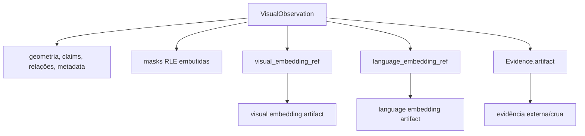
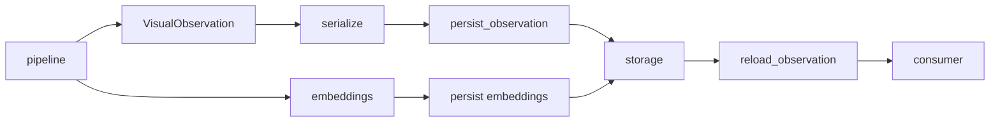

# Artifacts

Este documento explica **o que é persistido, o que fica referenciado, como os artifacts
se relacionam e o que deve invalidar ou versionar cada representação**.

## Visão geral

`visual-perception` produz uma `VisualObservation` canônica, mas nem todo dado pesado
fica embutido nela.



A regra é preservar no payload canônico aquilo que define a observação e referenciar
artifacts pesados ou com ciclo de vida independente.

## Tipos de artifact

| Artifact | Papel | Persistência | Identidade |
| --- | --- | --- | --- |
| `VisualObservation` serializada | produto canônico do módulo | `persist_observation` | schema + conteúdo/proveniência |
| mask de região | geometria necessária para interpretar a região | embutida como RLE | parte da observação |
| visual embedding | representação pooled da região | separado | `visual_embedding_ref` |
| language embedding | representação alinhada à linguagem | separado | `language_embedding_ref` |
| `Evidence.artifact` | evidência externa/crua produzida ou usada por modelo | separado/referenciado | `SourceArtifactReference` |
| cache de estágio | otimização intermediária de execução | diretório de cache | `(stage_name, fingerprint)` |
| sample de benchmark | inspeção e rastreabilidade experimental | `benchmarks/results/` | run id + manifest |

## Serialização canônica

[`infrastructure/serialization.py`](../src/visual_perception/infrastructure/serialization.py)
serializa `VisualObservation` para um dict JSON-able e faz o caminho inverso.

O round-trip deve preservar a semântica da observação.

### Masks

Masks são embutidas usando run-length encoding booleano.

Motivação:

- a geometria da região é necessária para interpretar a própria observação;
- RLE mantém a representação autocontida;
- não exige um armazenamento externo apenas para reconstruir a mask.

### Embeddings

Vetores de embedding não ficam dentro do payload canônico.

```text
ObservedRegion
    +--> visual_embedding_ref ------> vetor visual
    +--> language_embedding_ref ----> vetor language-aligned
```

Isso evita transformar toda `VisualObservation` em um payload grande e permite que
consumidores carreguem embeddings somente quando necessário.

### Evidência externa

`Evidence.artifact` usa `SourceArtifactReference` para apontar para evidência que não
precisa ser copiada para o JSON canônico.

A referência deve preservar a identidade do artifact original. Não substitua a URI ou
referência por paths locais ad hoc durante a serialização.

## Schema e compatibilidade

Cada payload carrega:

- `schema_version`;
- `coordinate_convention`.

Uma versão não suportada deve falhar com `UnsupportedSchemaVersionError`, em vez de ser
interpretada silenciosamente sob regras novas.

Ao alterar `VisualObservation`, pergunte:

```text
a mudança é apenas aditiva e retrocompatível?
    -> possivelmente manter schema

a mudança altera significado, formato ou invariantes?
    -> avaliar bump de schema
```

Mudanças em máscaras, coordenadas, semântica de confidence ou referências de embedding
merecem atenção especial porque podem produzir payloads sintaticamente válidos com
interpretação errada se o schema não refletir a incompatibilidade.

## Persistência

A fronteira está em:

[`infrastructure/integration/persistence_integration.py`](../src/visual_perception/infrastructure/integration/persistence_integration.py)

Ela define `EvidencePersistencePort`, com uma interface opaca de armazenamento:

```text
put(id, payload) -> reference
get(reference)   -> payload
```

O módulo não conhece detalhes como:

- filesystem;
- bucket;
- banco;
- cliente remoto;
- path físico de armazenamento.

Esses detalhes pertencem à implementação concreta da persistência.

## Operações de persistência

### Observação completa

```text
VisualObservation
    -> persist_observation
    -> EvidencePersistencePort
    -> reference

reference
    -> reload_observation
    -> VisualObservation
```

O round-trip deve preservar a observação canônica.

### Embeddings visuais

```text
pooled visual embeddings
    -> persist_visual_embeddings
    -> referências estáveis
    -> ObservedRegion.visual_embedding_ref
```

### Embeddings alinhados à linguagem

```text
language embeddings
    -> persist_language_embeddings
    -> referências estáveis
    -> ObservedRegion.language_embedding_ref
```

Os testes usam
`infrastructure/fakes/fake_evidence_store.InMemoryEvidenceStore` para validar essa
fronteira sem depender de um backend externo.

## Cache de estágio

`application/cache.StageCache` não usa o mesmo contract da persistência canônica.

```text
StageCache
    -> cache de execução
    -> descartável/recomputável
    -> indexado por fingerprint

VisualObservation persistida
    -> produto canônico
    -> usada entre processos/consumidores
    -> versionada por schema
```

O cache grava um registro JSON por `(stage_name, fingerprint)` sob um diretório escolhido
pelo chamador.

Consulte [execution.md](execution.md#cache-de-estágio) para regras de invalidação.

## Fingerprints

Artifacts intermediários que dependem de configuração devem estar ligados ao fingerprint
que representa aquela execução ou estágio.

Exemplos de alterações que devem invalidar resultados dependentes:

- troca de checkpoint;
- mudança de threshold;
- mudança de prompt version;
- alteração de tiling;
- alteração da regra de merge;
- mudança na implementação que altera a saída.

Um artifact sem ligação clara com sua configuração experimental perde valor de
rastreabilidade.

## Artifacts de benchmark e validação

A validação end-to-end gera samples em:

```text
benchmarks/results/samples/<run-id>/
```

Este documento é a **fonte única** do layout: `execution.md` e `model-backends.md` linkam
para cá em vez de repetir a árvore.

```text
benchmarks/results/samples/<run-id>/
├── manifest.json
└── frames/<frame-id>/
    ├── observation.json      VisualObservation serializada
    ├── diagnostics.json      resumo estatístico do frame
    ├── embeddings.npz        os vetores por região que os slots referenciam
    ├── raw.png               pixels de origem, nunca modificados
    ├── proposals.png         masks + boxes antes do merge, sem semântica
    ├── regions-masks.png     só as masks finais
    ├── regions-boxes.png     só as boxes finais
    ├── regions-labels.png    labels no centróide, sem caixas
    ├── regions-overlay.png   masks + boxes + labels
    ├── ego-mask.png          silhueta do rig, quando a sequência a declara
    ├── valid-area-mask.png   área útil do sensor, quando declarada
    └── pipeline-input.png    só quando difere de raw.png
```

Uma camada por pergunta. Um overlay único com dezenas de caixas não distingue "o SAM
propôs errado" de "o merge deveria ter unido" de "a máscara está certa e só a caixa parece
larga"; camadas separadas distinguem.

Duas regras que o layout codifica:

- **os pixels de origem são imutáveis.** `raw.png` é o frame como veio do dataset.
  `pipeline-input.png` só existe quando algum pré-processamento alterou a entrada, e
  `diagnostics.json` afirma explicitamente se os dois são idênticos. Desde a #202 nenhuma
  opção altera os pixels: as máscaras de exclusão são geometria declarada em
  `benchmarks/sequence-masks/<sequence>.json`, aplicadas na filtragem de proposals e
  persistidas como artifacts;
- **os dois eixos de confiança são nomeados.** O overlay escreve `sem=0.90 geom=0.97`, com
  `sem=?` quando o produtor não pontuou. Um número solto ao lado de um label era lido como
  certeza semântica quando descrevia a qualidade da máscara.

As views por região (foreground mask-aware, tight crop, contextual crop) **não** são
persistidas pelo run: são função pura da observação, dos pixels e da config, todos já
salvos. [`benchmarks/inspect_region.py`](../benchmarks/inspect_region.py) as materializa
sob demanda para a região investigada, sem GPU e sem re-executar o SAM — portanto sem o
jitter dele. Persistir as três para cada uma de dezenas de regiões por frame produziria
milhares de arquivos versionados que quase nunca seriam abertos.

`manifest.json` grava `frame_artifact_layout`, de modo que um leitor que espere outro
layout falhe explicitamente em vez de ler o diretório errado em silêncio. A versão atual é
`frames/2`.

O que a `frames/2` acrescentou é `embeddings.npz`, e a razão é uma falha de referência,
não uma conveniência: até a #217 cada `RegionEvidenceSlot` gravava um `artifact_ref` e
**nenhum artifact existia para ele resolver**. Os vetores eram produzidos — 121 chamadas de
encoder por frame na configuração real — e descartados dentro do pipeline. Agora eles saem
no `PipelineResult` e são persistidos num `.npz` comprimido, indexado exatamente pelos
mesmos identificadores que os slots citam. A observação canônica continua sendo
referências-only: nenhum vetor é embutido nela.

### Campos de `diagnostics.json`

`diagnostics.json` responde, sem abrir imagem nenhuma, o que aconteceu entre as proposals
e os labels finais. Os campos que exigem leitura cuidadosa:

| campo | o que afirma |
| --- | --- |
| `region_kinds` | histograma de `RegionKind` (`thing`/`stuff`/`part`/`unknown`) por região. **Não** confundir com `ClaimKind`: até a #202 este campo contava o tipo do *claim* e reportava `[["attribute",130],["label",126]]`, um número sobre a forma da resposta e não sobre a natureza das regiões |
| `label_counts` | histograma do label primário aberto, uma contagem por região |
| `category_counts` | histograma da `category` — a categoria mais estável, distinta do label |
| `semantic_confidence.degenerate` | a distribuição tem mais de um valor a comparar e nenhuma variância. É o caso de `corridor-02-002`, onde o backend informou `0,9` exato nas 60 regiões: o número é preservado como veio, e este campo torna legível que ele não carrega informação |
| `duplicate_label_hypotheses` | regiões que persistem hipóteses de label equivalentes entre si |
| `ego.regions_overlapping_ego` | regiões finais que ainda sobrepõem o rig; o gate exige zero |
| `fisheye.proposals_outside_valid_area` | proposals descartadas por caírem fora da lente; o gate exige zero após a filtragem |
| `rejected_proposals` | histograma dos motivos de descarte, para que `proposal_count - merged_proposal_count` seja explicável |
| `ego_vehicle_mask_applied` | se havia geometria de ego declarada. Significa *filtragem aplicada*, nunca pixels pintados |
| `valid_fisheye_mask` | `applied` quando a sequência declara área válida, `unavailable` quando não |
| `contextual.signal_statuses` | histograma dos desfechos do canal independente sobre as hipóteses primárias. `indistinguishable` conta à parte de propósito: colapsá-lo em "sem suporte" inventaria um veredito que a margem medida não sustenta |
| `contextual.regions_with_unsupported_primary` | regiões cuja hipótese primária é contradita por **todos** os sinais medidos |
| `contextual.regions_with_ambiguous_identity` | regiões em que nenhum sinal medido distingue a primária das concorrentes |
| `contextual.region_kind_contradictions` | regiões cujo conceito e natureza declarados são incompatíveis. A cobertura mudou na #216 (de casamento por string exata de `category` para casamento por núcleo nominal), então esta contagem **não é comparável** com runs anteriores a ela |
| `contextual.distinct_raw_labels` vs `distinct_canonical_concepts` | o primeiro é a métrica contaminada por variação de grafia, preservada para comparabilidade histórica; o segundo é o número que responde "quantas coisas diferentes este frame diz" |
| `contextual.entity_groups` / `regions_in_entity_groups` / `supported_entity_groups` | grupos de mesma superfície propostos, regiões que eles cobrem, e quantos a coerência densa corrobora. Um grupo `unresolved` continua sendo evidência |
| `contextual.semantic_relations` | histograma `(predicado, contagem)` das relações inferidas por modelo, separado de `geometric_relations` |

Esses artifacts têm finalidade diferente da persistência operacional. Eles existem para
inspeção, reprodução e comparação experimental.

## Ciclo de vida



O consumidor decide quando resolver as referências de embedding. Recarregar a observação
não deve exigir carregar todos os vetores automaticamente.

## Quero mudar X: onde mexo?

| Quero alterar | Arquivo principal | Também revisar |
| --- | --- | --- |
| formato JSON da observação | [`serialization.py`](../src/visual_perception/infrastructure/serialization.py) | schema, round-trip e testes |
| estrutura de `VisualObservation` | [`domain/visual_observation.py`](../src/visual_perception/domain/visual_observation.py) | pipeline, serialização e consumidores |
| encoding de mask | `serialization.py` + `domain/geometry.py` | compatibilidade de schema |
| referência de embeddings | `domain/regions.py` | persistência e consumidores |
| backend de persistência | implementação de `EvidencePersistencePort` | não altere contracts públicos sem necessidade |
| regra de cache | [`application/cache.py`](../src/visual_perception/application/cache.py) | fingerprints e execution docs |
| artifact de benchmark | `benchmarks/` | manifest e protocolo experimental |
| schema version | serialização + domain | loaders antigos, testes e migration policy |

## O que não fazer

- embutir tensors ou objetos de framework no JSON canônico;
- transformar path local em contract público de armazenamento;
- reutilizar cache de fingerprint incompatível;
- remover `schema_version` ou `coordinate_convention` do payload;
- persistir embeddings sem referência estável para reconectá-los à região;
- tratar artifacts de benchmark como se fossem o backend operacional de persistência;
- alterar o significado de um campo persistido sem avaliar compatibilidade de schema.

## Checklist para novo artifact

Antes de introduzir um novo artifact, defina:

- quem o produz;
- quem é dono da sua semântica;
- quem o consome;
- se é canônico ou recomputável;
- como é identificado;
- se depende de fingerprint;
- como é versionado;
- como é invalidado;
- como é recarregado;
- quais testes garantem round-trip ou compatibilidade.
