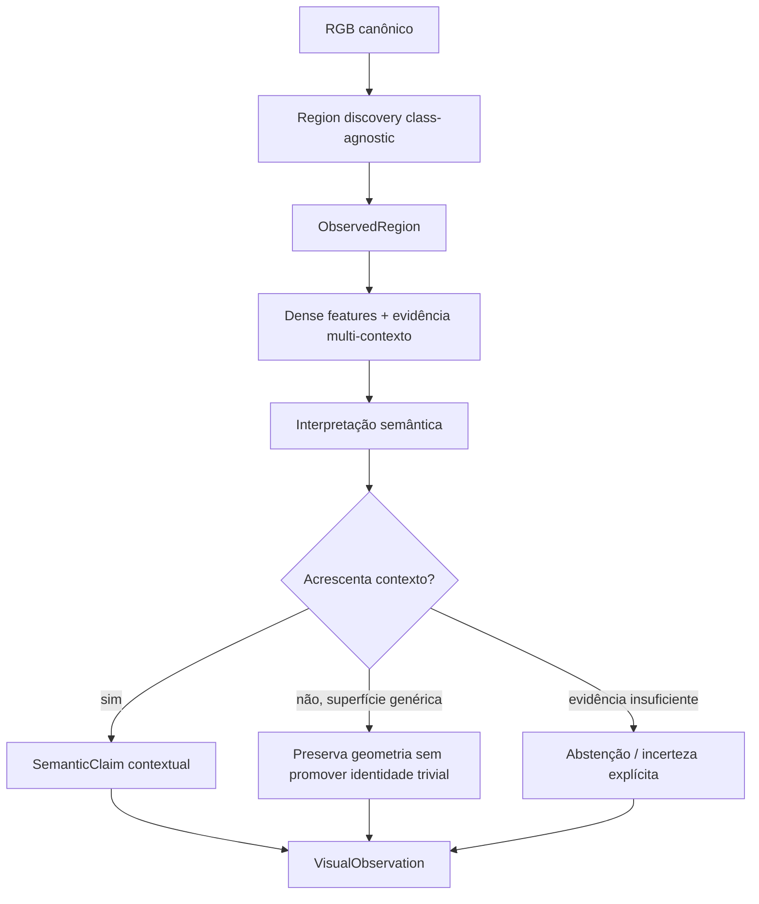

# Política de semântica contextual

Este documento define **qual semântica o `visual-perception` deve considerar útil para o
mapa contextual** e, principalmente, qual semântica ele deve deixar de promover.

A política parte de uma distinção simples: **geometria visual não é contexto semântico**.
Uma parede pode ocupar metade da imagem e ser uma região geométrica válida sem acrescentar
informação contextual relevante ao mapa. Já uma rachadura nessa parede, uma pichação, uma
placa, uma mancha de umidade ou um dano estrutural acrescentam informação que deve
sobreviver até os módulos 3D.

> **Status:** política normativa aceita para a próxima revisão semântica do módulo.
> A implementação em `main` ainda não está completamente alinhada. O prompt atual de
> região ainda declara que uma superfície simples (`wall`, `floor`, `ceiling`) é uma
> resposta válida. A seção [Estado de adoção](#estado-de-adoção) registra essa diferença
> explicitamente para que a documentação não seja confundida com comportamento já
> implementado.

## Objetivo

`visual-perception` não é um segmentador estrutural denso de ambientes internos. Seu
objetivo é produzir **evidência visual 2D contextual, aberta a vocabulário, auditável e
geometricamente localizada** para alimentar:

```text
visual-perception
    -> sensor-association
    -> semantic-fusion
    -> semantic-map
    -> semantic-memory
    -> scene-graph
    -> context-reasoning
```

A pergunta que guia a interpretação de uma região deixa de ser apenas:

> "o que ocupa estes pixels?"

E passa a ser:

> "o que existe nestes pixels que acrescenta informação útil ao entendimento contextual
> do ambiente?"

Isso não significa descartar geometria. Significa impedir que geometria estrutural
trivial seja confundida com o produto semântico do módulo.

## Separação fundamental: região, suporte e significado

O pipeline já possui a separação necessária entre geometria e semântica:

```text
RegionProposal
    = hipótese geométrica class-agnostic

ObservedRegion
    = região 2D consolidada, com mask e bounding box

SemanticClaim
    = interpretação semântica anexada à evidência visual
```

A nova política atua **depois da descoberta geométrica**. SAM pode continuar encontrando
paredes, piso, teto e grandes superfícies. O que muda é a promoção semântica dessas regiões.



Nenhuma decisão semântica deve alterar mask, box, identidade ou ordem da região. A
invariante arquitetural continua sendo: **depois do merge, estágios semânticos interpretam
a geometria; eles não a reescrevem**.

## Superfícies estruturais genéricas não são contexto final

As seguintes identidades, quando aparecem sozinhas e sem outra evidência contextual, não
devem ser promovidas como resultado semântico final:

- `wall`, `plain wall`, `surface`;
- `floor`, `flooring`, `ground`;
- `ceiling`, `plain ceiling`;
- variações cuja única informação nova seja material ou aparência genérica da superfície,
  quando isso não for relevante para uma condição, risco ou elemento contextual.

O motivo não é que essas estruturas não existam. Elas existem geometricamente e podem ser
úteis para reconstrução, localização, navegação e relações espaciais. O problema é outro:
**repetir que uma parede é uma parede consome capacidade semântica, domina a distribuição
de labels e pode contaminar o mapa com informação de baixo valor**.

A geometria dessas superfícies deve ser tratada pelos módulos geométricos e pela associação
2D→3D. `visual-perception` só deve promovê-las semanticamente quando houver algo
contextualmente relevante nelas.

## O que deve ser promovido

### Entidades e elementos distinguíveis

Objetos, aberturas e elementos físicos continuam sendo candidatos semânticos normais:

- portas, janelas e passagens;
- placas, cartazes e sinalização;
- extintores, caixas, pallets e mobiliário;
- cabos, tubulações, corrimãos e fixtures;
- pessoas, veículos, vegetação e outros elementos relevantes ao cenário;
- obstáculos ou bloqueios localizáveis.

A regra não é "ignorar estruturas". Uma porta continua sendo uma entidade útil, mesmo
quando está embutida numa parede.

### Evidência contextual apoiada em superfície

Uma superfície passa a ser semanticamente relevante quando carrega uma observação que
muda a interpretação do ambiente. Exemplos:

- pichação, desenho, escrita, texto, símbolo ou marcação;
- placa ou aviso afixado;
- rachadura, fratura, fissura, buraco ou deformação;
- dano estrutural, desplacamento, material exposto ou armadura exposta;
- tinta descascada, corrosão, ferrugem ou deterioração;
- umidade, infiltração, mancha, mofo ou contaminação visível;
- fuligem, queimadura ou evidência de incêndio;
- água, óleo ou outra condição de risco sobre o piso;
- fita, pintura ou marcação de perigo;
- abertura, passagem bloqueada ou obstrução associada à estrutura.

Nesses casos, o **conteúdo contextual** é o conceito principal. A superfície é o suporte
físico, não o label que deve dominar a observação.

## Regra de rotulagem

A interpretação deve preferir o conceito informativo mais localizado que a evidência
visual sustenta.

| Evidência observada | Saída desejada | Saída a evitar |
| --- | --- | --- |
| parede lisa sem particularidade | nenhuma identidade contextual | `wall`, `plain wall` |
| pichação numa parede | `graffiti` / `writing` | `wall` |
| rachadura extensa | `crack` / `structural damage` | `wall` |
| tinta soltando | `peeling paint` | `wall` |
| mancha de infiltração no teto | `water damage` / `moisture stain` | `ceiling` |
| piso seco comum | nenhuma identidade contextual | `floor` |
| água visível no piso | `wet area` + condição/hazard correspondente | `floor` |
| porta vermelha parcialmente visível | `door` quando houver suporte local suficiente | `wall` como fallback |
| região ambígua entre porta e parede | incerteza/abstenção explícita | escolher `wall` apenas por ser a classe genérica mais fácil |
| pallet sobre fundo planar | `pallet` somente com footprint local compatível | projetar `pallet` sobre uma máscara que cobre parede/fundo |

Essa tabela define a **intenção semântica**, não uma taxonomia fechada. O vocabulário
continua aberto.

## Superfície genérica nunca deve ser fallback

Um erro importante observado nas runs recentes é usar `wall` como resposta conservadora
quando o detalhe local é pequeno, parcial ou difícil de reconhecer. Isso é particularmente
ruim porque transforma incerteza em uma afirmação estrutural aparentemente plausível.

A política é:

```text
evidência local insuficiente
    !=
rotular como wall/floor/ceiling
```

Quando a região pode ser uma porta, um detalhe estrutural, uma abertura ou outra entidade,
mas a evidência é insuficiente, o pipeline deve preservar a incerteza. A implementação
precisa oferecer um mecanismo explícito de abstenção ou interpretação não resolvida; até
isso existir, **não se deve sintetizar uma superfície genérica para preencher o campo**.

Esse princípio também vale para `alternatives`: uma alternativa deve representar uma
hipótese local defensável, não uma classe estrutural usada como escape.

## Compatibilidade entre conceito e geometria da máscara

Semântica correta com geometria errada continua sendo erro para o mapa.

Exemplo observado:

```text
VLM reconhece: wooden pallet
mask cobre: pallet + grande área planar de fundo
```

Projetar essa máscara no LiDAR espalharia o conceito `wooden pallet` pela parede ou por
outra superfície.

Portanto, quando um conceito de natureza `thing` ou `part` é associado a uma máscara cuja
geometria parece uma grande superfície contínua, a interpretação deve ser tratada como
**não resolvida geometricamente** até que exista refinamento suficiente do footprint.

O objetivo é preservar esta separação:

```text
identidade semântica plausível
        +
footprint espacial plausível
        =
evidência pronta para associação 2D→3D
```

Mais frames podem ajudar a corroborar ou rejeitar máscaras, mas não tornam uma máscara
individual ruim automaticamente correta. Consistência temporal pertence à fusão
downstream; o `visual-perception` continua responsável por não exportar uma interpretação
espacialmente incoerente como se fosse precisa.

## Contexto de cena não substitui evidência local

A política contextual não significa usar a descrição global para preencher regiões.

Claims de cena podem ajudar a interpretar condições ambientais, mas uma região precisa de
evidência local própria. Em particular:

- `corridor`, `hallway`, `outdoor field` e equivalentes não são labels de objetos locais;
- uma descrição global não deve transformar uma região ambígua em `wall`;
- refinamento não deve reintroduzir a cena inteira como evidência de identidade local;
- contexto serve para **condicionar** a leitura, não para substituir os pixels da região.

A arquitetura atual já separa contexto de cena e interpretação de região. Essa fronteira
continua válida e deve ser mantida.

## Implicações para cada estágio

### Region discovery

Não muda de objetivo. Continua class-agnostic e pode propor grandes superfícies.

A existência de uma proposal não implica que haverá um `SemanticClaim` de identidade
contextualmente útil.

### Dense features e pooling

Ganham importância relativa. Detalhes pequenos, escritos, rachaduras e danos podem ocupar
poucos pixels, então preservar resolução e footprint correto é mais importante do que
classificar grandes superfícies triviais.

### Language-aligned evidence

O alinhamento deve ser usado como **segunda fonte de evidência** para conceitos
contextuais. Similaridade não é confiança calibrada e não deve virar probabilidade.

### Multimodal reasoning

O prompt de região deve deixar de apresentar superfícies simples como resposta desejável.
Ele deve:

- procurar primeiro entidades e evidência contextual local;
- descrever dano, texto, símbolo, condição ou hazard quando visíveis;
- evitar `wall`, `floor` e `ceiling` como fallback;
- declarar incerteza quando a região não sustenta uma identidade útil;
- manter a interpretação estritamente local.

### Refinamento seletivo

Deve priorizar pelo menos dois casos:

1. identidade contextual plausível com footprint geométrico incompatível;
2. interpretação que caiu em superfície genérica apesar de existir evidência de detalhe ou
   hipótese alternativa local.

Refinamento precisa trazer **nova evidência**. Repetir a mesma view e o mesmo prompt não é
refinamento.

### Reconciliação

Não deve existir apenas para transformar `plain wall` em `wall`. Com superfícies genéricas
fora do produto semântico final, a reconciliação passa a concentrar valor em conceitos
contextuais equivalentes e em partes que realmente precisam ser relacionadas.

### Relações

A superfície pode continuar aparecendo como suporte geométrico downstream, mas uma relação
semântica só deve ser exportada quando os dois lados possuírem evidência que justifique a
relação. Não se deve criar um grafo grande apenas para conectar dezenas de fragmentos de
`wall`.

### Auditoria

A auditoria deve ser capaz de distinguir pelo menos:

- identidade contextual válida;
- superfície estrutural genérica promovida indevidamente;
- semântica plausível com footprint incompatível;
- hipótese não resolvida/abstenção;
- contradição entre fontes independentes.

Os nomes concretos dos códigos de audit pertencem à implementação. Este documento define
a propriedade que precisa ser observável, não o identificador de enum futuro.

## Implicações para avaliação

Depois que esta política for implementada, **distribuições de labels não são diretamente
comparáveis com runs anteriores**. Reduzir `plain wall` por prompt muda a tarefa
semântica, não apenas a qualidade do modelo.

### O que continua comparável

Desde que a geometria não mude:

- proposal count;
- region count;
- máscaras e boxes;
- cobertura e validade geométrica;
- latência e VRAM por estágio;
- custos de modelo;
- métricas independentes da semântica final.

### O que precisa de nova baseline

- frequência de labels;
- `dominant_label` e `distinct_labels`;
- distribuição de `RegionKind`;
- quantidade de grupos `same_surface` baseada em conceito;
- taxas de suporte/contradição entre hipóteses semânticas;
- qualquer métrica de precisão/recall semântica.

### Métricas que passam a importar

A avaliação contextual deve privilegiar:

- precisão de **evidência contextual emitida**;
- recall de pequenos elementos contextuais;
- qualidade do footprint de objetos/partes antes da projeção 3D;
- taxa de superfícies genéricas promovidas indevidamente;
- capacidade de abstenção em regiões ambíguas;
- estabilidade semântica entre observações antes da fusão 3D;
- impacto da percepção na qualidade final do mapa contextual.

Uma queda no número de `wall` não é, sozinha, prova de melhoria. A pergunta correta é se
o módulo deixou de preencher o mapa com semântica trivial **sem perder portas, danos,
textos, hazards e objetos relevantes**.

## Implicações para o conjunto anotado

A política de anotação atual (`annotation-policy/1`) ainda inclui paredes, piso e teto como
regiões semanticamente anotáveis. Ela permanece versionada para reproduzir os experimentos
que já a referenciam.

Quando a nova política for aplicada ao conjunto de referência, ela deve entrar como uma
**nova versão de política**, nunca alterando retroativamente `annotation-policy/1`.

A revisão nova deve seguir estas regras:

- superfícies estruturais sem particularidade não são targets semânticos;
- portas, janelas, placas, objetos, aberturas e obstáculos continuam sendo targets;
- dano, escrita, símbolo, mancha, hazard ou outra evidência apoiada na superfície é target;
- quando o detalhe possui footprint visual próprio, a máscara deve seguir o detalhe, não a
  superfície inteira;
- quando a condição afeta uma área maior, a máscara deve representar a área observável da
  condição;
- a avaliação deve manter `ambiguous` e `unknown` como respostas válidas, sem forçar um
  label estrutural genérico.

O manifest existente não deve mudar de `policy_version` até ser efetivamente revisto sob a
nova regra.

## Relação com a literatura

Esta política é uma **decisão do projeto**. Nenhum dos trabalhos abaixo afirma que
`wall`, `floor` ou `ceiling` devam ser universalmente removidos de mapas semânticos.
Eles sustentam os problemas que motivam a decisão, não a regra específica.

### VLMaps

VLMaps funde features visual-language densas com uma reconstrução espacial e mostra que
falsos positivos nas máscaras semânticas levam o planejamento a objetivos errados. Isso
reforça que a informação semântica projetada no mapa precisa ser espacialmente precisa e
útil, e não apenas plausível em 2D.

Referência: Huang et al., *Visual Language Maps for Robot Navigation*,
[arXiv:2210.05714](https://arxiv.org/abs/2210.05714).

### CLIP-Fields

CLIP-Fields mostra que a qualidade da memória 3D acompanha a qualidade do modelo 2D que a
supervisiona. Em um dos exemplos reais, uma região de piso previamente identificada como
`table` pelo modelo web continua sendo recuperada como `table` no campo semântico. O erro
2D não desaparece quando entra na memória espacial.

Isso sustenta uma regra importante para este projeto: **não projetar para 3D uma hipótese
semântica fraca apenas porque ela é plausível**.

Referência: Shafiullah et al., *CLIP-Fields: Weakly Supervised Semantic Fields for Robotic
Memory*, [arXiv:2210.05663](https://arxiv.org/abs/2210.05663).

### Survey de semantic mapping

O survey de Igelbrink et al. separa semantic mapping em mapeamento geométrico, aquisição de
informação semântica e integração de conhecimento. Essa separação é compatível com a
arquitetura adotada aqui: uma região pode ser geometricamente válida sem precisar virar
uma classe semântica de alto valor.

Referência: Igelbrink et al., *Online Knowledge Integration for 3D Semantic Mapping: A
Survey*, [arXiv:2411.18147](https://arxiv.org/abs/2411.18147).

### Vernata

Vernata mostra que distilação cross-modal com features 2D de alta resolução produz o maior
ganho individual de sua ablação e melhora robustez em pontos LiDAR distantes. Para este
módulo, a consequência relevante é priorizar features capazes de preservar **detalhes
finos** que serão semanticamente mais úteis que grandes superfícies triviais.

Referência: Lemke et al., *Vernata: Self-Supervised Learning of LiDAR Point
Representations*, [arXiv:2608.06919](https://arxiv.org/abs/2608.06919).

## Estado de adoção

### Já compatível

- region discovery é class-agnostic;
- geometria e semântica são contracts separados;
- claims preservam proveniência e incerteza;
- contexto de cena e região são separados;
- dense features e embeddings existem independentemente do label final;
- estágios semânticos não alteram a geometria consolidada.

### Ainda incompatível em `main`

O prompt atual em
[`infrastructure/adapters/multimodal_reasoning_backend.py`](../src/visual_perception/infrastructure/adapters/multimodal_reasoning_backend.py)
ainda contém a instrução equivalente a:

```text
a plain surface (wall, floor, ceiling) is a valid, specific answer
```

Portanto, os runs atuais em que `wall`, `plain wall`, `floor` e `ceiling` dominam a saída
são **pré-política contextual**. Eles continuam válidos como evidência histórica e baseline
de engenharia, mas não representam o comportamento semântico desejado daqui em diante.

A implementação desta política deve, no mínimo:

1. alterar e versionar o prompt de região;
2. introduzir abstenção explícita para região sem conceito contextual sustentado;
3. impedir superfície genérica de virar fallback de identidade;
4. tratar incompatibilidade entre `thing` e footprint planar amplo como razão de
   refinamento/abstenção;
5. atualizar auditoria e diagnósticos para medir a nova propriedade;
6. criar uma nova baseline real sobre os mesmos frames vinculantes;
7. somente depois, versionar uma nova política de anotação e revisar o conjunto de
   referência correspondente.

A mudança de prompt deve incrementar `prompt_version` e, portanto, invalidar o cache
semântico dependente. Runs anteriores devem permanecer versionados em vez de serem
reescritos.
