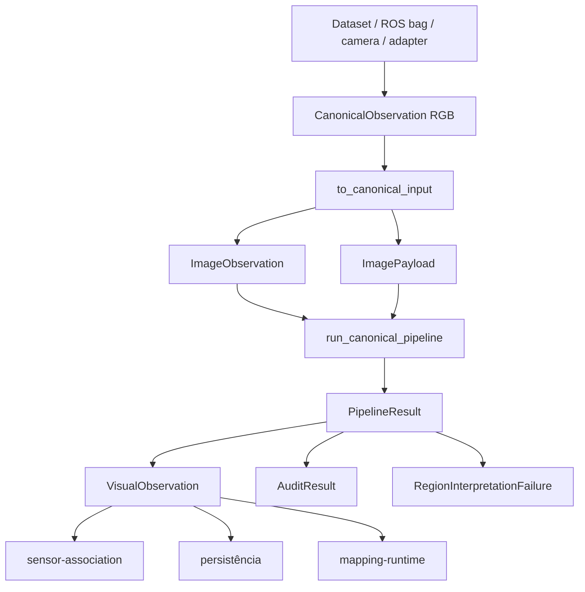
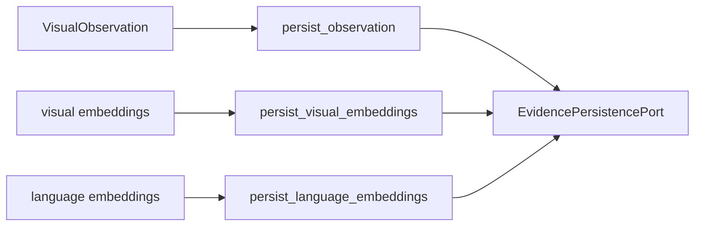

# Guia de integração

Este documento explica **como entrar no módulo, como consumir sua saída e em qual
fronteira alterar cada integração**.

`visual-perception` não seleciona datasets, não lê ROS bags, não resolve URIs de imagem e
não constrói mapa 3D. A aplicação ou adapter prepara a observação RGB; o módulo produz
evidência visual 2D canônica.

## Fluxo de integração



A aplicação é responsável por resolver os pixels antes de chamar o pipeline. O módulo
preserva identidade, timestamp, frame e proveniência recebidos na entrada.

## Caminho mínimo com fakes

No diretório `modules/visual-perception`:

```bash
python3.12 -m venv .venv
source .venv/bin/activate
pip install -e ".[dev]"
```

Exemplo mínimo:

```python
import numpy as np
from contextual_mapping_contracts import (
    FrameId,
    ObservationReference,
    SourceArtifactReference,
    Timestamp,
)
from visual_perception import (
    ImageObservation,
    ImagePayload,
    ModuleConfig,
    create_perception_ports,
    run_canonical_pipeline,
)

pixels = np.zeros((480, 640, 3), dtype=np.uint8)
source = ObservationReference(
    observation_id="camera-001",
    dataset_id="example",
    sequence_id="sequence-001",
    sensor_id="front-camera",
    sequence_index=0,
    timestamp=Timestamp(nanoseconds=0, clock_id="system"),
    frame_id=FrameId("front_camera_optical_frame"),
)
image = ImageObservation(
    width=640,
    height=480,
    encoding="rgb8",
    image=SourceArtifactReference(uri="memory://camera-001", media_type="image/raw"),
    source=source,
)
payload = ImagePayload(pixels=pixels, width=640, height=480)

config = ModuleConfig()
ports = create_perception_ports(config)
result = run_canonical_pipeline(image, payload, config, ports)

if not result.audit.passed:
    raise RuntimeError(result.audit.errors)

observation = result.observation
```

`ModuleConfig()` usa backends `fake` por padrão. Isso permite validar integração,
contracts e pipeline sem GPU e sem download de checkpoint.

## Entrada vinda de adapters

Quando a entrada já é um `contextual_mapping_adapters.CanonicalObservation` de kind
`"rgb"`, use a fronteira:

[`infrastructure/integration/rgb_adapter_boundary.py`](../src/visual_perception/infrastructure/integration/rgb_adapter_boundary.py)

A função `to_canonical_input(...)` constrói:

```text
CanonicalObservation RGB
        |
        v
to_canonical_input
        |
        +--> ImageObservation
        +--> ImagePayload
```

A aplicação continua responsável por resolver `observation.artifact` em pixels RGB antes
da chamada quando o adapter entrega apenas a referência ao artifact.

Falhas esperadas antes da inferência incluem:

- `kind` diferente de `rgb`;
- pixels fora do shape `(H, W, 3)`;
- dimensões do payload incompatíveis com `ImageObservation`;
- encoding ou metadados inválidos.

Não invente timestamp, frame, sensor ou URI depois que a observação já entrou no sistema.
Esses campos fazem parte da proveniência e devem ser preservados desde a origem.

## Backends reais

Backends reais são opt-in. Instale o extra de ML:

```bash
pip install -e ".[ml]"
```

A composição atual de referência é:

| Capability | Backend | Checkpoint de referência |
| --- | --- | --- |
| Region discovery | `sam` | `facebook/sam-vit-huge` |
| Dense feature extraction | `dinov2` | `facebook/dinov2-base` |
| Language-aligned embedding | `clip` | `openai/clip-vit-large-patch14` |
| Multimodal reasoning | `qwen_vl` | `Qwen/Qwen2.5-VL-3B-Instruct` em 4-bit |

A seleção ocorre em
[`infrastructure/adapters/factory.py`](../src/visual_perception/infrastructure/adapters/factory.py).
A configuração de referência pode ser obtida por `research_quality_config(real_backends=True)`
em [`application/execution_profile.py`](../src/visual_perception/application/execution_profile.py).

Cada adapter real carrega o modelo sob demanda. `create_perception_ports(...)` recebe um
`ModelLifecycleManager` opcional e cria um automaticamente quando omitido, compartilhando
o mesmo manager entre os ports compostos. Assim, os backends podem existir como objetos
ao mesmo tempo sem manter todos os modelos pesados residentes simultaneamente na GPU.

`run_canonical_pipeline(...)` não escolhe nem cria backends; ele recebe `PerceptionPorts`
já compostos.

Consulte [model-backends.md](model-backends.md) para benchmark, VRAM, limitações e
contratos específicos de cada backend.

## Saída para `sensor-association`

`sensor-association` recebe a evidência visual 2D necessária para relacionar pixels e
regiões com a geometria 3D.

A fronteira de referência está em:

[`infrastructure/integration/sensor_association_contract.py`](../src/visual_perception/infrastructure/integration/sensor_association_contract.py)

O consumidor pode usar:

- identidade da observação;
- timestamp e frame;
- dimensões da imagem;
- masks e boxes;
- claims semânticos;
- referências de embeddings;
- convenção de coordenadas;
- proveniência.

O que **não** deve ser assumido nessa fronteira:

- uma `ObservedRegion` não é uma entidade 3D;
- uma mask 2D não confirma ocupação geométrica;
- uma `CandidateRelation` não é uma relação 3D confirmada;
- confiança geométrica não é confiança semântica.

A projeção e validação dessas evidências pertencem a `sensor-association` e módulos
downstream.

## Persistência

A integração de persistência fica em:

[`infrastructure/integration/persistence_integration.py`](../src/visual_perception/infrastructure/integration/persistence_integration.py)

Ela depende de `EvidencePersistencePort`, uma interface opaca para armazenamento. O
módulo não conhece paths, buckets, bancos ou clientes concretos.



A observação serializada preserva geometria e metadados. Os vetores de embedding são
persistidos separadamente e permanecem referenciados por id.

Consulte [artifacts.md](artifacts.md) para o formato e ciclo de vida dos artifacts.

## Integração com `mapping-runtime`

A fronteira de referência está em:

[`infrastructure/integration/mapping_runtime_integration.py`](../src/visual_perception/infrastructure/integration/mapping_runtime_integration.py)

Ela demonstra como um composition root pode:

1. preparar a entrada;
2. chamar a API pública;
3. traduzir `VisualPerceptionError` para o diagnóstico do runtime;
4. preservar `AuditResult` e falhas recuperáveis;
5. evitar que exceptions específicas dos backends escapem como contract externo.

O runtime deve orquestrar o módulo, não duplicar seus estágios internos.

## Quero integrar com X: onde mexo?

| Quero integrar ou alterar | Arquivo principal | Observação |
| --- | --- | --- |
| Entrada RGB de adapters | [`rgb_adapter_boundary.py`](../src/visual_perception/infrastructure/integration/rgb_adapter_boundary.py) | Traduz tipo externo para `ImageObservation` + `ImagePayload`. |
| Mapping runtime | [`mapping_runtime_integration.py`](../src/visual_perception/infrastructure/integration/mapping_runtime_integration.py) | Trata execução e tradução de erro. |
| `sensor-association` | [`sensor_association_contract.py`](../src/visual_perception/infrastructure/integration/sensor_association_contract.py) | Expõe somente a evidência necessária ao consumidor 3D. |
| Persistência | [`persistence_integration.py`](../src/visual_perception/infrastructure/integration/persistence_integration.py) | Usa `EvidencePersistencePort`. |
| Serialização da observação | [`serialization.py`](../src/visual_perception/infrastructure/serialization.py) | Mudanças devem preservar ou versionar o schema. |
| Novo backend de ML | `infrastructure/adapters/` + `factory.py` | Implemente um port existente quando possível. |
| Novo consumidor downstream | `infrastructure/integration/` | Não importe tipos do consumidor no domínio. |
| Mudar a ordem dos estágios | [`application/pipeline.py`](../src/visual_perception/application/pipeline.py) | Não é responsabilidade da integração. |

## Falhas e responsabilidades

Existem três classes conceituais de falha:

```text
entrada/contract inválido
        -> falha antes ou na fronteira do pipeline

backend indisponível ou falha de inferência
        -> VisualPerceptionError / Backend*Error

interpretação semântica local malformada
        -> RegionInterpretationFailure
        -> restante da observação pode continuar válido
```

`AuditResult` é o critério de validade estrutural da observação produzida. Warnings não
devem ser descartados por consumidores que precisam de rastreabilidade.

## Checklist para uma nova integração

Antes de considerar uma integração concluída:

- preserve `ObservationReference` e `SourceArtifactReference`;
- mantenha a convenção de coordenadas canônica;
- use apenas exports públicos de `visual_perception` fora do módulo;
- não exponha tensors ou exceptions de framework;
- preserve `AuditResult`, warnings e proveniência;
- trate `SemanticClaim.confidence=None` como ausência de score;
- adicione testes da fronteira em `tests/test_integration_boundaries.py` ou arquivo
  específico equivalente;
- documente qualquer novo contract downstream em [api-contracts.md](api-contracts.md).
