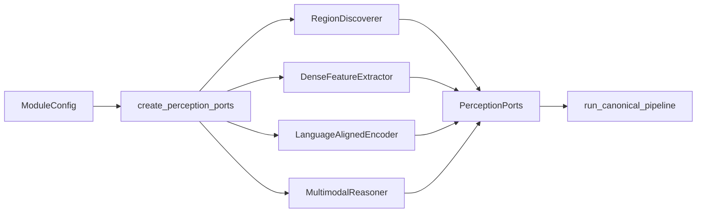

# Model Backends

Este documento explica **qual implementação concreta atende cada capability, por que ela
foi selecionada, onde alterá-la e quais limites precisam ser considerados**.

O pipeline canônico continua dependente apenas dos ports. Checkpoints, bibliotecas e
regras de runtime ficam isolados em `infrastructure/adapters/`.

## Visão geral

O módulo roda por padrão com `backend="fake"`. Os fakes são determinísticos, não exigem
GPU e exercitam contracts, pipeline, cache e integração.

A configuração real de referência foi escolhida por benchmark reproduzível na RTX 3060
8GB (#174):

| Capability | Port | Backend real | Checkpoint | Identificador |
| --- | --- | --- | --- | --- |
| Region discovery | `RegionDiscoverer` | SAM ViT-H | `facebook/sam-vit-huge` | `sam` |
| Dense feature extraction | `DenseFeatureExtractor` | DINOv2-base | `facebook/dinov2-base` | `dinov2` |
| Language-aligned embedding | `LanguageAlignedEncoder` | CLIP ViT-L/14 | `openai/clip-vit-large-patch14` | `clip` |
| Multimodal reasoning | `MultimodalReasoner` | Qwen2.5-VL-3B-Instruct 4-bit | `Qwen/Qwen2.5-VL-3B-Instruct` | `qwen_vl` |

`research_quality_config(real_backends=True)` em
[`application/execution_profile.py`](../src/visual_perception/application/execution_profile.py)
retorna a configuração de referência com os quatro backends reais.

## Quero mudar X: onde mexo?

| Quero alterar | Arquivo principal | Também revisar |
| --- | --- | --- |
| backend selecionado por capability | [`factory.py`](../src/visual_perception/infrastructure/adapters/factory.py) | `config.py`, testes e docs |
| checkpoint/configuração de referência | [`application/execution_profile.py`](../src/visual_perception/application/execution_profile.py) | `config.py`, benchmark e fingerprint |
| implementação de region discovery | [`region_discovery_backend.py`](../src/visual_perception/infrastructure/adapters/region_discovery_backend.py) | `ports/region_discovery.py` e testes GPU |
| implementação de dense features | [`feature_extraction_backend.py`](../src/visual_perception/infrastructure/adapters/feature_extraction_backend.py) | `ports/feature_extraction.py`, pooling e benchmark |
| implementação de language embedding | [`language_embedding_backend.py`](../src/visual_perception/infrastructure/adapters/language_embedding_backend.py) | `ports/language_embedding.py` e benchmark |
| modelo ou prompt do VLM | [`multimodal_reasoning_backend.py`](../src/visual_perception/infrastructure/adapters/multimodal_reasoning_backend.py) | parser de cena/região, fingerprint e testes |
| parsing de resposta de região | [`application/region_semantics.py`](../src/visual_perception/application/region_semantics.py) | `domain/semantics.py` e testes do parser |
| lifecycle e VRAM | [`application/lifecycle.py`](../src/visual_perception/application/lifecycle.py) | `factory.py`, `_runtime.py` e validação real |
| candidatos de benchmark | [`benchmarks/candidates/`](../benchmarks/candidates/) | `run_backend_benchmark.py` e resultados |
| execução real de referência | [`benchmarks/validate_reference_pipeline.py`](../benchmarks/validate_reference_pipeline.py) | overlays, manifests e samples |

## Instalação

O ambiente fake-only usa a instalação base/dev. Para os adapters reais:

```bash
pip install -e ".[ml]"
```

Uma configuração real deve declarar backend, checkpoint e device válidos.

Semântica dos erros:

```text
checkpoint ausente / dependência ausente / GPU solicitada indisponível
    -> BackendUnavailableError

falha durante load ou inferência
    -> BackendExecutionError
```

Nunca existe fallback silencioso de backend real para fake.

## Composição dos backends

A seleção concreta acontece em:

[`infrastructure/adapters/factory.py`](../src/visual_perception/infrastructure/adapters/factory.py)



`pipeline.py` não escolhe bibliotecas ou checkpoints. Para substituir uma implementação,
prefira manter o mesmo port e trocar somente o adapter/factory/configuração.

## Region discovery

### Responsabilidade

Produzir propostas geométricas 2D class-agnostic. O backend não atribui identidade
semântica final à região.

### Implementação atual

- port: `RegionDiscoverer`;
- adapter: `infrastructure/adapters/region_discovery_backend.py`;
- backend: `sam`;
- checkpoint: `facebook/sam-vit-huge`.

### Por que foi escolhido

No benchmark #174, SAM ViT-H apresentou IoU previsto médio de `0.956`, contra `0.937`
para SAM2.1-hiera-large e `0.585` para FastSAM-x. Todos cabiam individualmente no budget
de 8GB, então a seleção priorizou qualidade.

### Output esperado

O adapter deve produzir `RegionProposal` e respeitar o contract do port. Merge,
consolidação e semântica são etapas posteriores.

### Limites atuais

SAM pode over-segmentar superfícies repetitivas, como tetos em ladrilhos. O merge atual
atua por IoU/sobreposição e não une automaticamente regiões vizinhas não sobrepostas com
semântica semelhante.

## Dense feature extraction

### Responsabilidade

Produzir um `FeatureMap` espacial que preserve estrutura visual suficiente para pooling
por mask.

### Implementação atual

- port: `DenseFeatureExtractor`;
- adapter: `infrastructure/adapters/feature_extraction_backend.py`;
- backend: `dinov2`;
- checkpoint: `facebook/dinov2-base`.
- resolução de entrada do perfil real: maior aresta 448, preservando aspect ratio e
  alinhamento ao patch 14;
- candidato aprendido: `FeatUpDenseFeatureExtractionAdapter`, FeatUp/JBU sobre
  DINOv2-small, instalado pelo extra `feature-upsample`.

### Por que foi escolhido

No benchmark #174, DINOv2-base obteve `0.966` no proxy de coerência espacial do primeiro
componente PCA, contra `0.958` do DINOv2-large. O modelo maior não melhorou o proxy no
conjunto de referência e consumia mais recursos.

### Output esperado

Tensors internos, tokens e objetos de framework não atravessam o port. O adapter expõe
somente o `FeatureMap` definido pelo módulo.

### Relação com pooling

A transformação de feature map para embedding por região pertence a
[`application/pooling.py`](../src/visual_perception/application/pooling.py), não ao
adapter DINO.

O adapter FeatUp é uma implementação alternativa do mesmo port, não um stage escondido.
Sua revisão Git, checkpoint JBU, grade fonte, resolução efetiva e eventual fallback são
campos de provenance do `FeatureMap`. Como o JBU oficial usa DINOv2-small (384 canais),
seus vetores não são misturados ou comparados diretamente com DINOv2-base (768 canais).

## Language-aligned embedding

### Responsabilidade

Produzir embeddings em um espaço compartilhado entre imagem/região e linguagem.

### Implementação atual

- port: `LanguageAlignedEncoder`;
- adapter: `infrastructure/adapters/language_embedding_backend.py`;
- backend: `clip`;
- checkpoint: `openai/clip-vit-large-patch14`.

### Por que foi escolhido

No benchmark #174, CLIP ViT-L/14 apresentou margem top1/top2 de similaridade de cosseno
zero-shot `0.024`, contra `0.009` do SigLIP-base, usando o vocabulário indoor genérico do
benchmark.

### Output esperado

O espaço de embedding deve continuar compatível com a operação imagem-texto prevista
pelo port. A dimensão de referência do ViT-L/14 é 768.

### O lado de texto passou a ser usado (#214)

`encode_text` existia no port e nos dois adapters desde a #163, e **nenhuma linha de
código de produção o chamava**. O estágio de suporte de hipótese fechou esse circuito: ele
compara o texto de cada hipótese contra os vetores de crop que o estágio de evidência já
produziu.

O custo é quase nulo por construção — nenhuma imagem é recodificada, e o texto de cada
conceito distinto do frame é codificado uma vez só. O ganho é que o módulo passa a ter
**duas** fontes de semântica em vez de uma.

**Medido sobre os frames de referência**, com as mesmas máscaras e os mesmos recortes do
run `20260908T131207Z` (92 regiões com alternativa, 3 frames):

| slot | concorda com o primary | indistinguível | discorda |
| --- | ---: | ---: | ---: |
| `masked_subject` | 50/92 | 25/92 | 17/92 |
| `tight_crop` | 55/92 | 22/92 | 15/92 |
| `contextual_crop` | **59/92** | 13/92 | 20/92 |

Três leituras importam para quem for mexer neste backend:

1. como **classificador** sobre o vocabulário do frame, o CLIP acerta o primário do
   reasoner em 6 a 13 de 40 regiões. Como **árbitro entre as hipóteses que o produtor
   registrou**, os números acima. É a segunda pergunta que tem resposta útil;
2. o slot certo depende do consumidor. `masked_subject` é a melhor evidência para o VLM e
   a **pior** para o CLIP — 27% de indistinguível, porque o CLIP nunca viu recortes sobre
   fundo cinza chapado no treino;
3. a margem mediana é de 0,019 a 0,027, numa faixa de similaridade que vive entre 0,13 e
   0,27. Isso proíbe tratar o cosseno como confiança e **exige** o desfecho explícito de
   "indistinguível": sem ele, 14 a 27% das regiões receberiam um veredito inventado.

A sonda que produziu esses números é reproduzível:

```bash
python benchmarks/evidence_signal_probe.py --run benchmarks/results/samples/<run-id>
```

## Multimodal reasoning

### Responsabilidade

Produzir respostas estruturadas para:

- contexto global da cena;
- interpretação semântica de regiões;
- relações multimodais candidatas quando solicitadas pelo pipeline.

### Implementação atual

- port: `MultimodalReasoner`;
- adapter: `infrastructure/adapters/multimodal_reasoning_backend.py`;
- backend: `qwen_vl`;
- checkpoint: `Qwen/Qwen2.5-VL-3B-Instruct`;
- execução de referência: 4-bit `bitsandbytes` NF4.

### Por que foi escolhido

O candidato 7B falhou em três tentativas na GPU de referência, por OOM no carregamento e
por incompatibilidade `bitsandbytes`/Transformers no vision tower fundido. O 3B em 4-bit
rodou com score de qualidade `1.0` no benchmark e pico aproximado de 2.5GB de VRAM.

A escolha é baseada na evidência do hardware de referência, não em uma afirmação de que o
3B seja universalmente superior ao 7B.

### Limites atuais

Em crops pequenos ou ambíguos, o VLM pode:

- retornar JSON malformado;
- usar o contexto global da cena em vez do conteúdo específico do crop;
- omitir score quando não consegue estimar confiança.

Medido: nos três frames de referência em `ebe211f`, o Qwen2.5-VL-3B **nunca** omitiu
`confidence` — 177 claims de label, 177 pontuadas. A distribuição é concentrada em
poucos valores âncora: 117 das 177 valem exatamente 0,90, e 138 ficam em 0,90 ou acima
(mínimo 0,05, máximo 0,98). O contract representa a ausência corretamente, mas este
backend não a exerce, e o score que ele emite parece mais um hábito de formatação do que
uma estimativa. Tratá-lo como confiança calibrada seria um erro; é para isso que existe
a calibração da #196, ainda bloqueada pela anotação humana da #210.

Cuidado ao ler os overlays: o número ao lado do label é a `geometric_confidence` da
região, não a confiança do claim.

Falhas locais de interpretação viram `RegionInterpretationFailure` e não precisam
invalidar toda a observação.

## Contract de resposta de relação

A #206 acrescentou um terceiro prompt, e por isso a versão subiu para `v7`. Os prompts de
**cena** e de **região** são idênticos aos do `v6`, byte a byte: labels e claims continuam
comparáveis entre os dois runs, e o que mudou é que a versão passa a identificar três
prompts em vez de dois.

O adapter mostra ao VLM **uma** imagem contendo as duas regiões, com o sujeito contornado
em verde e o objeto em azul, e repete a medida geométrica que o módulo já calculou
(containment, IoU, contato). O modelo devolve:

```json
{"predicate": "part_of", "confidence": 0.42}
```

Duas decisões de prompt merecem registro, porque as duas atacam a mesma pressão:

1. **`none` é a primeira opção oferecida**, e o texto diz explicitamente que ela é a
   resposta esperada para a maioria dos pares. Um vocabulário fechado sem saída de escape
   empurra o modelo a escolher o predicado menos ruim, e a aresta inventada entra no grafo
   como se fosse observação;
2. **o prompt proíbe inferir profundidade**. `behind`, `in_front_of` e distância não estão
   no vocabulário, mas dizer isso no texto reduz a chance de o modelo tentar expressá-las
   dentro de um predicado que existe.

Quantos pares são consultados é decisão de `semantic_relations.max_pairs`, não do modelo:
perguntar sobre todos é O(n²), e num frame de 40 regiões seriam 780 chamadas para produzir
sobretudo "nenhuma relação".

## Contract de resposta de região

O schema de região não mudou no `v7`. A versão anterior era `v6`. O schema da resposta **de região** é o mesmo desde
`v2`; o que mudou até o `v5` foi a entrada, o exemplo e o enquadramento da tarefa. O `v6`
mudou o schema da resposta **de cena** (ver "Contract de resposta de cena", abaixo) e as
views que acompanham a região, e por isso quebra a comparabilidade direta com os runs
anteriores: `prompt_version` participa do fingerprint, então o cache dependente da
resposta antiga é invalidado.

`v3` passou a receber um `RegionReasoningRequest` e a enviar ao VLM as views da região
como imagens numeradas e rotuladas pelo seu papel (foreground isolado, crop justo,
contexto), seguidas do contexto de cena como claims tipadas. Em `v2` ele mandava um único
recorte pelo bounding box e a primeira string de `scene_description`.

`v4` trocou o exemplo de formato por placeholders. **Medido em `0fda5cf`:** com o exemplo
concreto de `v3` (`"label": "door"`, `category "opening"`, alternativa `panel`,
`material "wood"`), 26 das 27 regiões rotuladas `door` em `corridor-02-000` reproduziam a
assinatura inteira do exemplo — inclusive a região que cobre o frame inteiro. A taxa de
eco saltou de 1/54 para 27/54 naquele frame e de 1/50 para 12/50 em `corridor-02-017`
quando a entrada passou a ser multi-imagem.

A lição é geral: **um exemplo de formato cujos valores formam uma resposta plausível vira
a resposta padrão quando a entrada fica mais difícil**, e `door` num corredor é plausível
o bastante para não parecer erro. O `v4` mantém a forma inequívoca com placeholders
`<...>`, e `parse_region_interpretation` recusa um label ainda em forma de placeholder
como `InvalidInterpretation` — de modo que o eco vira uma falha local visível em vez de um
claim silencioso. Um placeholder ecoado numa *alternativa* é descartado, porque a
alternativa é evidência opcional e não deve custar um label primário válido.

Ao comparar runs, a assinatura do eco (`category == "opening"` com alternativa `panel`) é
um diagnóstico barato, e vale medi-la junto com os labels.

`v5` restaurou o enquadramento da tarefa que o `v3` havia perdido, e é a correção que
importou. Medido em `corridor-02-000`, com os **mesmos pixels** (`--region-view
tight_crop` produz exatamente o crop do baseline), as mesmas claims de cena e o mesmo
exemplo:

| enquadramento da tarefa | `door` | labels distintos |
| --- | ---: | ---: |
| `v2` "Describe ONLY what is visible in THIS cropped image" | 1/54 | 7 |
| `v4` "Identify the SUBJECT REGION itself" | 45/54 | 8 |
| `v5` "Describe ONLY what is actually visible … do NOT name an object merely because este tipo de cena costuma conter um" | 3/54 | 9 |

Pedir para **identificar** o sujeito faz o modelo nomear um objeto discreto; num corredor,
o objeto default é uma porta. Pedir para **descrever o que está visível** mantém a
resposta presa aos pixels. A cláusula que permite explicitamente uma superfície lisa
("a plain surface is a valid, specific answer") precisa ficar junto da instrução da
tarefa: no `v3`/`v4` ela existia, mas depois de "Identify the SUBJECT REGION itself", e
não bastou.

O texto do prompt é, portanto, uma variável de primeira ordem do resultado — maior, nestes
frames, que a escolha de views. Comparações de evidência que não fixem o prompt não medem
o que dizem medir.

O adapter pede um único objeto JSON por região:

```json
{
  "label": "door",
  "kind": "thing",
  "category": "opening",
  "confidence": 0.71,
  "alternatives": [
    {"label": "panel", "confidence": 0.2}
  ],
  "description": "...",
  "attributes": ["closed"],
  "condition": "worn",
  "material": "wood"
}
```

Semântica dos campos:

- `label`, open-vocabulary, singular e obrigatório;
- `kind`, `thing | stuff | part | unknown`; ausência vira `unknown`;
- `category`, string livre, sem taxonomia canônica versionada neste módulo;
- `confidence`, score informado pelo modelo; a chave deve ser omitida quando o modelo
  não sabe estimá-la;
- `alternatives`, hipóteses concorrentes que viram claims irmãos do principal.

O parsing é feito por `parse_region_interpretation` em
[`application/region_semantics.py`](../src/visual_perception/application/region_semantics.py).
O formato legado `{"labels": [...]}` é rejeitado com `InvalidInterpretation`.

`prompt_version` participa de `ModelProvenance` e do fingerprint de configuração, então
uma mudança de versão invalida cache dependente da resposta anterior.

As três views enviadas por região no `v6` são `masked_subject`, `tight_crop` e
`contextual_crop`:

- `masked_subject` isola o sujeito sobre **cinza médio**. O fundo não é preto de
  propósito: nos frames do `corridor-02` o preto é exatamente a cor da vinheta do fisheye,
  e usá-lo tornaria "fora da máscara" indistinguível de "fora da lente" para o modelo;
- `contextual_crop` mantém o entorno íntegro e desenha o **contorno** da máscara sobre ele.
  Até a #202 os dois crops textuais chegavam com `mask_ref: null`, isto é, sem nenhuma
  indicação de qual pixel era o sujeito — numa região cuja máscara ocupa parte pequena do
  bounding box, o que o modelo interpretava era a caixa. `mask_fill_ratio` no slot de
  evidência torna esse caso contável.

`foreground_dense` continua existindo como o slot do embedding denso do DINOv2, com fundo
zerado, e não é mais enviado ao VLM: usar o mesmo recorte para os dois confundia a
evidência do reasoner com a do extractor.

## Contract de resposta de cena

O `v6` substituiu o contract anterior — `scene_type`, `description` em prosa,
`attributes` e `hazards` — por um **ambiental**:

```json
{
  "scene_type": "corridor",
  "environment": "indoor",
  "layout": "a narrow corridor running away from the camera",
  "lighting": "dim artificial light",
  "visibility": "clear",
  "navigability": "open path ahead",
  "confidence": 0.85
}
```

**Medido em `corridor-02-002`** com o contract anterior: o modelo devolveu
`attributes: ["fisheye lens", "carpeted floor", "suitcase"]` e "there is a suitcase on the
ground in the foreground". A "mala" era o próprio quad que carrega a câmera, e aquele
texto ia inteiro para o prompt de **cada uma** das 60 regiões.

Não há frase de prompt que conserte isso de forma confiável — a #212 já mediu que
instrução textual não é mecanismo de garantia. Duas mudanças estruturais foram
necessárias:

1. o campo que pedia um inventário de objetos saiu do contract, e uma resposta que ainda
   traga `attributes`, `hazards` ou `description` é recusada como malformada;
2. a cena passou a ser analisada sobre a **área válida menos a área do ego**. É um
   recorte, nunca uma pintura: os pixels de origem permanecem intactos, e o modelo não
   pode inventariar um objeto que não recebeu.

Só `scene_type` carrega o score informado pelo produtor; os campos ambientais são
descritivos e não podem carregar confiança bruta (#195). Um campo ambiental ausente vira
ausência de claim, nunca string vazia.

`REGION_SCENE_CLAIM_KINDS` passou a ser exatamente o conjunto ambiental, de modo que
nenhum objeto inferido globalmente possa induzir a identidade de uma região local.

## Exclusão de prompts no SAM: limitação medida

A barreira ideal contra o rig teria duas camadas: remover os pontos de prompt que caem
sobre o ego-veículo **antes** da inferência, e rejeitar as propostas que ainda vazassem.
Só a segunda foi implementada, e a razão é uma limitação concreta da integração.

O adapter usa `transformers.pipeline("mask-generation")`. Verificado em `transformers`
5.16.1, `MaskGenerationPipeline._sanitize_parameters` aceita `points_per_batch`,
`points_per_crop`, `crops_n_layers`, `crop_overlap_ratio`,
`crop_n_points_downscale_factor`, `pred_iou_thresh`, `stability_score_thresh` e
`crops_nms_thresh` — e **não** aceita `point_grids`. A grade de pontos é gerada
internamente por `image_processor.generate_crop_boxes`, sem ponto de injeção.

`point_grids` existe no `SamAutomaticMaskGenerator` do pacote `segment-anything`, que não
é dependência deste módulo. Trocar a integração por ele é uma mudança de backend com
benchmark próprio, e não foi feita nesta rodada.

**Consequência prática:** o SAM continua propondo máscaras sobre o rig, e elas são
rejeitadas na filtragem por sobreposição (`ego_vehicle_overlap`). O gate — nenhuma região
final representando chassi, pneus ou estrutura do robô — é atingido pela segunda barreira
sozinha; o custo é computação desperdiçada em propostas que serão descartadas.

## Política de confiança

Ausência de score é representada como `None`.

```text
confidence ausente
    -> None

confidence = 0.0
    -> score explicitamente fornecido
```

O adapter não deve inventar `1.0`, `0.0` ou outro valor para preencher ausência.
Consumidores usam a política canônica em `most_confident_claim`; consulte
[api-contracts.md](api-contracts.md#confiança-ausente).

## Orçamento de VRAM e lifecycle

Os picos observados na configuração de referência são aproximadamente:

| Backend | Pico de referência |
| --- | ---: |
| SAM ViT-H | 4.6 GB |
| DINOv2-base | 0.3 GB |
| CLIP ViT-L/14 | 1.6 GB |
| Qwen2.5-VL-3B 4-bit | 2.5 GB |

A soma aproximada excede 8GB. Por isso, os adapters reais compartilham um
[`ModelLifecycleManager`](../src/visual_perception/application/lifecycle.py).

`create_perception_ports(config, lifecycle=None)` cria um manager quando ele não é
fornecido e o compartilha entre os ports compostos. O pipeline recebe os ports já
construídos e não seleciona modelos por conta própria.

```text
SAM   -> inferência -> unload
DINO  -> inferência -> unload
CLIP  -> inferência -> unload
Qwen  -> inferência -> unload
```

`ModelLifecycleManager.metrics` registra métricas por estágio, incluindo identificação do
backend/checkpoint, tempo de load e pico de memória medido pelo runtime disponível.

## Benchmark de seleção (#174)

Resultados brutos:

```text
../benchmarks/results/benchmark-174-*.json
```

Candidatos e proxies:

```text
../benchmarks/candidates/
../benchmarks/run_backend_benchmark.py
../benchmarks/backend_benchmark.py
```

Conjunto de referência usado na seleção:

```text
18 frames de corridor-02
../benchmarks/prepare_corridor02_frames.py
```

Um resultado que altere a configuração de referência deve registrar pelo menos:

- dataset e subset;
- revisão do código;
- checkpoint;
- configuração;
- hardware;
- métrica/proxy;
- latência;
- consumo de memória;
- falhas de execução.

## Validação end-to-end reproduzível (#190/#212)

[`../benchmarks/validate_reference_pipeline.py`](../benchmarks/validate_reference_pipeline.py)
executa a configuração real sobre todos os frames, uma seleção explícita por `--frame-id`
ou um prefixo ordenado por `--limit`. Para o protocolo de três frames:

```bash
python benchmarks/validate_reference_pipeline.py \
  --frame-id corridor-02-000 \
  --frame-id corridor-02-008 \
  --frame-id corridor-02-017
```

Por frame, a validação produz a `VisualObservation` canônica, um diagnóstico estatístico e
as camadas de inspeção separadas por estágio (proposals, masks, boxes, labels, overlay). O
layout exato está descrito em [artifacts.md](artifacts.md#artifacts-de-benchmark-e-validação),
que é a fonte única dessa árvore. O manifest guarda IDs ordenados, hashes de entrada, git
revision, configuração, fingerprint, latência, VRAM, falhas, audit e cobertura por estado
de cada slot. Não há mais variante de pós-processamento: o merge semântico saiu na #202.

Saída:

```text
../benchmarks/results/samples/<run-id>/
```

Esses artifacts servem para inspeção qualitativa e rastreabilidade. Métricas de pesquisa
mais fortes devem ser definidas em protocolos de avaliação específicos.

## Candidatos avaliados nesta rodada

A revisão de contexto visual investigou quatro candidatos modernos. Nenhum deles trocou a
configuração de referência, e os motivos são diferentes entre si:

| candidato | capability | disponibilidade verificada | estado |
| --- | --- | --- | --- |
| Qwen3-VL 2B / 4B / 8B | multimodal reasoning | `transformers` 5.16.1 tem `Qwen3VLForConditionalGeneration`; os três checkpoints já estão no cache local (4,0 / 8,3 / 17 GB), sem gate | **benchmark pendente**, issue #218. Nenhum download necessário |
| DINOv3 ViT-B/16 | dense features | `transformers` 5.16.1 tem `DINOv3ViTModel`; `facebook/dinov3-vitb16-pretrain-lvd1689m` é 85,7 M params — mesma classe do DINOv2-base — mas está **`gated=manual`** no Hub | **bloqueado**: exige aceite de licença na conta HF do usuário. Issue #219 |
| SAM 3 | verificação condicionada a conceito | `transformers` 5.16.1 tem `Sam3Model`/`Sam3Processor`; `facebook/sam3` é 860 M params e está **`gated=manual`** | **bloqueado** pelo mesmo motivo. Issue #220 |
| LoftUp | feature upsampling | não integrado | **não avaliado** nesta rodada; prioridade menor que os anteriores. Issue #221 |

Duas observações de método:

- o SAM 3 é interessante aqui **apenas** pela segmentação condicionada a conceito dentro
  de um frame. O tracker de vídeo dele é identidade temporal, que é explicitamente
  proibida neste módulo;
- nenhuma comparação de backend é interpretável antes de a arquitetura contextual estar
  fixa. É por isso que as quatro issues dependem da #207, e não o contrário.

## Dívidas conhecidas

- `application/scene_context.py` ainda deve ser revisado para garantir a mesma política
  explícita de confiança ausente aplicada ao parser de regiões. `relation_generation.py`
  e `semantic_relations.py` já a aplicam: uma relação inferida sem score sai com
  `confidence=None`;
- relações `geometric_2d` podem usar `ConfidenceScore(1.0)` legitimamente quando o valor
  representa o resultado de um predicado determinístico, não ausência de score;
- over-segmentation de superfícies repetitivas não é resolvida apenas pela troca de
  checkpoint;
- crops semanticamente ambíguos ainda podem induzir o VLM a responder com contexto da
  cena em vez da região.

Quando uma dívida for resolvida, atualize este documento junto com os testes e o
benchmark que comprovam a mudança.
