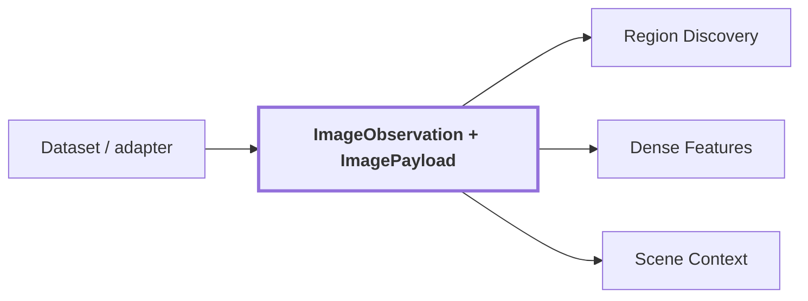

# 01. Entrada RGB

## Onde estamos na pipeline



## Objetivo

Materializar uma observação RGB sem misturar identidade/proveniência com a representação concreta dos pixels. `ImageObservation` carrega identidade e metadados auditáveis; `ImagePayload` carrega os pixels que os modelos processam.

## Contract

```text
ImageObservation
{
    width
    height
    encoding
    image: SourceArtifactReference
    source: ObservationReference
}

ImagePayload
{
    pixels: RGB[H, W, 3]
    width
    height
}
```

`ObservationReference` preserva `observation_id`, dataset, sequência, sensor, timestamp, frame e calibração quando disponível.

## Transformação

1. O adapter resolve a imagem do dataset/runtime.
2. Resolução e encoding são validados.
3. O payload em memória deve manter shape `(H, W, 3)`.
4. A identidade original continua ligada a todos os resultados downstream.

## Reference run

```text
observation_id: corridor-02-000
dataset_id: corridor02
sequence_id: seq-0
sensor_id: camera_1
sequence_index: 0
timestamp.nanoseconds: 1000000
timestamp.clock_id: rosbag
frame_id: camera_1_optical_frame
image_width: 640
image_height: 480
```

Imagem real:


Neste ponto não existe label, entidade ou posição XYZ. Existe apenas uma observação visual identificada e seus pixels.

## Saída

O mesmo payload alimenta `Region Discovery`, `Dense Feature Extraction`, `Scene Context` e a criação das views de região.

## Limitações atuais

A referência visual possui `calibration_id: null`. Isso não impede a percepção 2D, mas significa que a continuidade até uma associação RGB-LiDAR precisa usar a calibração fornecida pelo workflow 3D correspondente, não inferir uma calibração a partir deste JSON.