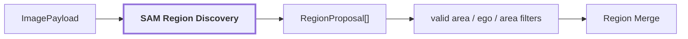
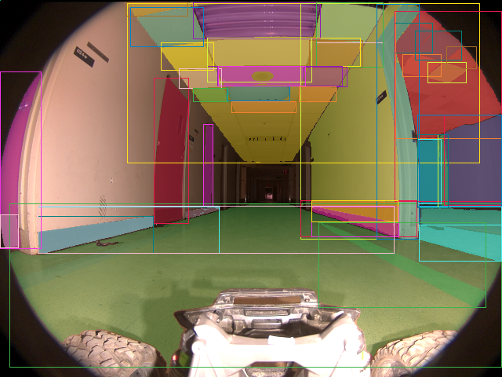

# 02. Region Discovery

## Onde estamos na pipeline



## Objetivo

Encontrar áreas visuais coerentes que merecem análise separada. A etapa é geométrica e class-agnostic: ela não decide que uma região é `door`, `wall` ou `pallet`.

## Como funciona

O backend real de referência usa SAM ViT-H. A imagem pode ser processada em tiles/escalas; cada candidato retorna máscara, bounding box e confiança geométrica. Coordenadas locais são remapeadas para a imagem original e filtros removem proposals inválidas antes da consolidação.

## Reference run

Para `corridor-02-000`:

```text
proposal_count: 75
merged_proposal_count: 47
region_count: 40
regions_with_multiple_proposals: 5

rejected_proposals:
  ego_vehicle_overlap: 13
  below_min_relative_area: 9
  outside_valid_area: 6
```

Artifacts:



| suporte fisheye válido | ego-veículo |
| --- | --- |
|  |  |

`75 proposals` não significam `75 objetos`. Parte é rejeitada e parte representa regiões sobrepostas do mesmo conteúdo visual.

## Saída

```text
RegionProposal[]
    -> filtros
    -> Region Merge / Consolidation
```

## Influência no contexto do mapa

Erros aqui se propagam. Uma proposal que inclui objeto e fundo pode fazer uma hipótese semanticamente correta ganhar um footprint espacial errado. Mais frames não corrigem automaticamente uma máscara individual ruim.

## Referência científica

A implementação usa Segment Anything como mecanismo de proposta/segmentação class-agnostic. A semântica é adicionada somente em estágios posteriores.