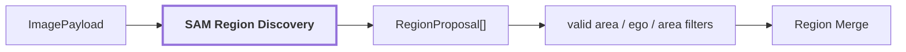

# 02. Region Discovery

## Onde estamos na pipeline



## Objetivo

Encontrar áreas visuais coerentes que merecem análise separada. A etapa é geométrica e class-agnostic: ela não decide que uma região é `door`, `wall` ou `pallet`.

Na configuração `research_quality` atual, o backend selecionado é o **SAM3 tracker** (`facebook/sam3`), em modo *segment everything* com `pred_iou_threshold=0.80` e `stability_score_threshold=0.90`. O prompt textual do SAM3 (PCS) não é usado na descoberta, porque prompts genéricos devolvem zero máscaras; ver [backends de modelos](../modules/visual-perception/docs/model-backends.md#region-discovery). O mesmo adapter aceita checkpoints SAM/SAM2 para comparação. A reference run documentada nesta página (`20260910T115810Z`) é anterior à troca e usou **SAM ViT-H** (`facebook/sam-vit-huge`); os exemplos abaixo refletem aquela run.

## O que o SAM produz

O SAM recebe pixels RGB e devolve propostas de máscara. Cada máscara é uma matriz booleana com a mesma resolução da imagem:

```text
imagem 640 x 480
        |
        v
SAM
        |
        v
mask 640 x 480
```

Exemplo reduzido:

```text
0 0 0 0 0 0
0 0 1 1 0 0
0 1 1 1 1 0
0 1 1 1 1 0
0 0 0 0 0 0
```

Os pixels `1` pertencem à proposal. A partir dela o módulo calcula também a bounding box e preserva a confiança geométrica.

```text
RegionProposal
├── mask
├── box
├── geometric_confidence
└── source
```

O SAM **não retorna uma label semântica**. A saída não é:

```text
mask -> "door"
```

É apenas:

```text
mask -> "esta região parece visualmente coerente"
```

## Como a máscara será usada depois

A máscara é uma das peças centrais da pipeline porque ela define onde está o sujeito visual.

Depois do merge, a mesma geometria é usada para:

```text
SAM mask
├── construir masked_subject para Qwen/CLIP
├── construir tight_crop
├── construir contextual_crop com contorno do sujeito
├── selecionar patches/features do DINO
└── posteriormente testar membership do pixel projetado do LiDAR
```

A máscara não é enviada ao Qwen como uma matriz booleana. Ela é usada para construir as imagens que o Qwen e o CLIP recebem.

## Como funciona

O backend real de referência usa geração automática de máscaras. A imagem pode ser processada em tiles; cada candidato retorna máscara e score. Coordenadas locais são remapeadas para a imagem original.

Depois existem filtros geométricos para remover propostas que não devem entrar na análise:

```text
proposal SAM
   |
   +--> pequena demais? ---------> rejeita
   +--> fora da área fisheye? ---> rejeita
   +--> sobre ego-veículo? ------> rejeita
   +--> válida ------------------> Region Merge
```

Isso é feito sobre a geometria das máscaras. O pipeline evita alterar os pixels originais apenas para esconder o rig, porque isso já foi observado degradando o comportamento dos modelos downstream.

## Reference run

Para `corridor-02-000`:

```text
proposal_count: 75
merged_proposal_count: 47
region_count: 40
regions_with_multiple_proposals: 5

rejected_proposals:
  ego_vehicle_overlap: 13
  below_min_relative_area: 9
  outside_valid_area: 6
```

Artifacts:


| suporte fisheye válido | ego-veículo |
| --- | --- |
|  |  |

`75 proposals` não significam `75 objetos`. Parte é rejeitada e parte representa regiões sobrepostas do mesmo conteúdo visual.

## Exemplo de propagação de erro

Imagine que o SAM produza uma máscara assim:

```text
[porta vermelha + pedaço grande da parede]
```

Mesmo que o Qwen acerte a hipótese `door`, a evidência visual usada depois pode continuar contaminada pela parede. O CLIP pode pontuar o crop de modo ambíguo e, quando essa região for associada ao mapa 3D, o footprint semântico pode alcançar pontos que não pertencem à porta.

Por isso qualidade de máscara é uma preocupação independente da qualidade do VLM.

## Saída

```text
RegionProposal[]
    -> filtros
    -> Region Merge / Consolidation
```

## Referência científica e implementação

A implementação atual usa Segment Anything como mecanismo de proposta/segmentação class-agnostic. A semântica é adicionada somente em estágios posteriores.

Para ver a relação completa entre SAM, DINO, Qwen e CLIP, consulte [Pipeline detalhada de Visual Perception](../modules/visual-perception/docs/pipeline.md).

## Próxima leitura

- [03. Region Merge / Consolidation](./03-region-merge.md)
- [Pipeline detalhada de `visual-perception`](../modules/visual-perception/docs/pipeline.md)