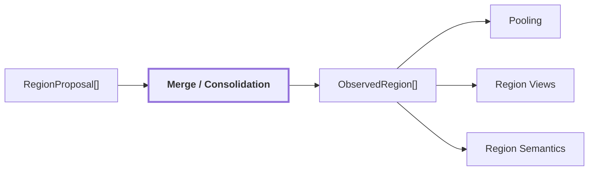
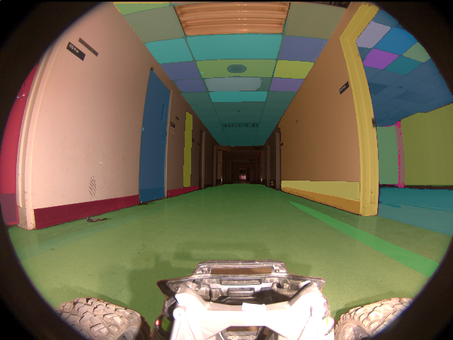
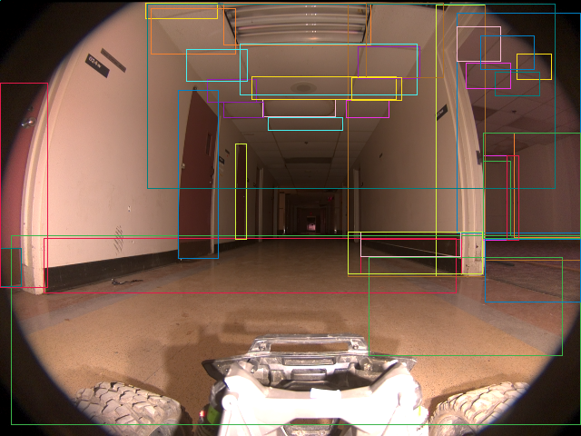

# 03. Region Merge / Consolidation

## Onde estamos na pipeline



## Objetivo

Consolidar proposals redundantes ou sobrepostas em uma unidade 2D canônica, `ObservedRegion`, sem confundir essa unidade com uma entidade física persistente.

## Contract conceitual

```text
ObservedRegion
{
    region_id
    mask
    box
    geometric_confidence
    contributing_proposal_ids
    claims[]
    visual_embedding_ref?
    language_embedding_ref?
    evidence[]
}
```

A região preserva quais proposals contribuíram para ela. Claims e evidências podem ainda estar vazios neste ponto.

## Reference run

O frame `corridor-02-000` terminou com `40` regiões canônicas, originadas de `75` proposals iniciais e `47` proposals após o estágio de merge/filtros.

```text
geometric_confidence
count: 40
min: 0.9277539253
max: 1.0
mean: 0.9788180351
median: 0.9824641347
distinct_values: 34
degenerate: false
```

Artifacts:

| máscaras | boxes | overlay |
| --- | --- | --- |
|  |  |  |

## Saída

`ObservedRegion[]` é consumido por pooling DINOv2, geração de views, CLIP e reasoner semântico.

## Limitação central

Consolidar regiões 2D não prova identidade física. Duas regiões que parecem partes do mesmo objeto ainda precisam de geometria e observações temporais para se tornarem uma entidade persistente.