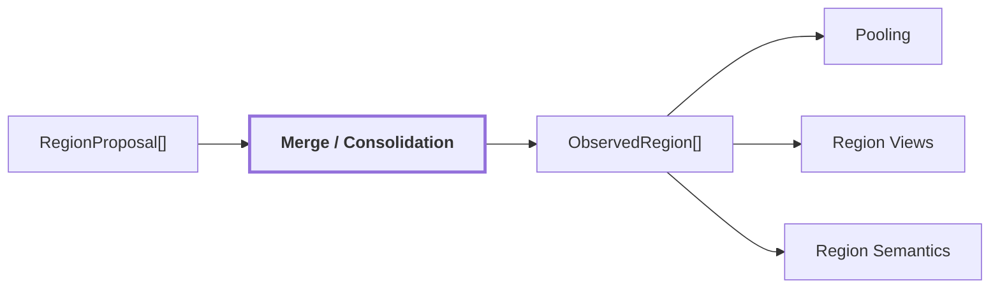

# 03. Region Merge / Consolidation

## Onde estamos na pipeline



## Objetivo

Consolidar proposals redundantes ou sobrepostas em uma unidade 2D canônica, `ObservedRegion`, sem confundir essa unidade com uma entidade física persistente.

SAM pode produzir várias máscaras para praticamente o mesmo conteúdo, principalmente quando existem tiles, escalas diferentes ou regiões parcialmente contidas umas nas outras.

Sem merge, uma única porta poderia entrar na pipeline como várias regiões independentes.

## Entrada

A entrada é uma coleção de `RegionProposal`:

```text
proposal A
├── mask
├── box
├── geometric_confidence
└── source

proposal B
├── mask
├── box
├── geometric_confidence
└── source
```

Essas proposals já passaram pelos filtros de área válida, ego-veículo e tamanho.

## Como duas proposals podem representar a mesma região

Exemplo conceitual:

```text
proposal A
+------------------+
|      porta       |
|      porta       |
+------------------+

proposal B
  +--------------+
  |    porta     |
  |    porta     |
  +--------------+
```

As máscaras possuem grande sobreposição. O merge usa critérios como IoU e containment para decidir se devem ser consolidadas.

```text
IoU alta
ou
containment alto
        |
        v
mesma região canônica
```

## Por que não simplesmente descartar duplicatas antes

O pipeline preserva `contributing_proposal_ids`.

Isso permite saber que a região final foi sustentada por mais de uma proposal em vez de apagar essa proveniência.

```text
ObservedRegion
├── region_id
├── mask
├── box
├── geometric_confidence
└── contributing_proposal_ids
    ├── sam-12
    └── sam-37
```

A região canônica é a unidade que os estágios seguintes passam a usar.

## Contract conceitual

```text
ObservedRegion
{
    region_id
    mask
    box
    geometric_confidence
    contributing_proposal_ids
    claims[]
    visual_embedding_ref?
    language_embedding_ref?
    evidence[]
}
```

Neste ponto, normalmente:

```text
claims = []
evidence = []
```

A geometria existe antes da interpretação semântica.

## Reference run

O frame `corridor-02-000` terminou com:

```text
75 proposals iniciais
47 proposals após filtros/merge intermediário
40 regiões canônicas
5 regiões formadas por múltiplas proposals
```

Para as 40 regiões finais:

```text
geometric_confidence
count: 40
min: 0.9277539253
max: 1.0
mean: 0.9788180351
median: 0.9824641347
distinct_values: 34
degenerate: false
```

Artifacts:

| máscaras | boxes | overlay |
| --- | --- | --- |
|  |  |  |

## O que acontece depois

A mesma `ObservedRegion.mask` passa a alimentar caminhos paralelos:

```text
ObservedRegion
├── mask + DINO FeatureMap
│      -> mask-aware pooling
│
├── mask + RGB
│      -> RegionView[]
│      -> Qwen
│      -> CLIP image encoder
│
└── depois, no 3D
       -> membership do pixel projetado
```

Por isso um erro de merge pode contaminar mais de um estágio ao mesmo tempo.

## Limitação central

Consolidar regiões 2D não prova identidade física.

```text
mesma região 2D no frame
    !=
mesma entidade persistente no mundo
```

Duas regiões semelhantes em frames diferentes ainda precisam de geometria, pose e associação temporal antes de poderem ser tratadas como a mesma entidade.

## Próxima leitura

- [04. Dense Feature Extraction](./04-dense-features.md)
- [05. Mask-aware Pooling](./05-mask-aware-pooling.md)
- [Pipeline detalhada de `visual-perception`](../modules/visual-perception/docs/pipeline.md)