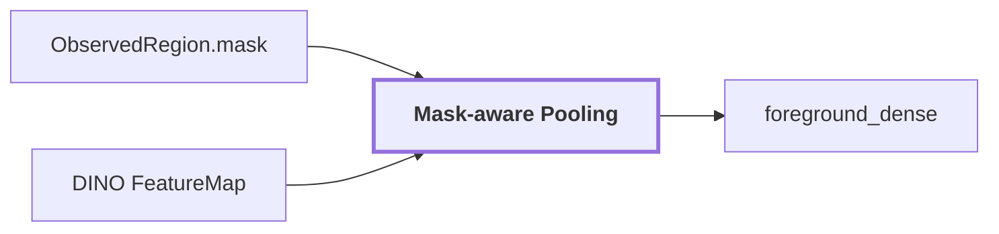

# 05. Mask-aware Pooling

## Onde estamos na pipeline



## Objetivo

Combinar a geometria 2D da região com as dense features para produzir uma representação visual agregada do foreground.

```text
mask = onde está a região
FeatureMap = como cada posição é representada visualmente
pooling = representação agregada das posições cobertas pela máscara
```

## Transformação

A máscara é projetada/amostrada no espaço da feature map. Features pertencentes ao suporte da região são agregadas e normalizadas. O vetor pesado é persistido em artifact; o JSON mantém referência e metadados de transformação.

## Reference run

Para `region-2c84165423b25fc3`:

```text
slot: foreground_dense
state: available
crop_box: [480, 5, 535, 305]
preprocessing: mask_aware_pooling:pixel_nearest_highres
artifact_ref: visual-region-2c84165423b25fc3
mask_ref: mask-region-2c84165423b25fc3
support_ratio: 1.0
mask_fill_ratio: 0.4477575758
EmbeddingSpace.dimension: 768
EmbeddingSpace.normalized: true
```

O vetor está em [`embeddings.npz`](../modules/visual-perception/benchmarks/results/samples/20260910T115810Z/frames/corridor-02-000/embeddings.npz), não inline em `observation.json`.

## Saída

Um `RegionEvidenceSlot` denominado `foreground_dense` com referência ao artifact, espaço vetorial, crop, máscara e suporte.

## Limitação

Pooling reduz várias posições a um vetor. Isso é útil para representar a região, mas perde detalhes internos. Para cross-modal distillation por ponto, a pipeline futura precisa preservar feature 2D alinhada ao pixel projetado do ponto LiDAR, não depender apenas do embedding agregado da região.