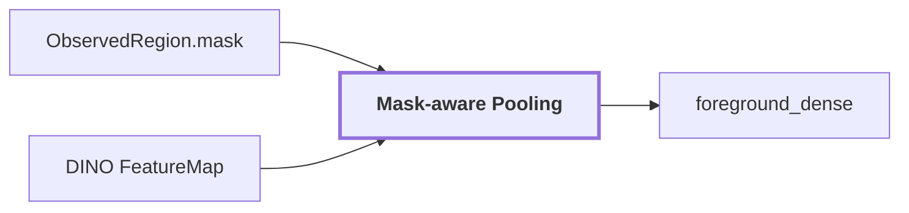

# 05. Mask-aware Pooling

## Onde estamos na pipeline



## Objetivo

Combinar a geometria 2D da região com as dense features do DINO para produzir uma representação visual agregada do foreground.

```text
mask = onde está a região
FeatureMap = como cada posição é representada visualmente
pooling = resumir apenas as features cobertas pela região
```

## Por que pooling é necessário

Depois do DINO, não temos um único vetor para a imagem. Temos uma grade:

```text
FeatureMap [24, 32, 768]
```

Cada posição `[y, x]` possui um vetor de `768` dimensões.

Já a região do SAM existe como uma máscara na imagem:

```text
mask [480, 640]
```

O pooling faz a ponte entre essas duas resoluções.

## Exemplo simplificado

Imagine uma região cuja máscara cobre principalmente três posições da feature map:

```text
patch A -> [ 0.10,  0.03, -0.20, ... ]
patch B -> [ 0.08,  0.01, -0.18, ... ]
patch C -> [ 0.13,  0.05, -0.22, ... ]
```

Cada vetor possui 768 valores. O pooling agrega esses vetores segundo a cobertura da máscara e produz um vetor da região:

```text
region_embedding
    -> [0.103, 0.030, -0.200, ...]
       <----------- 768 ----------->
```

Esse número é apenas ilustrativo. O artifact real guarda o vetor completo.

## A máscara impede que o fundo domine a região

Sem mask-aware pooling, usar apenas a bounding box poderia incluir muitos patches de fundo.

Exemplo:

```text
bounding box
+-----------------------+
| parede   porta parede |
| parede   porta parede |
| parede   porta parede |
+-----------------------+
```

Se a região for a porta, a máscara permite selecionar majoritariamente os patches que pertencem à porta em vez de calcular um embedding do retângulo inteiro.

Isso é importante em regiões finas, diagonais ou com bounding box muito maior que o objeto real.

## Transformação

```text
ObservedRegion.mask
        +
DINO FeatureMap
        |
        v
mapear suporte da máscara para a grade de features
        |
        v
selecionar/agregar vetores cobertos
        |
        v
normalizar
        |
        v
VisualEmbedding [768]
```

O vetor pesado é persistido em artifact. O JSON mantém a referência e os metadados necessários para reproduzir como ele foi obtido.

## Reference run

NOTE: os artifacts da run que sustentava este exemplo (`20260910T115810Z`, incluindo `embeddings.npz`) foram removidos do repositório — ver nota em [`docs/README.md`](./README.md#reference-run). Os valores abaixo são um exemplo conceitual da forma do output.

Para `region-2c84165423b25fc3` (exemplo conceitual):

```text
slot: foreground_dense
state: available
crop_box: [480, 5, 535, 305]
preprocessing: mask_aware_pooling:pixel_nearest_highres
artifact_ref: visual-region-2c84165423b25fc3
mask_ref: mask-region-2c84165423b25fc3
support_ratio: 1.0
mask_fill_ratio: 0.4477575758
EmbeddingSpace.dimension: 768
EmbeddingSpace.normalized: true
```

`mask_fill_ratio ~= 0.448` significa que menos da metade do retângulo da bounding box pertence efetivamente à máscara. Isso mostra por que usar apenas o crop retangular seria uma representação diferente da região real.

O vetor é persistido em um `embeddings.npz` por run, não inline em `observation.json`.

## O que esse vetor representa

O embedding `foreground_dense` é evidência visual DINO. Ele não é uma label e não vive no mesmo espaço texto-imagem do CLIP.

```text
DINO region embedding
    !=
CLIP image embedding
    !=
Qwen semantic claim
```

Cada um existe para uma função diferente.

## Saída

Um `RegionEvidenceSlot` denominado `foreground_dense` com referência ao artifact, espaço vetorial, crop, máscara e suporte.

## Limitação

Pooling reduz várias posições a um vetor. Isso é útil para representar a região como um todo, mas perde detalhes internos.

Para futura associação por ponto, o caminho mais rico é:

```text
ponto LiDAR
 -> pixel projetado
 -> posição específica da FeatureMap
 -> feature DINO local
```

em vez de atribuir a todos os pontos da região exatamente o mesmo embedding agregado.

## Próxima leitura

- [06. Region Evidence](./06-region-evidence.md)
- [04. Dense Feature Extraction](./04-dense-features.md)
- [Pipeline detalhada de `visual-perception`](../modules/visual-perception/docs/pipeline.md)