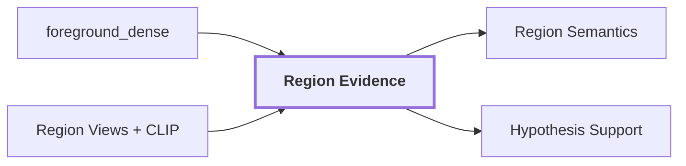

# 06. Region Evidence

## Onde estamos na pipeline



## Objetivo

Preservar evidências complementares em vez de condensar toda a região em um único embedding genérico.

## Slots

```text
foreground_dense
masked_subject
tight_crop
contextual_crop
scene_conditioned
```

Cada slot possui função distinta. `foreground_dense` representa visualmente o foreground via DINOv2. `masked_subject` isola o sujeito. `tight_crop` mantém entorno imediato. `contextual_crop` amplia o contexto. `scene_conditioned` reserva evidência condicionada ao quadro global.

Cada slot deve declarar estado (`available`, `missing`, `failed`), preprocessing, geometria, artifact e `EmbeddingSpace`. Vetores de espaços incompatíveis não devem ser comparados silenciosamente.

## Reference run

A região `region-2c84165423b25fc3` possui `foreground_dense` DINOv2 e slots CLIP `masked_subject`, `tight_crop` e `contextual_crop`. O run mostra que esses slots podem discordar semanticamente, justificando mantê-los separados.

## Influência no contexto

Contexto visual não é um único vetor. Separar sujeito e entorno permite detectar quando uma hipótese é sustentada pelo objeto em si ou apenas pelo ambiente ao redor, uma distinção importante para evitar vazamento semântico para a geometria 3D.

## Saída

Os slots alimentam `Region Semantics`, `Hypothesis Support` e auditoria.