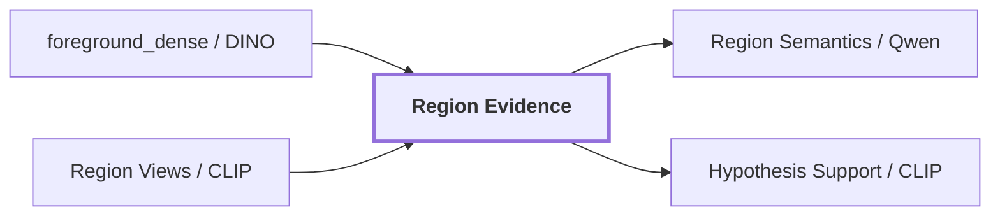

# 06. Region Evidence

## Onde estamos na pipeline



## Objetivo

Preservar diferentes tipos de evidência da mesma região sem condensar tudo em um único vetor genérico.

Uma região pode ser vista de maneiras diferentes:

```text
só o foreground
recorte justo
recorte com contexto
cena completa
```

Essas views respondem perguntas diferentes e podem até discordar semanticamente.

## Slots de evidência

```text
foreground_dense
masked_subject
tight_crop
contextual_crop
scene_conditioned
```

### `foreground_dense`

Vem do DINOv2 por mask-aware pooling.

```text
SAM mask + DINO FeatureMap
 -> VisualEmbedding 768D
```

Serve como evidência visual densa e não é diretamente comparável com texto.

### `masked_subject`

A máscara do SAM é usada para neutralizar o fundo do recorte. O resultado em pixels é enviado ao CLIP image encoder e também pode ser mostrado ao reasoner multimodal.

```text
RGB + mask
 -> sujeito preservado
 -> fundo neutralizado
```

Isso reduz a chance de o modelo classificar a região pelo ambiente ao redor.

### `tight_crop`

É um recorte justo da bounding box da região. Dependendo da configuração, pode preservar o fundo interno ao retângulo.

Ele ajuda quando detalhes de borda, textura ou forma ficam mais fáceis de interpretar com a região ampliada.

### `contextual_crop`

Expande a bounding box e mantém o entorno. O sujeito é marcado por contorno em vez de apagar o contexto.

```text
contexto ao redor continua visível
+ sujeito demarcado
```

Esse slot existe porque alguns conceitos precisam do ambiente para serem desambiguados.

### `scene_conditioned`

É evidência global da cena. O vetor pode ser compartilhado entre regiões porque não depende de uma única máscara.

## DINO e CLIP coexistem, mas em espaços diferentes

A região pode carregar simultaneamente:

```text
DINO foreground_dense
    -> visual_dense space

CLIP masked_subject
CLIP tight_crop
CLIP contextual_crop
    -> language_aligned space
```

Mesmo quando ambos têm dimensão `768`, isso **não significa que os vetores sejam comparáveis**.

```text
768 números DINO
    !=
768 números CLIP
```

A identidade do `EmbeddingSpace` inclui modelo, checkpoint, modalidade, dimensão e normalização justamente para evitar comparações silenciosas entre espaços incompatíveis.

## Exemplo real

A região `region-2c84165423b25fc3` possui:

```text
foreground_dense
    DINOv2
    dimension: 768

masked_subject
    CLIP
    dimension: 768

tight_crop
    CLIP
    dimension: 768

contextual_crop
    CLIP
    dimension: 768
```

Os três embeddings CLIP são diferentes porque cada um viu pixels diferentes, embora usem o mesmo modelo e vivam no mesmo espaço.

Essa diferença aparece no suporte semântico real da região:

```text
masked_subject -> favorece wooden door
tight_crop     -> favorece wooden door
contextual_crop -> favorece wooden panel
```

Portanto "o embedding da região" não é um conceito único no pipeline.

## Como os mesmos recortes chegam ao Qwen e ao CLIP

`build_region_views()` é o ponto comum.

```text
ObservedRegion.mask
        +
RGB
        |
        v
RegionView[]
   |              |
   |              +--> Qwen region semantics
   |
   +--> CLIP image encoder
```

Isso garante que Qwen e CLIP avaliem a mesma geometria visual. Sem essa regra, um poderia ver um crop justo e o outro uma região expandida, tornando a comparação de suporte difícil de interpretar.

## Estado de cada slot

Cada slot declara explicitamente:

```text
available
missing
failed
```

Esses estados são diferentes:

```text
missing = não foi configurado / não existe
failed  = deveria ser produzido, mas houve falha
```

A distinção é importante para benchmarks e ablations.

## Saída

Os slots alimentam:

```text
Qwen Region Semantics
CLIP Hypothesis Support
reconciliation
quality audit
artifacts de benchmark
```

O pipeline não força todos os consumidores a usar todos os slots.

## Próxima leitura

- [07. Language-Aligned Evidence](./07-language-aligned-evidence.md)
- [09. Region Semantics](./09-region-semantics.md)
- [Pipeline detalhada de `visual-perception`](../modules/visual-perception/docs/pipeline.md)