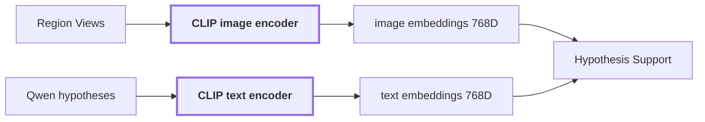

# 07. Language-Aligned Evidence

## Onde estamos na pipeline



## Objetivo

Representar imagem e texto no mesmo espaço vetorial para medir se a evidência visual é compatível com hipóteses linguísticas.

Esse é o papel que diferencia CLIP do DINO na pipeline.

```text
DINOv2
    imagem -> representação visual densa

CLIP
    imagem -> vetor
    texto  -> vetor
    ambos no mesmo espaço
```

## Dois encoders, um espaço compartilhado

O checkpoint atual é `openai/clip-vit-large-patch14`, com dimensão `768`.

Conceitualmente:

```text
CLIP image encoder
    image -> [768]

CLIP text encoder
    text -> [768]
```

Exemplo ilustrativo:

```text
imagem da região
 -> [ 0.012, -0.044, 0.091, ..., 0.031 ]

texto da hipótese
 -> [ 0.019, -0.051, 0.087, ..., 0.040 ]
```

Os números acima são apenas ilustrativos. O ponto importante é que os dois vetores vivem no mesmo `EmbeddingSpace`.

## Primeiro CLIP codifica as imagens

Antes de o Qwen ter sua hipótese validada, o pipeline já criou views da região a partir da máscara do SAM:

```text
masked_subject
tight_crop
contextual_crop
```

Cada view passa pelo image encoder do CLIP:

```text
masked_subject
 -> CLIP image encoder
 -> image_embedding_subject[768]

contextual_crop
 -> CLIP image encoder
 -> image_embedding_context[768]
```

Esses embeddings ficam armazenados em memória e podem ser persistidos por referência.

## Depois Qwen produz as hipóteses textuais

O Qwen analisa as views da região e o contexto da cena. Para a região real `region-2c84165423b25fc3`, ele produziu:

```text
primary: wooden panel
alternative: wooden door
```

Nesse momento o CLIP não aceita simplesmente a escolha do Qwen.

O estágio de `Hypothesis Support` pega cada conceito e aplica o template textual versionado atual:

```text
prompt_template: "a photo of {concept}"
template_version: align/v1
```

Portanto o que entra efetivamente no text encoder é:

```text
wooden panel
    -> "a photo of wooden panel"
    -> CLIP text encoder
    -> text_panel[768]

wooden door
    -> "a photo of wooden door"
    -> CLIP text encoder
    -> text_door[768]
```

O template faz parte do sinal. Mudar a frase pode mudar o embedding textual e, por consequência, as margens de suporte. Por isso ele é versionado e participa do fingerprint de configuração.

## Como imagem e texto são comparados

Como os vetores são normalizados e pertencem ao mesmo espaço, o dot product pode ser usado como similaridade de cosseno:

```text
score = image_embedding dot text_embedding
```

Exemplo simplificado usando os scores observados:

```text
masked_subject
    score("wooden panel") = 0.154
    score("wooden door")  = 0.193
```

Os nomes na tabela representam as hipóteses originais. Os embeddings de texto foram gerados a partir do template `a photo of {concept}`.

Então:

```text
margin(door)
 = 0.193 - 0.154
 = +0.039
```

Nesse slot, `wooden door` tem suporte maior que `wooden panel`.

## Exemplo real da reference run

Para `region-2c84165423b25fc3`:

| hipótese | slot | score | margem | resultado |
| --- | --- | ---: | ---: | --- |
| `wooden panel` | `masked_subject` | 0.154144 | -0.039176 | contradicts |
| `wooden panel` | `tight_crop` | 0.224522 | -0.011447 | contradicts |
| `wooden panel` | `contextual_crop` | 0.194337 | 0.019575 | supports |
| `wooden door` | `masked_subject` | 0.193320 | 0.039176 | supports |
| `wooden door` | `tight_crop` | 0.235969 | 0.011447 | supports |
| `wooden door` | `contextual_crop` | 0.174762 | -0.019575 | contradicts |

Isso mostra uma propriedade importante:

```text
sujeito isolado -> parece mais door
contexto amplo  -> parece mais panel
```

O pipeline preserva essa divergência em vez de reduzir tudo imediatamente a uma única label.

## CLIP não produz uma probabilidade de correção

Um score como:

```text
0.235969
```

não significa:

```text
23.5969% de chance de ser door
```

É uma similaridade no espaço de embeddings.

Por isso o pipeline mantém separados:

```text
Qwen confidence
CLIP score
CLIP margin
calibrated confidence
```

Eles não são o mesmo sinal.

## CLIP também não é usado como classificador aberto irrestrito nessa etapa

O estágio atual não pergunta ao CLIP:

```text
entre todas as palavras do mundo, o que é isto?
```

Ele pergunta algo mais controlado:

```text
entre as hipóteses que já existem para esta região,
qual é mais compatível com esta evidência visual?
```

Isso reduz o problema a uma arbitragem entre hipóteses concorrentes registradas pelo pipeline.

## Relação completa com Qwen

```text
SAM mask
   |
   v
RegionView
   |
   +--> Qwen ----------------------> "wooden panel", "wooden door"
   |                                      |
   |                                      v
   |                          "a photo of {concept}"
   |                                      |
   |                               CLIP text encoder
   |
   +--> CLIP image encoder
              |
              v
      image embedding
              |
              +------ compare ------ text embeddings
                              |
                              v
                   supports / contradicts /
                     indistinguishable
```

Essa é a validação independente que impede o Qwen de ser a única fonte de semântica.

## Reference run

```text
model: openai/clip-vit-large-patch14
dimension: 768
modality: language_aligned
context_expansion: 0.25
hypothesis prompt: a photo of {concept}
indistinguishable_margin: 0.01
```

Os vetores completos ficam nos artifacts de embedding, enquanto `observation.json` e diagnósticos preservam referências e sinais derivados.

## Limitações

CLIP pode ser sensível ao crop, ao contexto e à formulação textual. Uma view isolada pode favorecer uma hipótese errada. Por isso a pipeline compara múltiplas views e usa margem entre concorrentes.

O suporte CLIP também não altera sozinho a claim. Refinement e calibração são os estágios responsáveis por decidir como usar a discordância.

## Próxima leitura

- [08. Scene Context](./08-scene-context.md)
- [09. Region Semantics](./09-region-semantics.md)
- [10. Hypothesis Support](./10-hypothesis-support.md)
- [Pipeline detalhada de `visual-perception`](../modules/visual-perception/docs/pipeline.md)