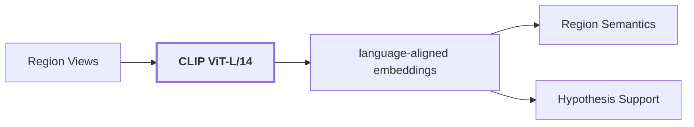

# 07. Language-Aligned Evidence

## Onde estamos na pipeline



## Objetivo

Representar imagem e texto no mesmo espaço vetorial para medir suporte visual independente às hipóteses linguísticas.

DINOv2 e CLIP não são intercambiáveis:

```text
DINOv2: imagem -> representação visual densa
CLIP: imagem/texto -> espaço compartilhado visual-language
```

A similaridade de cosseno em CLIP é uma medida no espaço de embedding. Ela não é probabilidade e não deve ser tratada como confiança calibrada.

## Reference run

Para `region-2c84165423b25fc3`:

```text
model: openai/clip-vit-large-patch14
dimension: 768
modality: language_aligned
context_expansion: 0.25

masked_subject:
  preprocessing: neutral_masked_crop:expansion=0.0
  artifact_ref: language-subject-region-2c84165423b25fc3

tight_crop:
  preprocessing: crop:expansion=0.0
  artifact_ref: language-region-2c84165423b25fc3

contextual_crop:
  mesmo espaço CLIP com contexto expandido
```

## Saída

Embeddings language-aligned por view, consumidos principalmente por `Hypothesis Support`.

## Limitação

Uma view isolada pode favorecer uma hipótese errada. O run real mostra divergência entre `masked_subject`, `tight_crop` e `contextual_crop`; por isso a pipeline preserva múltiplas views e não promove um único score a verdade.