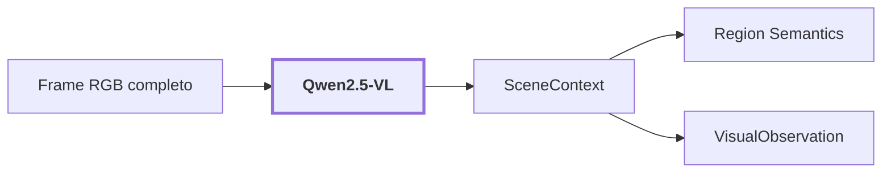

# 08. Scene Context

## Onde estamos na pipeline



## Objetivo

Interpretar o frame completo e produzir claims globais úteis para desambiguar regiões. Esses claims são hipóteses semânticas do frame e não possuem automaticamente geometria 2D ou 3D própria.

## Reference run

Para `corridor-02-000`:

```text
scene_type: corridor
scene confidence: 0.85
environment: indoor
layout: long hallway with doors on both sides
lighting: dim, artificial lights
visibility: clear, but dimly lit
navigability: moderate, some obstacles like a suitcase
```

Proveniência:

```text
producer: qwen_vl
checkpoint: Qwen/Qwen2.5-VL-3B-Instruct
prompt_version: v7
stage: scene_context
```

O trecho `some obstacles like a suitcase` é output do modelo, não ground truth.

## Saída

`SceneContext` entra no reasoner de regiões e é persistido dentro de `VisualObservation`.

## Influência no mapa contextual

Esta etapa fornece contexto explícito de cena, por exemplo tipo de ambiente, layout e condições. Ela ajuda a interpretar regiões, mas não deve sobrescrever evidência local nem criar posição XYZ. O contexto global precisa permanecer auditável e separado da geometria.