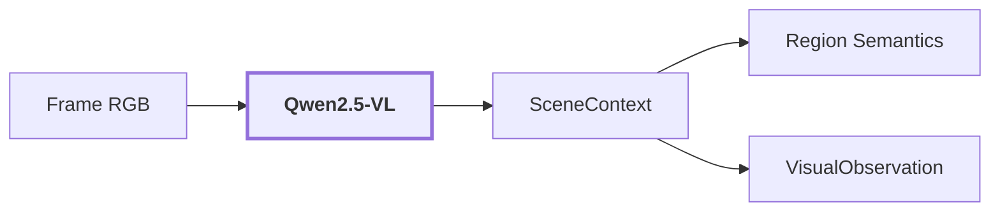

# 08. Scene Context

## Onde estamos na pipeline



## Objetivo

Interpretar o ambiente global do frame antes de interpretar cada região individualmente.

O contexto de cena responde perguntas como:

```text
que tipo de ambiente é este?
é indoor ou outdoor?
como é o layout?
como está a iluminação?
como está a visibilidade?
como está a navegabilidade?
```

Ele **não deve funcionar como inventário global de objetos**.

## O que o Qwen recebe nessa etapa

O Qwen recebe uma view da cena em pixels. Quando existem máscaras de área válida e ego-veículo, o pipeline recorta a parte analisável da imagem para impedir que o próprio drone/rig seja interpretado como elemento do ambiente.

```text
RGB completo
    + área válida fisheye
    + ego mask
        |
        v
scene view
        |
        v
Qwen scene analysis
```

O pipeline não pinta a área inválida de preto. Ele prefere recortar a cena porque alterar pixels pode introduzir padrões artificiais que influenciam os modelos.

## Por que o contexto global existe

Uma região isolada pode ser ambígua.

Imagine um recorte marrom e retangular:

```text
somente região
    -> pode parecer painel
    -> pode parecer porta
    -> pode parecer móvel
```

Se o contexto global diz:

```text
scene_type: corridor
environment: indoor
layout: long hallway with doors on both sides
```

isso fornece informação adicional para o reasoner de região.

O ponto importante é que o contexto ajuda a desambiguar, mas não deve sobrepor evidência local.

## Contract atual

O contexto é estruturado em claims ambientais. Campos como inventário livre de objetos foram removidos da fronteira atual para reduzir propagação de alucinações.

Conceitualmente:

```text
SceneContext
├── scene_type
├── environment
├── layout
├── lighting
├── visibility
└── navigability
```

## Exemplo real da reference run

Para `corridor-02-000`:

```text
scene_type: corridor
scene confidence: 0.85
environment: indoor
layout: long hallway with doors on both sides
lighting: dim, artificial lights
visibility: clear, but dimly lit
navigability: moderate, some obstacles like a suitcase
```

Proveniência:

```text
producer: qwen_vl
checkpoint: Qwen/Qwen2.5-VL-3B-Instruct
prompt_version: v7
stage: scene_context
```

O trecho `some obstacles like a suitcase` é output do modelo, não ground truth.

## Um erro real que motivou a mudança de contract

Uma versão anterior permitia que o contexto de cena retornasse inventário de objetos. Em `corridor-02-002`, o modelo interpretou parte do próprio rig como uma `suitcase`.

Esse erro era perigoso porque o contexto global era depois usado para interpretar **todas as regiões**:

```text
Qwen scene:
    "há uma suitcase"
        |
        v
contexto enviado para várias regiões
        |
        v
risco de induzir interpretações locais erradas
```

A solução foi tornar o `SceneContext` predominantemente ambiental, em vez de uma lista de objetos inferidos globalmente.

## Relação com Region Semantics

Depois que `SceneContext` é criado, o pipeline seleciona claims de cena permitidas e as inclui em cada `RegionReasoningRequest`.

```text
RegionView[]
        +
SceneContext ambiental
        |
        v
Qwen region semantics
```

O Qwen de região, portanto, não recebe apenas um crop isolado. Ele recebe pixels locais e informação estruturada do ambiente.

## O que Scene Context não recebe

Na implementação atual, o Qwen dessa etapa não recebe o embedding DINO como entrada semântica.

```text
DINO -> dense visual evidence
Qwen -> multimodal reasoning sobre pixels
```

São canais independentes que se encontram mais tarde no estado da região e nos mecanismos de avaliação/reconciliação.

## Confiança

Apenas scores realmente fornecidos pelo produtor são preservados. Se o Qwen não retornar confiança para uma claim, o pipeline mantém `None` em vez de inventar `1.0`.

Isso evita transformar ausência de score em certeza artificial.

## Saída

`SceneContext` entra no reasoner de regiões e é persistido dentro de `VisualObservation`.

Ele não possui posição XYZ própria. Uma claim de cena como `corridor` descreve a observação global, não um ponto específico do mapa.

## Influência no mapa contextual

A informação global pode ser útil downstream para raciocínio contextual, mas precisa permanecer separada da geometria.

```text
"corridor"
    = claim ambiental do frame
    !=
GeometryPoint(x, y, z)
```

A associação espacial acontece em etapas posteriores.

## Próxima leitura

- [09. Region Semantics](./09-region-semantics.md)
- [Política de semântica contextual](../modules/visual-perception/docs/contextual-semantics.md)
- [Pipeline detalhada de `visual-perception`](../modules/visual-perception/docs/pipeline.md)