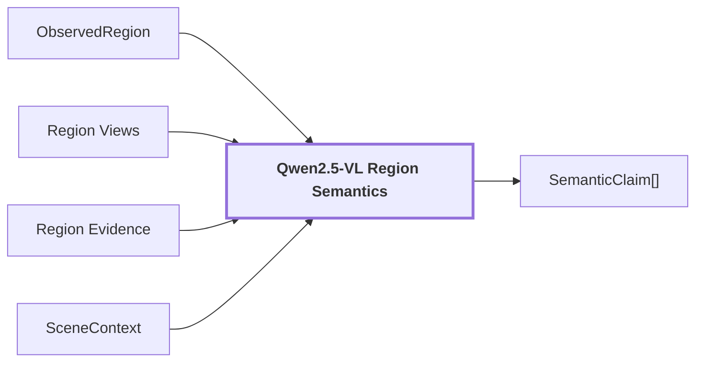

# 09. Region Semantics

## Onde estamos na pipeline



## Objetivo

Adicionar interpretações semânticas auditáveis à geometria 2D da região, mantendo hipótese principal, alternativas, atributos, condição, material e proveniência separados da confiança geométrica.

## Reference run

Para `region-2c84165423b25fc3`:

```json
{
  "label": "wooden panel",
  "confidence": 0.9,
  "alternatives": [{"label": "wooden door", "confidence": 0.8}],
  "category": "door",
  "kind": "thing",
  "attributes": ["smooth", "shiny"],
  "condition": "new",
  "material": "wood"
}
```

A qualidade geométrica da mesma região é `0.97944176197052`. Ela não é o mesmo sinal que a confiança semântica `0.9`.

No frame completo:

```text
semantic_confidence
count: 40
min: 0.9
max: 0.9
distinct_values: 1
stddev: 0.0
degenerate: true
```

Nesse run, a confiança bruta `0.9` não discrimina regiões. Portanto não pode ser tratada como uma probabilidade calibrada de correção.

## Saída

`SemanticClaim[]` segue para `Hypothesis Support`, refinement e reconciliation.

## Regra importante

`confidence=None` significa ausência de score, não zero. `geometric_confidence`, `SemanticClaim.confidence` e confiança calibrada são conceitos distintos e não devem ser combinados sem política explícita.