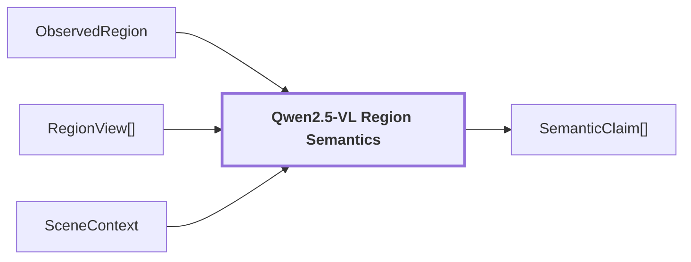

# 09. Region Semantics

## Onde estamos na pipeline



## Objetivo

Adicionar interpretações semânticas auditáveis à geometria 2D da região sem alterar a própria geometria.

Depois do merge, `region_id`, máscara e bounding box estão congelados. Esta etapa apenas acrescenta claims.

```text
geometria
    -> permanece igual

semântica
    -> é anexada
```

## O que o Qwen recebe

O reasoner não recebe apenas uma bounding box crua.

Ele recebe um `RegionReasoningRequest` contendo:

```text
region_id
region_box
image_width
image_height
views[]
scene_claims[]
```

Na configuração atual do primeiro passe, `MultimodalReasoningConfig.region_views` seleciona exatamente:

```text
masked_subject
tight_crop
contextual_crop
```

Portanto o request visual normal do Qwen de região é:

```text
SAM mask
   |
   v
build_region_views()
   |
   +--> masked_subject
   +--> tight_crop
   +--> contextual_crop
            |
            v
      Qwen region semantics
```

`scene_conditioned` pode existir como slot de evidência multi-contexto na configuração `research_quality`, mas **não está no conjunto padrão `region_views` do primeiro passe de interpretação**.

O contexto global da cena chega por outro canal, como `scene_claims[]`, controlado por `scene_context_mode`. O modo atual é `context_assisted`.

Assim existem dois canais distintos:

```text
canal visual local
    masked_subject + tight_crop + contextual_crop

canal textual/contextual
    SceneContext claims
```

Essa separação é deliberada para evitar que a imagem inteira da cena domine a identidade local de uma região.

## Como cada view é construída

As `views[]` são derivadas da máscara do SAM:

```text
masked_subject
    sujeito isolado
    fundo neutralizado com cinza médio

tight_crop
    recorte justo da bounding box
    na configuração atual, sem mascarar o fundo interno

contextual_crop
    bounding box expandida
    contexto preservado
    sujeito marcado por contorno verde
```

A mesma geometria de view também é usada pelo CLIP, o que permite comparar a hipótese do Qwen com evidência visual produzida a partir dos mesmos pixels.

## Relação SAM -> Qwen

```text
SAM
 -> mask
 -> RegionView
 -> Qwen
 -> hipótese textual
```

A máscara booleana não é usada como label e não diz ao Qwen o que existe. Ela apenas define o sujeito visual e como os pixels são apresentados ao modelo.

Exemplo:

```text
SAM:
    "estes pixels formam uma região"

Qwen:
    "vendo essa região e o contexto, acho que é wooden panel"
```

## O DINO participa diretamente dessa decisão?

Não na implementação atual.

O Qwen recebe views em pixels e contexto de cena. O `foreground_dense` do DINO fica preservado como evidência visual da região, mas não é passado como vetor numérico ao `analyze_region()`.

```text
DINO embedding 768D
    -> evidência visual densa

Qwen
    -> interpretação multimodal dos pixels
```

Isso mantém o reasoner independente do espaço interno do DINO.

## O que o Qwen produz

O contrato atual aceita:

```text
primary label
alternatives
category
region kind
confidence opcional
atributos descritivos
condition
material
```

Exemplo conceitual (os artifacts da run que sustentava este exemplo foram removidos do repositório — ver nota em [`docs/README.md`](./README.md#reference-run)):

```json
{
  "label": "wooden panel",
  "confidence": 0.9,
  "alternatives": [
    {"label": "wooden door", "confidence": 0.8}
  ],
  "category": "door",
  "kind": "thing",
  "attributes": ["smooth", "shiny"],
  "condition": "new",
  "material": "wood"
}
```

A resposta bruta é preservada em evidência para permitir auditoria posterior.

## Claims, não uma label única

A pipeline evita transformar o resultado do Qwen diretamente em um campo único:

```text
region.label = "wooden panel"
```

Em vez disso, cria claims irmãos:

```text
PRIMARY:
    wooden panel

ALTERNATIVE:
    wooden door
```

Isso é importante porque a etapa seguinte pode encontrar evidência visual favorecendo a alternativa.

## Exemplo de por que alternativas importam

Para a região de referência:

```text
Qwen primary:
    wooden panel

Qwen alternative:
    wooden door
```

Depois, o CLIP encontra:

```text
masked_subject -> wooden door combina mais
contextual_crop -> wooden panel combina mais
```

Se a alternativa tivesse sido descartada, o pipeline não teria uma hipótese concorrente explícita para comparar.

## Relação exata Qwen -> CLIP

O Qwen não envia embeddings ao CLIP. Ele produz **conceitos textuais**.

O estágio seguinte pega esses conceitos e constrói os textos CLIP com o template versionado:

```text
wooden panel
 -> "a photo of wooden panel"
 -> CLIP text encoder

wooden door
 -> "a photo of wooden door"
 -> CLIP text encoder
```

Esses vetores de texto são comparados com os embeddings CLIP das mesmas views de imagem que participaram da construção da evidência regional.

Portanto:

```text
Qwen
    propõe o significado

CLIP
    mede se a imagem é compatível com as hipóteses propostas
```

## Confidence do Qwen não é qualidade geométrica

Na mesma região:

```text
geometric_confidence: 0.97944176197052
semantic confidence:  0.9
```

Esses sinais medem coisas diferentes.

```text
geometric_confidence
    -> qualidade/confiança da região visual proposta

semantic confidence
    -> score declarado pelo Qwen para a interpretação
```

Eles não devem ser combinados como se fossem probabilidades equivalentes.

## Um problema real da reference run

No frame completo:

```text
semantic_confidence
count: 40
min: 0.9
max: 0.9
distinct_values: 1
stddev: 0.0
degenerate: true
```

O Qwen devolveu `0.9` para todas as regiões.

Isso torna esse score pouco informativo para distinguir uma região confiável de uma região duvidosa.

Por isso a pipeline possui um canal independente de suporte com CLIP.

## O que acontece com ausência de score

Se o modelo omitir `confidence`, o sistema preserva:

```text
confidence = None
```

Não converte para:

```text
confidence = 1.0
```

Essa distinção evita inventar certeza.

## Saída

```text
SemanticClaim[]
    |
    +--> Hypothesis Support
    +--> calibration
    +--> selective refinement
    +--> reconciliation
```

As claims continuam vinculadas à mesma `ObservedRegion` e preservam proveniência do modelo, checkpoint, estágio e prompt.

## Próxima leitura

- [10. Hypothesis Support](./10-hypothesis-support.md)
- [Política de semântica contextual](../modules/visual-perception/docs/contextual-semantics.md)
- [Pipeline detalhada de `visual-perception`](../modules/visual-perception/docs/pipeline.md)