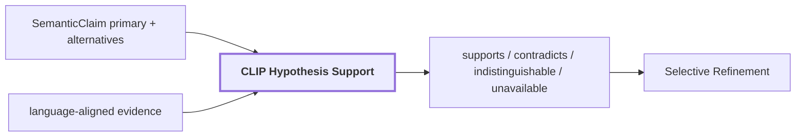

# 10. Hypothesis Support

## Onde estamos na pipeline



## Objetivo

Impedir que uma label do VLM se torne verdade apenas porque foi emitida. A etapa mede sinais visuais independentes no espaço CLIP para a hipótese principal e alternativas.

## Contract conceitual

```text
HypothesisSupportSignal
{
    source
    hypothesis
    slot
    status
    score?
    margin?
    space?
    reason?
}
```

## Reference run

Para `region-2c84165423b25fc3`:

| hipótese | slot | status | score | margem |
| --- | --- | --- | ---: | ---: |
| `wooden panel` | `masked_subject` | contradicts | 0.154144 | -0.039176 |
| `wooden panel` | `tight_crop` | contradicts | 0.224522 | -0.011447 |
| `wooden panel` | `contextual_crop` | supports | 0.194337 | 0.019575 |
| `wooden door` | `masked_subject` | supports | 0.193320 | 0.039176 |
| `wooden door` | `tight_crop` | supports | 0.235969 | 0.011447 |
| `wooden door` | `contextual_crop` | contradicts | 0.174762 | -0.019575 |

No frame inteiro:

```text
supports: 72
contradicts: 27
indistinguishable: 21
regions_with_unsupported_primary: 5
regions_with_ambiguous_identity: 2
competing_assertions: 24
```

## Interpretação

O sujeito isolado e o tight crop favorecem `wooden door`; o contexto mais amplo favorece `wooden panel`. Essa divergência é informação útil. Uma margem pequena deve permanecer `indistinguishable`, não ser forçada a suporte ou contradição.

## Saída

Sinais de suporte entram no refinement e na reconciliation preservando a proveniência da hipótese e da view usada.