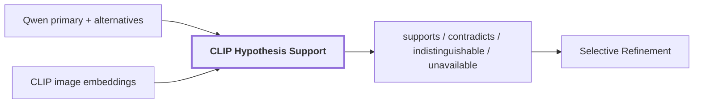

# 10. Hypothesis Support

## Onde estamos na pipeline



## Objetivo

Adicionar um canal independente que possa concordar ou discordar das hipóteses produzidas pelo Qwen.

Sem essa etapa, o fluxo seria:

```text
Qwen diz "wall"
        |
        v
pipeline aceita "wall"
```

Com hypothesis support:

```text
Qwen diz "wooden panel"
Qwen também sugere "wooden door"
        |
        v
CLIP compara as duas hipóteses
contra evidência visual real
        |
        v
supports / contradicts / indistinguishable
```

## O CLIP não recodifica as imagens nessa etapa

As imagens já foram codificadas anteriormente em `Region Evidence`.

Para cada região podem existir embeddings CLIP de:

```text
masked_subject
tight_crop
contextual_crop
```

Esses vetores são reutilizados.

O custo adicional principal é codificar os **textos das hipóteses**.

## Relação Qwen -> CLIP text encoder

O Qwen produz algo como:

```text
primary: wooden panel
alternative: wooden door
```

O support stage pega esses conceitos e chama:

```text
CLIP.encode_text("wooden panel")
CLIP.encode_text("wooden door")
```

Cada texto vira um vetor de `768` dimensões no mesmo espaço dos embeddings CLIP das imagens.

```text
image vector [768]
text vector  [768]
        |
        v
dot product / cosine similarity
```

## Exemplo numérico simplificado

Suponha o slot `masked_subject`:

```text
score("wooden panel") = 0.154
score("wooden door")  = 0.193
```

Para `wooden door`:

```text
margin = 0.193 - 0.154
       = +0.039
```

Para `wooden panel`:

```text
margin = 0.154 - 0.193
       = -0.039
```

Assim:

```text
wooden door  -> supports
wooden panel -> contradicts
```

## Por que usar margem e não apenas score absoluto

Um score CLIP isolado depende de muitos fatores e não é uma probabilidade calibrada.

O que interessa aqui é a competição local entre as hipóteses registradas para a mesma região:

```text
esta imagem parece mais com "door"
ou mais com "panel"?
```

Então a pipeline calcula:

```text
margin(hypothesis)
 = score(hypothesis)
 - melhor score entre as concorrentes
```

## Estado `indistinguishable`

Diferenças muito pequenas não devem ser convertidas em decisão forte.

Exemplo:

```text
door  = 0.221
panel = 0.219
margin = 0.002
```

Se esse valor estiver abaixo do piso configurado:

```text
status = indistinguishable
```

Isso significa:

```text
a evidência CLIP não separa as hipóteses com margem suficiente
```

em vez de escolher arbitrariamente uma delas.

## Reference run real

Para `region-2c84165423b25fc3`:

| hipótese | slot | status | score | margem |
| --- | --- | --- | ---: | ---: |
| `wooden panel` | `masked_subject` | contradicts | 0.154144 | -0.039176 |
| `wooden panel` | `tight_crop` | contradicts | 0.224522 | -0.011447 |
| `wooden panel` | `contextual_crop` | supports | 0.194337 | 0.019575 |
| `wooden door` | `masked_subject` | supports | 0.193320 | 0.039176 |
| `wooden door` | `tight_crop` | supports | 0.235969 | 0.011447 |
| `wooden door` | `contextual_crop` | contradicts | 0.174762 | -0.019575 |

A região mostra por que múltiplas views importam:

```text
sujeito isolado
    -> door

tight crop
    -> door

contextual crop
    -> panel
```

O entorno influencia a interpretação.

## O que o support stage não faz

Ele não substitui diretamente:

```text
primary = wooden panel
```

por:

```text
primary = wooden door
```

Ele anexa sinais à claim.

```text
SemanticClaim("wooden panel")
├── Qwen confidence
└── CLIP support signals[]
```

Quem decide como reagir à contradição são estágios posteriores, como calibração e selective refinement.

## Por que isso é mais robusto que usar apenas Qwen

Qwen e CLIP cometem erros diferentes.

Qwen possui capacidade forte de interpretação contextual, mas pode alucinar ou ser influenciado pelo entorno.

CLIP é mais restrito, mas fornece uma comparação imagem-texto independente.

A arquitetura tenta aproveitar essa diferença:

```text
Qwen
    propõe significado

CLIP
    testa compatibilidade visual das hipóteses
```

A independência não é perfeita porque ambos são modelos visuais treinados em grandes datasets, mas é estruturalmente melhor do que confiar em um único score do VLM.

## Métricas do frame de referência

```text
supports: 72
contradicts: 27
indistinguishable: 21
regions_with_unsupported_primary: 5
regions_with_ambiguous_identity: 2
competing_assertions: 24
```

Esses números descrevem a run observada e não thresholds universais.

## Quando o sinal fica `unavailable`

Pode ocorrer quando:

```text
não há embedding CLIP para o slot
texto não pôde ser codificado
há apenas uma hipótese, sem concorrente
espaço/configuração incompatível
```

A ausência de suporte não deve ser tratada automaticamente como contradição.

## Saída

Os sinais seguem anexados às claims para:

```text
calibration
selective refinement
quality audit
reconciliation
```

## Próxima leitura

- [11. Selective Refinement](./11-selective-refinement.md)
- [07. Language-Aligned Evidence](./07-language-aligned-evidence.md)
- [Pipeline detalhada de `visual-perception`](../modules/visual-perception/docs/pipeline.md)