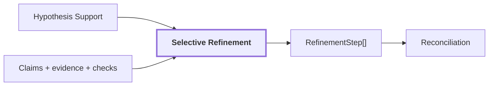

# 11. Selective Refinement

## Onde estamos na pipeline



## Objetivo

Reanalisar somente regiões que apresentam motivo explícito de risco ou inconsistência e somente quando o novo passe oferece evidência diferente da usada anteriormente.

## Razões implementadas

```text
missing_semantics
unsupported_primary
competing_hypotheses
contradictory_claims
region_kind_contradiction
abstained_support
failed_calibration
evidence_slot_unavailable
insufficient_foreground
small_region
```

`small_region` é modificador de risco e não deve iniciar um novo passe sozinho.

## Transformação

```text
claim inicial
 + support signals
 + structural checks
        -> precisa refinar?
        -> novas views/evidências quando justificadas
        -> novas claims anexadas
```

O histórico deve permanecer append-only. Refinement não apaga silenciosamente a hipótese anterior.

## Exemplo de falha que esta etapa deve atacar

```text
VLM: wooden pallet
mask: pallet + grande área de parede
mask_fill_ratio baixo
        -> insufficient_foreground
        -> nova evidência
        -> nova interpretação auditável
```

## Reference run

A run `20260910T115810Z` possui sinais de hipóteses concorrentes e regiões com primary não suportada, mas a documentação atual não isola um `RefinementStep` específico para `region-2c84165423b25fc3` como exemplo canônico. Não inventamos um.

## Influência no mapa

O refinement melhora a qualidade da evidência antes da projeção 3D. Ele não corrige sozinho uma máscara geometricamente ampla; quando a geometria da evidência está errada, a correção precisa atingir a proposta/máscara ou reduzir o suporte espacial da claim.