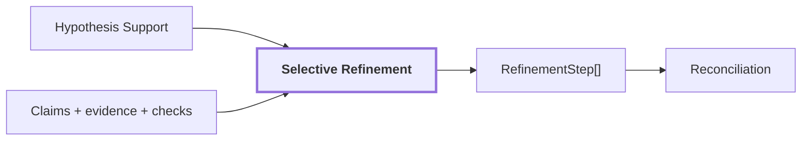

# 11. Selective Refinement

## Onde estamos na pipeline



## Objetivo

Reanalisar somente regiões que apresentam motivo explícito de risco ou inconsistência e somente quando o novo passe oferece evidência diferente da usada anteriormente.

A ideia é evitar dois extremos:

```text
nunca revisar uma hipótese ruim
```

ou:

```text
rodar o VLM repetidamente em todas as regiões
sem informação nova
```

## O que dispara refinement

Razões implementadas incluem:

```text
missing_semantics
unsupported_primary
competing_hypotheses
contradictory_claims
region_kind_contradiction
abstained_support
failed_calibration
evidence_slot_unavailable
insufficient_foreground
small_region
```

`small_region` é modificador de risco e não deve iniciar um novo passe sozinho.

## Exemplo: Qwen e CLIP discordam

Considere a região real acompanhada nas páginas anteriores:

```text
Qwen primary:
    wooden panel

Qwen alternative:
    wooden door

CLIP masked_subject:
    door > panel

CLIP tight_crop:
    door > panel
```

Isso pode produzir uma razão como:

```text
unsupported_primary
ou
competing_hypotheses
```

A região passa a ser candidata a refinement em vez de a label inicial ser aceita silenciosamente.

## Evidência nova é obrigatória

Refinement não deve fazer:

```text
mesmo prompt
+ mesmas imagens
+ temperature = 0
        |
        v
perguntar novamente esperando outra resposta
```

O estágio possui `escalation_views` para usar uma combinação diferente ou mais rica de evidência.

Na configuração atual:

```text
foreground_dense
masked_subject
tight_crop
contextual_crop
```

O refinamento só faz sentido quando existe um caminho de evidência novo em relação ao passe anterior.

## Por que a cena inteira não é simplesmente adicionada

Uma versão anterior do escalonamento acrescentava `scene_conditioned`, isto é, o frame completo.

Em `corridor-02-008`, isso fez regiões locais começarem a repetir uma claim global de layout, como `rows of crops`.

O mecanismo era:

```text
região ambígua
+ frame inteiro muito saliente
        |
        v
Qwen descreve a cena
em vez da região
```

Por isso a configuração atual prioriza evidência local e contextual da região, sem usar a imagem global como atalho automático de refinement.

## Exemplo de máscara ruim

```text
Qwen: wooden pallet
mask: pallet + grande área de parede
mask_fill_ratio baixo
        |
        v
insufficient_foreground
        |
        v
refinement solicitado
```

Entretanto, reanalisar semanticamente não corrige a geometria da máscara.

Se a proposal realmente inclui parede demais, a solução pode precisar acontecer antes:

```text
region discovery
merge
mask geometry
```

ou downstream reduzindo o suporte espacial da claim.

## Histórico append-only

Refinement não apaga silenciosamente a interpretação anterior.

Conceitualmente:

```text
claim inicial
    PRIMARY wooden panel

refinement
    nova hipótese / nova evidência

histórico
    preserva ambas + proveniência
```

Isso permite responder depois:

```text
qual modelo produziu a primeira hipótese?
por que a região foi reprocessada?
qual evidência nova foi usada?
o resultado mudou?
```

## Orçamento computacional

Refinement é seletivo também por custo.

A configuração possui limites como:

```text
max_iterations
max_regions_per_iteration
```

O objetivo é concentrar chamadas caras do Qwen nas regiões que realmente apresentam risco, em vez de multiplicar a latência de todos os frames.

## Reference run

Runs observadas anteriormente já mostraram sinais de hipóteses concorrentes e regiões com primary não suportada, mas nenhuma run atualmente versionada isola um `RefinementStep` específico como exemplo canônico — resultados de execução são regenerados sob demanda e não versionados (ver "Legado" em `AGENTS.md`).

Não inventamos um artifact de refinement para preencher essa lacuna.

## Saída

A saída continua sendo regiões com claims e evidências, mas agora acompanhadas do histórico das reinterpretações realizadas.

Esse estado segue para reconciliation intra-frame.

## Próxima leitura

- [12. Reconciliation intra-frame](./12-reconciliation.md)
- [10. Hypothesis Support](./10-hypothesis-support.md)
- [Pipeline detalhada de `visual-perception`](../modules/visual-perception/docs/pipeline.md)