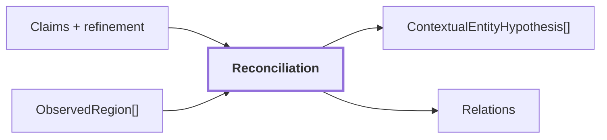

# 12. Reconciliation intra-frame

## Onde estamos na pipeline



## Objetivo

Reduzir redundância semântica dentro do mesmo frame, agrupando regiões compatíveis sem declarar tracking ou identidade física persistente em 3D.

```text
mesmo frame + semântica compatível + proximidade 2D
        -> hipótese contextual conjunta
        !=
mesma entidade física confirmada no mundo
```

## Por que reconciliation existe

SAM pode dividir uma mesma superfície ou objeto em várias regiões.

Depois da interpretação semântica, podemos ter algo como:

```text
region-A -> wall panel
region-B -> wall panel
region-C -> wall panel
```

Se as regiões são adjacentes ou geometricamente compatíveis, tratá-las como três entidades independentes pode inflar o mapa contextual.

Reconciliation cria uma hipótese de grupo sem apagar as regiões originais.

## Exemplo conceitual

```text
region-A  [wooden panel]
region-B  [wooden panel]
region-C  [door]

A e B:
    conceito compatível
    contato/proximidade 2D
        |
        v
ContextualEntityHypothesis
    members = [A, B]
    concept = wooden panel
```

A região C permanece separada.

## Coerência visual como corroboração

O módulo pode usar similaridade de evidência densa para medir se regiões semanticamente compatíveis também possuem aparência coerente.

Essa coerência não é usada sozinha para provar identidade.

```text
mesma aparência DINO
    !=
mesmo objeto físico
```

Ela funciona como corroboração de um grupo já proposto por sinais como conceito e geometria 2D.

## Conceito canônico vs label bruto

Labels linguisticamente parecidas podem ser normalizadas para comparação sem apagar a saída original.

Conceitualmente:

```text
raw label A: "Wooden Panel"
raw label B: "wooden panel"

canonical concept:
    wooden panel
```

O valor original continua disponível para auditoria.

A canonicalização atual é deliberadamente mínima e não é uma ontologia completa.

## Reference run

Para `corridor-02-000`:

```text
reconciled_regions: 30
entity_groups: 5
regions_in_entity_groups: 31
supported_entity_groups: 3
distinct_raw_labels: 8
distinct_canonical_concepts: 7
```

Esses grupos continuam sendo hipóteses intra-frame.

`31` regiões participando de grupos não significa 31 entidades físicas confirmadas. Significa que a etapa encontrou compatibilidade suficiente para propor agrupamentos dentro daquele frame.

## O que reconciliation não faz

Ela não possui ainda evidência suficiente para afirmar:

```text
region-A do frame 10
=
region-K do frame 25
=
mesma porta física
```

Isso exige:

```text
pose
geometria 3D
associação temporal
proveniência entre observações
```

## Relação com o mapa 3D

Reconciliation reduz redundância e organiza hipóteses antes da associação espacial, mas não cria `GeometryReference`.

```text
ContextualEntityHypothesis
    = hipótese visual intra-frame

GeometryReference
    = identidade de geometria persistente 3D
```

A persistência de entidades deverá ser resolvida downstream.

## Saída

```text
ObservedRegion[] reconciliadas
ContextualEntityHypothesis[]
```

Essas informações seguem para `VisualObservation` e ajudam a seleção de relações semânticas candidatas.

## Próxima leitura

- [13. Relations](./13-relations.md)
- [14. VisualObservation](./14-visual-observation.md)
- [17. Sensor Association](./17-sensor-association.md)