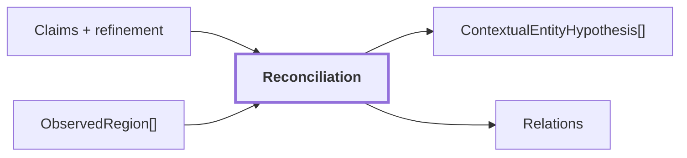

# 12. Reconciliation intra-frame

## Onde estamos na pipeline



## Objetivo

Reduzir redundância semântica dentro do mesmo frame, agrupando regiões compatíveis sem declarar tracking ou identidade física persistente em 3D.

```text
mesmo frame + semântica compatível
        -> hipótese contextual conjunta
        !=
mesma entidade física confirmada no mundo
```

Nenhuma geometria 3D deve ser inventada nesta etapa.

## Reference run

Para `corridor-02-000`:

```text
reconciled_regions: 30
entity_groups: 5
regions_in_entity_groups: 31
supported_entity_groups: 3
distinct_raw_labels: 8
distinct_canonical_concepts: 7
```

Esses grupos continuam sendo hipóteses intra-frame.

## Saída

`ContextualEntityHypothesis[]` e regiões reconciliadas seguem para `VisualObservation` e para a produção de relações candidatas.

## Limitação

Reconciliation 2D não substitui associação temporal/geométrica. A persistência de uma entidade ao longo de frames deve ser decidida downstream, usando geometria, múltiplas observações e proveniência.