# 13. Relations

## Onde estamos na pipeline

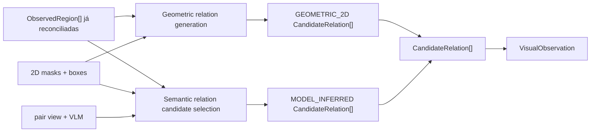

## Objetivo

Registrar relações candidatas entre regiões do mesmo frame sem promovê-las automaticamente a relações métricas 3D.

O contract atual distingue duas fontes:

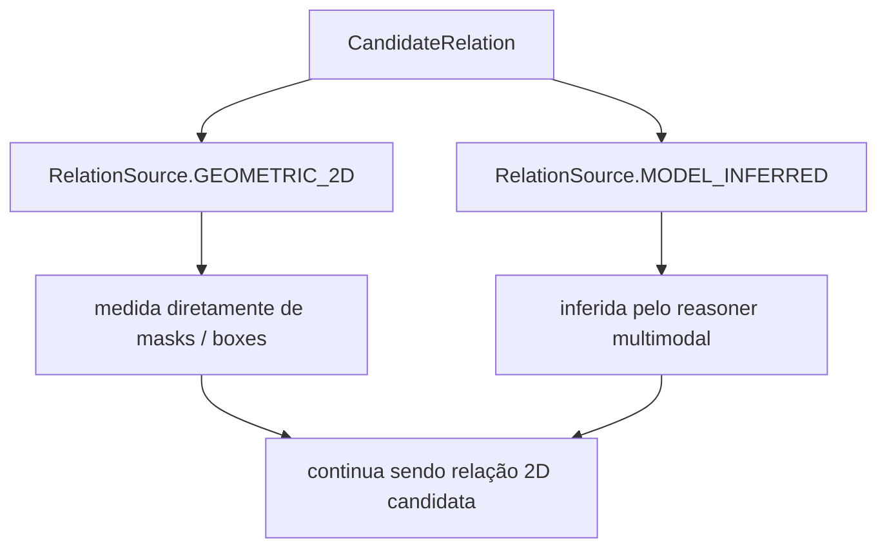

Nenhuma dessas arestas é automaticamente uma relação física verificada em 3D.

## Contract

```text
CandidateRelation
{
    relation_id
    subject_region_id
    predicate
    object_region_id
    confidence?
    source
    evidence[]
    provenance
}
```

A relação sempre referencia duas regiões canônicas diferentes e precisa carregar pelo menos uma evidência. Predicados são normalizados em `snake_case`.

## Vocabulário completo atual

A implementação atual possui dois vocabulários distintos.

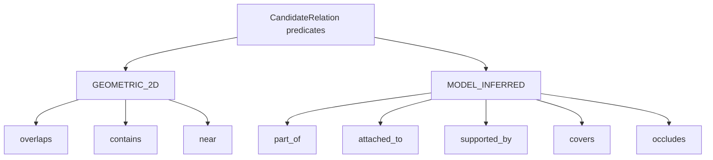

Esses são os predicados de relação emitidos pelo caminho canônico atual.

## Relações geométricas 2D

As relações geométricas são geradas diretamente de masks e boxes, sem VLM.

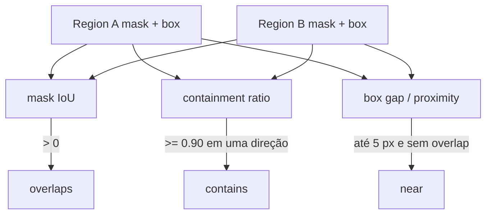

### `overlaps`

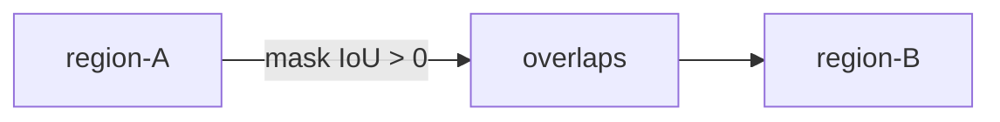

A confiança é o próprio IoU medido.

```text
confidence = mask_iou
```

Não significa que os dois elementos ocupam o mesmo volume no mundo; significa apenas que suas máscaras 2D se sobrepõem na imagem.

### `contains`

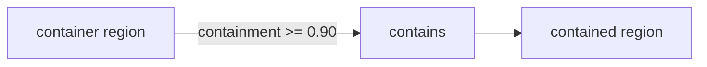

A direção é explícita. O pipeline compara os dois sentidos e emite `contains` somente para a direção dominante.

A confiança é o containment ratio medido.

### `near`

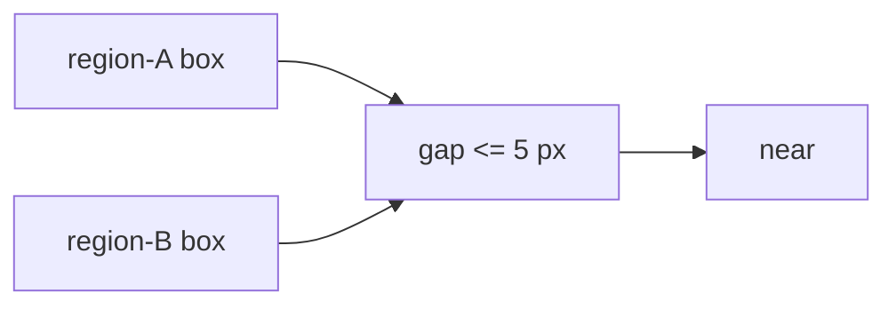

`near` só é emitido quando não existe overlap. A confiança é uma proximidade normalizada:

```text
1.0
    boxes encostados

0.0
    exatamente no limite de 5 px
```

`near` é proximidade em imagem, não distância métrica 3D.

## Relações semânticas inferidas por modelo

Depois da reconciliação intra-frame, o pipeline pode selecionar pares para uma chamada multimodal. O reasoner recebe uma única view conjunta do par, mantendo a relação espacial entre os dois sujeitos.

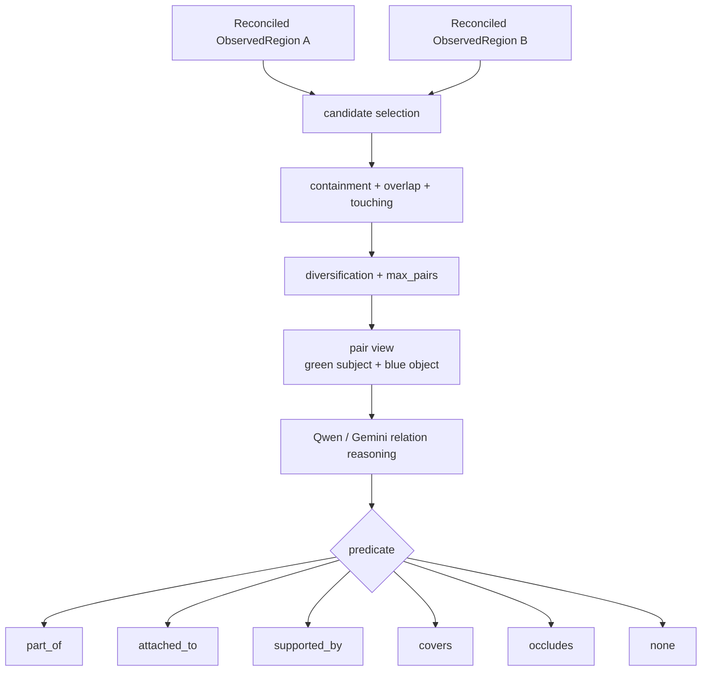

`none` é uma resposta válida e significa que nenhuma relação semântica do vocabulário é sustentada. Nesse caso nenhuma `CandidateRelation` é criada.

### `part_of`

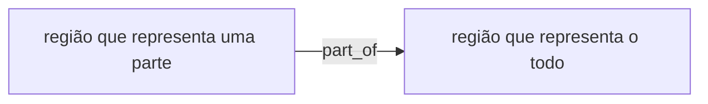

Uso pretendido: composição de entidades e objetos quando uma região visual é semanticamente parte de outra.

Exemplo conceitual:

```text
handle --part_of--> door
```

### `attached_to`

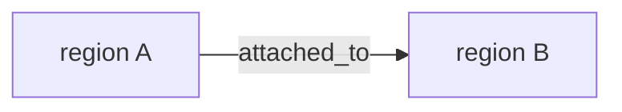

Representa uma conexão visual observável no frame em que uma entidade parece fisicamente presa a outra.

Exemplo conceitual:

```text
sign --attached_to--> panel
```

### `supported_by`

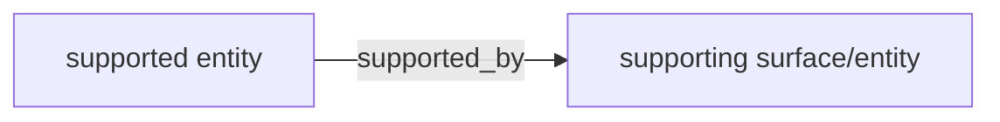

Representa suporte visual observável. É um candidato útil para um futuro `scene-graph`, mas ainda não é verificação métrica de contato ou força em 3D.

Exemplo conceitual:

```text
box --supported_by--> shelf
```

### `covers`


Expressa que uma região visual aparece cobrindo outra. É semanticamente diferente de `contains`: `contains` vem da geometria das máscaras, enquanto `covers` afirma uma interpretação da relação entre os conteúdos das regiões.

### `occludes`

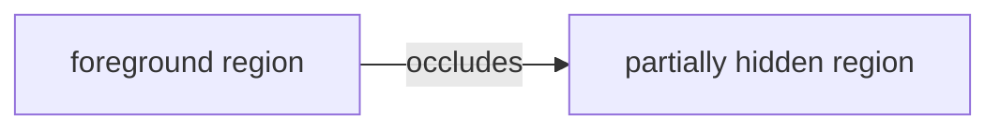

Expressa oclusão visual inferida dentro do frame. Ela pode informar etapas downstream, mas não substitui o teste geométrico de visibilidade em `sensor-association`.

## Relações que NÃO pertencem ao vocabulário semântico atual

O reasoner não pode emitir qualquer string arbitrária como predicado. O vocabulário é fechado e versionado.

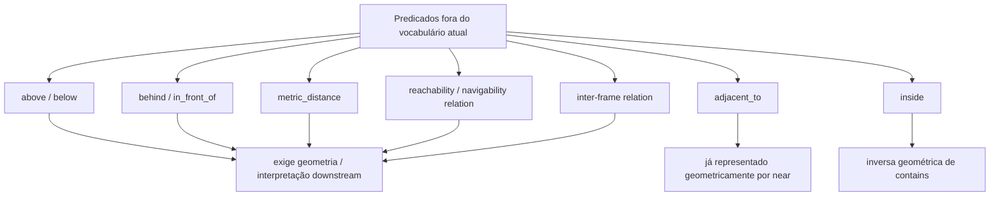

`above`, `below`, `behind` e `in_front_of` não são aceitos atualmente como relações semânticas inferidas porque a intenção do contract é não fingir geometria métrica 3D a partir de um único frame.

`adjacent_to` não existe no vocabulário semântico porque o canal geométrico já responde essa pergunta como `near`.

`inside` não existe porque é a relação inversa de `contains`; mantê-la no VLM duplicaria uma medida que a geometria já calcula diretamente.

## Como pares são selecionados

Perguntar ao VLM sobre todos os pares é quadrático.

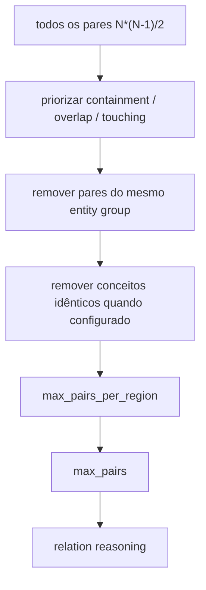

A direção do par é escolhida a partir da geometria, usando a região com maior containment como sujeito. Isso evita perguntar duas vezes sobre o mesmo par em sentidos arbitrários.

## Proveniência e confiança

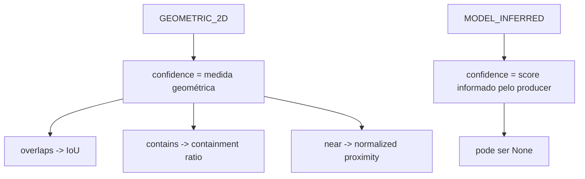

Uma relação inferida por modelo sem score continua válida com `confidence=None`; o pipeline não inventa `1.0` ou outro número.

As fontes coexistem. Uma relação geométrica não é sobrescrita por uma relação inferida por modelo e vice-versa.

## Relação com `reconciliation`

A inferência semântica acontece depois da reconciliação intra-frame.

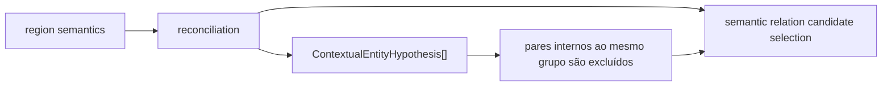

Se duas regiões já foram reconciliadas como membros da mesma hipótese de entidade, o estágio de relações não tenta descrever novamente esse vínculo como uma aresta semântica.

## Relações 2D versus relações 3D futuras

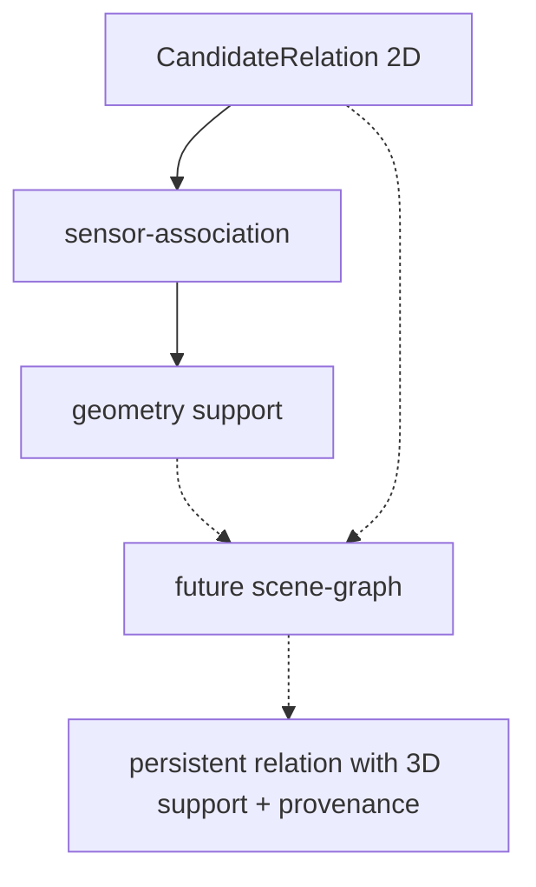

O sistema deverá continuar distinguindo:

```text
relação observada ou inferida em 2D
relação geometricamente suportada em 3D
relação inferida por contexto de alto nível
```

Uma `CandidateRelation` nunca deve ser promovida automaticamente a fato espacial persistente apenas porque o VLM retornou um predicado.

## Saída

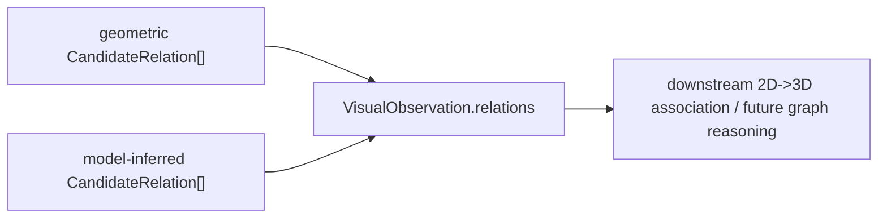

Cada relação preserva os IDs das duas regiões, fonte, evidência, proveniência e confiança quando disponível.

## Próxima leitura

- [Fluxo completo do repositório](./system-flow.md)
- [14. VisualObservation](./14-visual-observation.md)
- [12. Reconciliation intra-frame](./12-reconciliation.md)
- [17. Sensor Association](./17-sensor-association.md)
- [Fluxo semântico interno de `visual-perception`](../modules/visual-perception/docs/semantic-flow.md)
