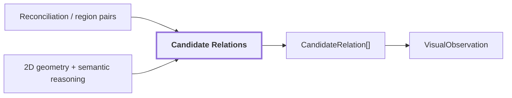

# 13. Relations

## Onde estamos na pipeline



## Objetivo

Registrar relações candidatas entre regiões do mesmo frame sem promovê-las automaticamente a relações métricas 3D.

Exemplos:

```text
fire extinguisher --near--> door
graffiti --on--> surface
sign --above--> door
```

## Dois tipos de relação

A pipeline distingue relações derivadas diretamente da geometria 2D e relações produzidas por raciocínio semântico.

```text
geometric relation
    -> derivada de boxes/masks

semantic relation
    -> inferida pelo reasoner multimodal
```

Essa distinção precisa permanecer visível porque os dois sinais possuem graus de evidência diferentes.

## Relações geométricas 2D

Exemplos conceituais:

```text
region-A está acima de region-B
region-C contém region-D
region-E encosta em region-F
```

Essas relações podem ser calculadas a partir da geometria da imagem.

Elas não provam profundidade física.

```text
A aparece acima de B na imagem
    !=
A está fisicamente acima de B no mundo
```

A perspectiva da câmera pode produzir a mesma configuração 2D para relações 3D diferentes.

## Relações semânticas

Para pares selecionados, o Qwen pode receber uma view conjunta em que os dois sujeitos são demarcados com cores diferentes.

Conceitualmente:

```text
region A: contorno verde
region B: contorno azul
        |
        v
Qwen relation reasoning
        |
        v
CandidateRelation
```

Usar uma única imagem para o par preserva o contexto espacial entre os dois lados. Mandar dois crops independentes eliminaria essa relação espacial.

## Por que não testar todos os pares

Com `N` regiões existem aproximadamente:

```text
N * (N - 1) / 2
```

pares possíveis.

Para 40 regiões:

```text
40 * 39 / 2 = 780 pares
```

Rodar um VLM em todos seria caro e incluiria muitos pares irrelevantes.

A configuração usa orçamento e filtros como containment, adjacency e limite de pares por região para selecionar candidatos mais informativos.

## Exemplo de contenção

```text
placa pequena
    dentro da região de uma parede
```

A geometria pode propor o par, e o reasoner pode produzir algo como:

```text
sign --ON--> wall
```

Essa relação continua sendo uma hipótese 2D até existir validação espacial downstream.

## Reference run

Para `corridor-02-000`:

```text
semantic_relations:
  covers: 4
  part_of: 4

geometric_relations: 210
total_relations: 218
```

As `210` relações geométricas mais `8` semânticas correspondem às `218` relações reportadas.

Esses números não significam 218 relações físicas confirmadas no mapa. São relações candidatas dentro de um frame.

## Influência no mapa contextual

As relações são sementes para um futuro `scene-graph`.

O sistema deverá distinguir pelo menos:

```text
relação observada/inferida em 2D
relação validada geometricamente em 3D
relação inferida por contexto de alto nível
```

Exemplo futuro:

```text
graffiti --ON--> wall
```

pode ser promovida quando a geometria associada à região do graffiti e à superfície da parede for compatível com a relação.

## Saída

`CandidateRelation[]` é serializado em `VisualObservation` com proveniência da observação e das regiões envolvidas.

## Próxima leitura

- [14. VisualObservation](./14-visual-observation.md)
- [12. Reconciliation intra-frame](./12-reconciliation.md)
- [17. Sensor Association](./17-sensor-association.md)