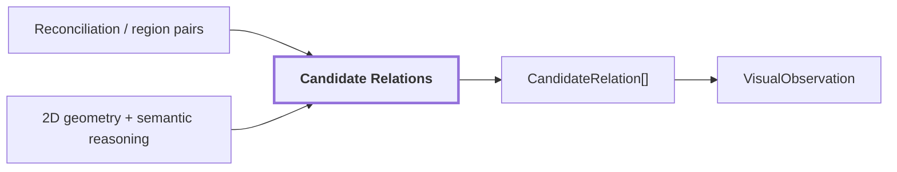

# 13. Relations

## Onde estamos na pipeline



## Objetivo

Registrar relações candidatas entre regiões do mesmo frame sem promovê-las automaticamente a relações métricas 3D.

Exemplos conceituais:

```text
fire extinguisher --near--> door
graffiti --on--> surface
```

Relações de profundidade física não devem ser inferidas somente da imagem quando a geometria 3D ainda não foi consultada.

## Reference run

```text
semantic_relations:
  covers: 4
  part_of: 4

geometric_relations: 210
total_relations: 218
```

As `210` relações geométricas mais `8` relações semânticas correspondem às `218` relações reportadas para `corridor-02-000`.

## Saída

`CandidateRelation[]` é serializado em `VisualObservation` com provenance da observação.

## Influência no mapa contextual

Estas relações são sementes de contexto estrutural, mas só podem virar relações persistentes do mundo depois de validação geométrica e temporal. O futuro `scene-graph` deve preservar a diferença entre relação observada em 2D, relação confirmada em 3D e relação inferida.