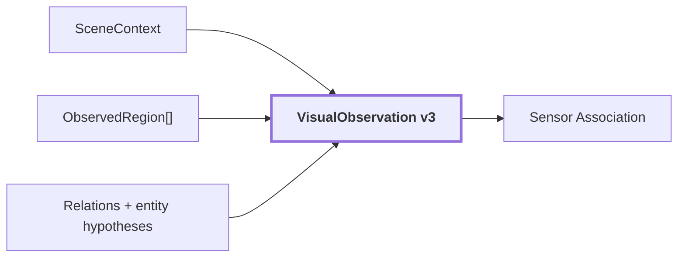

# 14. VisualObservation

## Onde estamos na pipeline



## Objetivo

`VisualObservation` é a saída canônica 2D de `visual-perception`. Ela reúne o que foi observado e inferido sobre um único frame sem fingir que a imagem já virou um mapa 3D.

É o envelope que atravessa a fronteira entre percepção visual e associação geométrica.

## Contract

```text
VisualObservation
{
    source: ObservationReference
    image_width
    image_height
    scene_context: SceneContext
    regions: ObservedRegion[]
    relations: CandidateRelation[]
    entity_hypotheses: ContextualEntityHypothesis[]
    schema_version
    coordinate_convention
}
```

## O que existe dentro de uma região

Depois de todos os estágios anteriores, uma `ObservedRegion` pode carregar:

```text
ObservedRegion
├── region_id
├── mask
├── box
├── geometric_confidence
├── contributing_proposal_ids
├── evidence slots
│   ├── foreground_dense / DINO
│   ├── masked_subject / CLIP
│   ├── tight_crop / CLIP
│   └── contextual_crop / CLIP
├── SemanticClaim[]
│   ├── Qwen primary
│   └── Qwen alternatives
└── hypothesis support
    └── CLIP supports/contradicts/indistinguishable
```

Isso mostra por que `VisualObservation` é mais rico que uma lista simples de boxes e labels.

## Exemplo real da região de referência

De forma resumida, `region-2c84165423b25fc3` possui:

```text
Qwen primary:
    wooden panel

Qwen alternative:
    wooden door

DINO:
    foreground_dense 768D

CLIP image evidence:
    masked_subject
    tight_crop
    contextual_crop

CLIP support:
    sujeito isolado favorece wooden door
    contexto ampliado favorece wooden panel
```

Essas evidências coexistem. `VisualObservation` não precisa apagar a ambiguidade para ser útil downstream.

## Reference run

Para `corridor-02-000`:

```text
schema_version: 3
coordinate_convention: top-left-origin,half-open-xyxy
image: 640 x 480
regions: 40
scene_type: corridor
relations: 218
interpretation_failures: 0
audit: pass, com 42 warnings
```

Artifact:

[`observation.json`](../modules/visual-perception/benchmarks/results/samples/20260910T115810Z/frames/corridor-02-000/observation.json)


O overlay mostra o que o pipeline afirmou naquele run, inclusive possíveis erros. Não é ground truth.

## O que não está inline no JSON

Vetores grandes não precisam ser duplicados dentro de `observation.json`.

A observação pode carregar referências para artifacts como:

```text
embeddings.npz
```

Enquanto o JSON preserva:

```text
artifact_ref
EmbeddingSpace
preprocessing
mask_ref
provenance
```

Isso mantém o payload auditável sem inflar a serialização principal com milhares de floats.

## Coordenadas ainda são 2D

A convenção:

```text
top-left-origin, half-open xyxy
```

é uma convenção de imagem.

Neste ponto temos:

```text
pixel
mask
box
```

Ainda não temos:

```text
x, y, z no mundo
```

## Fronteira de domínio

```text
VisualObservation
    = observação visual estruturada de UM frame

VisualObservation
    != mapa semântico 3D
```

A distinção é importante porque uma máscara 2D não sabe qual profundidade ocupa no mundo.

## Como a observação entra no 3D

A próxima parte combina:

```text
VisualObservation
        +
GeometryPoint
        +
pose
        +
CameraLidarCalibration
        |
        v
sensor-association
```

Para cada ponto, `sensor-association` calcula um pixel e verifica qual máscara de `VisualObservation` cobre aquele pixel.

Exemplo conceitual:

```text
GeometryPoint X
 -> pixel (420, 290)
 -> pixel pertence a region-abc
 -> region-abc carrega evidência "door"
 -> cria PointVisualAssociation
```

É somente aí que a evidência visual passa a estar ancorada em geometria persistente.

## Auditoria e warnings

`audit: pass` não significa que todas as labels são corretas.

A auditoria verifica invariantes estruturais e sinais diagnósticos. Warnings podem indicar situações como ambiguidade, suporte insuficiente ou combinações que merecem inspeção sem tornar o artifact inválido.

A correção semântica continua dependendo de avaliação contra referência anotada e de evidência multi-view/3D.

## Próxima leitura

- [15. Geometric Map](./15-geometric-map.md)
- [16. Pose + Calibration](./16-pose-calibration.md)
- [17. Sensor Association](./17-sensor-association.md)
- [Documentação de `visual-perception`](../modules/visual-perception/docs/README.md)