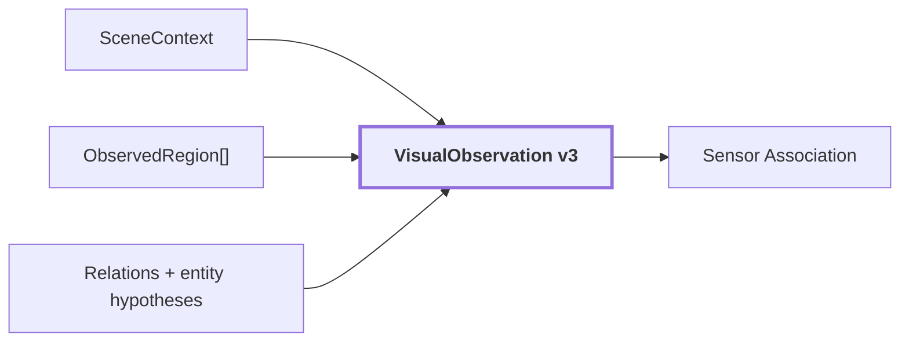
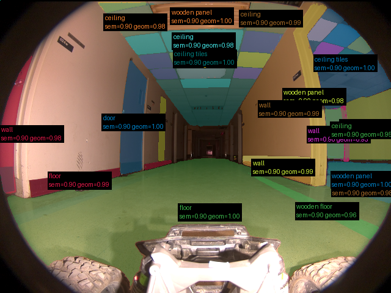

# 14. VisualObservation

## Onde estamos na pipeline



## Objetivo

`VisualObservation` é a saída canônica 2D de `visual-perception`. Ela reúne o que foi inferido sobre um único frame sem fingir que a imagem já virou um mapa 3D.

## Contract

```text
VisualObservation
{
    source: ObservationReference
    image_width
    image_height
    scene_context: SceneContext
    regions: ObservedRegion[]
    relations: CandidateRelation[]
    entity_hypotheses: ContextualEntityHypothesis[]
    schema_version
    coordinate_convention
}
```

## Reference run

```text
schema_version: 3
coordinate_convention: top-left-origin,half-open-xyxy
image: 640 x 480
regions: 40
scene_type: corridor
relations: 218
interpretation_failures: 0
audit: pass, com 42 warnings
```

Artifact:

[`observation.json`](../modules/visual-perception/benchmarks/results/samples/20260910T115810Z/frames/corridor-02-000/observation.json)



O overlay mostra o que o pipeline afirmou naquele run, inclusive possíveis erros. Não é ground truth.

## Fronteira de domínio

```text
VisualObservation = observação visual estruturada de UM frame
VisualObservation != mapa semântico 3D
```

A partir daqui a geometria 3D passa a ser necessária para ancorar evidência visual no mundo.