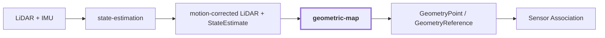

# 15. Geometric Map

## Onde estamos na pipeline



## Objetivo

Fornecer a geometria autoritativa e persistente do mundo. `visual-perception` descreve pixels e regiões; ela não cria coordenadas XYZ.

O papel desta etapa é responder:

```text
onde está cada amostra geométrica no frame global?
qual observação originou esse ponto?
como outros módulos podem referenciá-lo sem duplicar a geometria?
```

## Entrada

O módulo recebe observações LiDAR já associadas a um contexto de movimento produzido por `state-estimation`.

Conceitualmente:

```text
LiDAR point no frame do sensor
    + pose sensor -> mapa
        |
        v
GeometryPoint no frame global
```

## Contract atual

```text
GeometryPoint
{
    reference: GeometryReference
    coordinates_m: (x, y, z)
    source_coordinates_m: (x, y, z)
    source_observation
    provenance
}
```

`GeometryReference` fornece identidade estável dentro de um mapa persistente:

```text
GeometryReference
{
    map_id
    geometry_id
}
```

Isso permite que semântica, associação e aplicações apontem para a mesma geometria sem copiar o ponto.

## Exemplo conceitual de transformação

Este exemplo é didático, não medido na reference run.

Suponha um ponto LiDAR no frame do sensor:

```text
P_lidar = (2.0, 0.5, -0.2) m
```

E uma pose simplificada com apenas translação:

```text
T_map_lidar.translation = (10.0, 3.0, 1.2) m
```

Sem rotação, o ponto persistido seria:

```text
P_map = (12.0, 3.5, 1.0) m
```

Na implementação real, a rotação quaternion também é aplicada antes da translação.

## Identidade estável

O primeiro backend em memória deriva a identidade local usando a observação e o índice do ponto:

```text
<observation_id>:<point_index>
```

Exemplo conceitual:

```text
lidar-frame-0042:137
```

A referência completa ainda inclui `MapId`, evitando tratar o mesmo identificador local como universal entre mapas diferentes.

## Relação com contexto

A geometria é o suporte onde evidências de múltiplas observações podem convergir.

Sem uma referência persistente:

```text
frame A: "door"
frame B: "door"
```

são apenas duas observações independentes.

Quando ambas alcançam a mesma `GeometryReference`:

```text
frame A ----\
             -> geometry point -> semantic fusion
frame B ----/
```

passa a existir uma base explícita para fusão temporal e multi-view.

## Bounds espaciais

`Bounds3D` permite consultar um volume sem expor o armazenamento interno:

```text
minimum_m = (xmin, ymin, zmin)
maximum_m = (xmax, ymax, zmax)
```

Isso mantém consumidores independentes de a implementação usar dicionário, voxel grid, árvore espacial ou outra estrutura no futuro.

## Reference run

Nenhuma run atualmente versionada contém um artifact único que ligue uma região visual a um `GeometryReference` concreto — resultados de execução são regenerados sob demanda e não versionados (ver "Legado" em `AGENTS.md`). Portanto esta página não cria coordenadas de exemplo como se fossem medidas.

Existem implementação e workflows reais do `geometric-map`, além de integração com state estimation, mas o fio visual de referência termina em `VisualObservation`.

## Point representation

A capacidade `point-representation` já tem um primeiro slice implementado (contracts públicos, transforms determinísticos e o port `PointEncoder`, ainda sem backbone concreto — ver [`modules/point-representation/README.md`](../modules/point-representation/README.md)) e poderá adicionar embeddings aprendidos por ponto.

Essa representação complementa a geometria:

```text
GeometryPoint
    -> onde o ponto está

PointEmbedding
    -> como sua estrutura 3D local é representada

Semantic evidence
    -> o que as observações afirmam sobre ele
```

Separar esses três conceitos é importante para futura coerência 3D e distilação cross-modal.

## Saída

O próximo estágio usa a geometria persistente junto com pose, calibração e `VisualObservation` para perguntar onde cada ponto cai na imagem.

## Próxima leitura

- [16. Pose + Calibration](./16-pose-calibration.md)
- [17. Sensor Association](./17-sensor-association.md)
- [Documentação de `geometric-map`](../modules/geometric-map/docs/README.md)