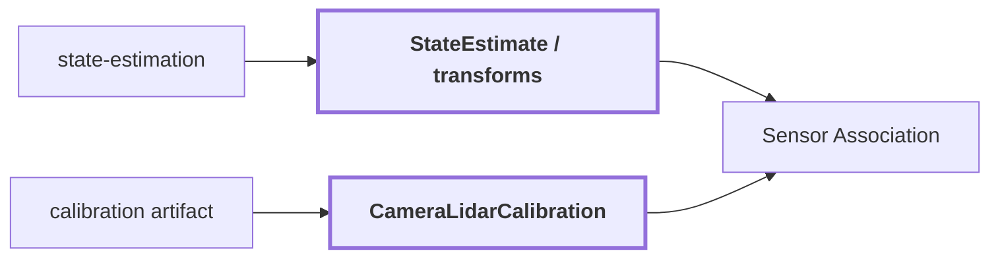

# 16. Pose + Calibration

## Onde estamos na pipeline



## Objetivo

Criar a ponte matemática e temporal entre a geometria LiDAR/mapa e o sistema de pixels da câmera.

Mesmo uma label 2D correta só pode ser anexada ao ponto 3D correto se pose e calibração estiverem coerentes.

## Duas transformações diferentes

É útil separar:

```text
pose
    onde o sensor estava no mundo

extrínseca
    relação rígida entre LiDAR e câmera
```

A associação precisa das duas.

## CameraLidarCalibration

```text
CameraLidarCalibration
{
    calibration_id
    artifact
    model
    fx, fy, cx, cy
    lidar_to_camera
    mirror_xi?
    distortion_k1, distortion_k2
    distortion_p1, distortion_p2
    front_hemisphere_only
}
```

Modelos suportados pela associação atual:

```text
pinhole
equidistant_fisheye
mei
```

## Fluxo geométrico

Para um ponto persistente:

```text
P_world
 -> transform world/map -> camera no timestamp correto
 -> P_camera = (Xc, Yc, Zc)
 -> camera model + intrinsics/distortion
 -> pixel (u, v)
```

Em uma câmera pinhole simplificada:

```text
u = fx * Xc / Zc + cx
v = fy * Yc / Zc + cy
```

Modelos fisheye e MEI usam projeções diferentes, por isso o modelo de câmera faz parte explícita do contract.

## Exemplo conceitual

Este exemplo é didático.

Suponha:

```text
P_camera = (1.0, 0.5, 4.0) m
fx = 400
fy = 400
cx = 320
cy = 240
```

Então, em pinhole sem distorção:

```text
u = 400 * 1.0 / 4.0 + 320 = 420
v = 400 * 0.5 / 4.0 + 240 = 290
```

O ponto seria projetado aproximadamente em:

```text
pixel = (420, 290)
```

A próxima etapa verifica se esse pixel é válido, visível, não ocluído e coberto por alguma região visual.

## Por que timestamp importa

Uma boa extrínseca não resolve frames capturados em instantes incompatíveis.

Se o drone se move entre LiDAR e RGB:

```text
LiDAR em t0
RGB em t1
```

usar a pose errada pode deslocar a projeção vários pixels, especialmente em objetos próximos ou movimento rápido.

Por isso a associação valida `clock_id` e diferença temporal.

## Erros que parecem semânticos mas são geométricos

Exemplo:

```text
Qwen/CLIP acertam: "door"
        |
        v
pose está deslocada
        |
        v
ponto da parede cai no pixel da porta
        |
        v
mapa recebe semântica errada
```

Nesse caso o problema não está no VLM.

A documentação e os diagnósticos precisam separar:

```text
erro de percepção 2D
erro de calibração
erro de pose
erro de oclusão
```

## Reference run

O `observation.json` visual de `corridor-02-000` possui `calibration_id: null`; por isso ele não é usado aqui para inventar uma calibração.

Os workflows 3D usam artifacts de calibração e pose próprios. Quando existir um artifact versionado que acompanhe a região de referência até XYZ, esta página deve incluir os transforms e pixels reais dessa execução.

## Próxima leitura

- [17. Sensor Association](./17-sensor-association.md)
- [15. Geometric Map](./15-geometric-map.md)
- [Documentação de `state-estimation`](../modules/state-estimation/docs/README.md)
- [Documentação de `sensor-association`](../modules/sensor-association/docs/README.md)