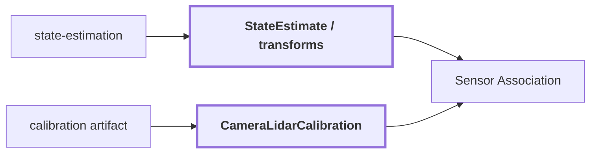

# 16. Pose + Calibration

## Onde estamos na pipeline



## Objetivo

Criar a ponte matemática e temporal entre a geometria LiDAR/mapa e o sistema de pixels da câmera.

## CameraLidarCalibration

```text
CameraLidarCalibration
{
    calibration_id
    artifact
    model
    fx, fy, cx, cy
    lidar_to_camera
    mirror_xi?
    distortion_k1, distortion_k2
    distortion_p1, distortion_p2
    front_hemisphere_only
}
```

Modelos suportados pela associação atual:

```text
pinhole
equidistant_fisheye
mei
```

## Transformação

```text
P_world
 -> transform map/camera na pose correspondente
 -> P_camera
 -> camera model + intrinsics/distortion
 -> pixel (u, v)
```

A validade temporal é parte do contract. Boa calibração espacial não corrige RGB e LiDAR capturados em instantes incompatíveis.

## Reference run

O `observation.json` visual de `corridor-02-000` possui `calibration_id: null`; por isso ele não é usado aqui para inventar uma calibração. Os workflows 3D usam artifacts de calibração e pose próprios.

## Influência no contexto do mapa

Erro de pose, extrínseca ou modelo de câmera desloca a evidência visual para pontos errados. Isso pode parecer um erro semântico, embora o label 2D esteja correto. Portanto qualidade de contexto depende diretamente da qualidade da associação geométrica.