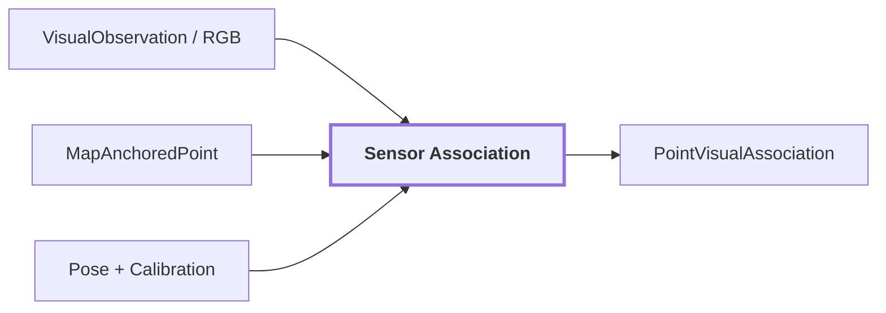

# 17. Sensor Association

## Onde estamos na pipeline



## Objetivo

Responder, para cada ponto 3D candidato:

> Se este ponto fosse observado por esta câmera neste instante, onde cairia na imagem e qual evidência visual válida cobre esse pixel?

## Fluxo

```text
ponto XYZ
 -> transform para camera
 -> projeção calibrada
 -> pixel (u,v)
 -> teste de hemisfério/frente
 -> bounds da imagem
 -> suporte óptico válido
 -> oclusão
 -> membership de máscara
 -> cor + region_id + label + feature_reference
```

Estados de rejeição explícitos incluem `behind_camera`, `outside_image`, `outside_valid_support` e `occluded`; pontos válidos tornam-se `associated`.

## Diagnóstico real do corridor-02

Uma versão anterior da associação do mapa persistente usava z-buffer somente no pixel exato. Em mapa esparso isso deixava buracos entre amostras da superfície frontal, permitindo que pontos atrás de paredes recebessem labels visuais incorretos.

A correção documentada em `corridor-02` passou a usar células de pixels com consulta de vizinhança `3x3` e comparação de profundidade no eixo óptico para `associate_map_points`. A política é conservadora: perder alguns pontos de borda é preferível a contaminar o fundo.

Outro problema real foi anexar scans coloridos ao mapa, criando amostragens duplicadas e pontos cinzas "fantasmas". A associação ancorada na geometria persistente evita essa duplicação conceitual.

## Reference run

A run visual `20260910T115810Z` não persiste uma linha de `PointVisualAssociation` para a região de referência. O exemplo 3D desta página usa somente comportamento real documentado do corridor-02, não uma associação inventada.

## Próxima evolução

Para cross-modal point representation, esta etapa deve ser capaz de fornecer feature visual densa alinhada ao ponto projetado, não apenas `feature_reference` regional agregado.