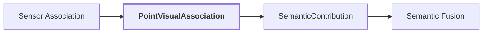

# 18. PointVisualAssociation

## Onde estamos na pipeline



## Objetivo

Materializar uma ligação auditável entre uma referência geométrica persistente e a evidência RGB de uma observação específica.

Antes desta etapa existe uma região em pixels e um ponto em XYZ. Depois dela existe uma afirmação explícita de que aquela observação visual alcançou aquele ponto.

```text
antes
    region_id em 2D
    GeometryReference em 3D

agora
    GeometryReference <- evidência visual daquela region_id
```

## Contract

```text
PointVisualAssociation
{
    geometry: GeometryReference
    lidar_observation: ObservationReference
    rgb_observation: ObservationReference
    calibration: CameraLidarCalibration
    status: AssociationStatus
    pixel?
    color_rgb?
    region_id?
    label?
    feature_reference?
}
```

## Exemplo conceitual

Este exemplo é didático, não extraído da reference run.

```text
geometry:
    map-01 / lidar-frame-0042:137

rgb_observation:
    corridor-02-000

pixel:
    (420, 290)

region_id:
    region-abc

label:
    wooden door
```

Isso significa:

```text
"o ponto geométrico map-01/lidar-frame-0042:137
foi visível no frame corridor-02-000,
caiu no pixel (420,290),
e esse pixel estava coberto pela região region-abc"
```

A label é evidência herdada da observação visual. Ela não redefine a geometria.

## Proveniência

A associação deve permitir reconstruir:

```text
qual GeometryReference?
qual frame RGB?
qual observação LiDAR?
qual calibração?
qual pixel?
qual região visual?
qual evidência/label estava disponível?
```

Sem isso, um erro no mapa não pode ser rastreado de volta para a origem.

## Por que a associação é por observação

O mesmo ponto pode ser visto em vários keyframes:

```text
GeometryReference X
├── frame A -> door, confidence 0.82
├── frame B -> door, confidence 0.76
└── frame C -> panel, confidence 0.61
```

Não queremos sobrescrever cada resultado conforme os frames chegam.

Cada observação vira uma contribuição independente. A fusão acontece depois.

## Feature reference

Hoje a associação pode transportar uma referência regional de feature.

No futuro, uma associação mais rica pode carregar uma feature visual alinhada ao próprio pixel projetado:

```text
pixel (u,v)
 -> DINO FeatureMap
 -> local vector[768]
 -> GeometryReference
```

Isso preserva mais detalhe do que usar um único embedding agregado para toda a máscara.

## Mudança de domínio

Este é o ponto em que passamos de:

```text
"esta região 2D parece uma porta"
```

para:

```text
"esta observação afirma que este ponto 3D pertence ou é suportado por uma região interpretada como porta"
```

A segunda formulação é deliberadamente mais cautelosa porque ainda pode haver erro de pose, máscara, oclusão ou semântica.

## Reference run

Ainda não existe na reference run visual um artifact versionado que associe `region-2c84165423b25fc3` a um `GeometryReference` específico.

Esta documentação não cria um identificador ou pixel fictício como se fosse resultado medido.

## Próxima evolução contextual

A associação deverá transportar, quando disponível:

```text
point-aligned dense visual feature
region semantic evidence
3D point embedding
association quality / visibility
provenance
```

Esses sinais permitirão que `semantic-fusion` compare coerência semântica, visual e estrutural em vez de depender somente de labels.

## Próxima leitura

- [19. Semantic Fusion](./19-semantic-fusion.md)
- [17. Sensor Association](./17-sensor-association.md)
- [Documentação de `sensor-association`](../modules/sensor-association/docs/README.md)