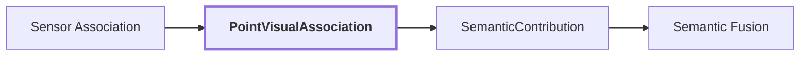

# 18. PointVisualAssociation

## Onde estamos na pipeline



## Objetivo

Materializar uma ligação auditável entre uma referência geométrica persistente e a evidência RGB de uma observação específica.

## Contract

```text
PointVisualAssociation
{
    geometry: GeometryReference
    lidar_observation: ObservationReference
    rgb_observation: ObservationReference
    calibration: CameraLidarCalibration
    status: AssociationStatus
    pixel?
    color_rgb?
    region_id?
    label?
    feature_reference?
}
```

A mudança de domínio é importante:

```text
antes: region_id existe em pixels
agora: GeometryReference existe em XYZ e recebeu evidência daquela região
```

## Proveniência

A associação deve permitir reconstruir qual ponto, qual frame RGB, qual observação LiDAR, qual calibração, qual pixel e qual região originaram a evidência.

## Reference run

Ainda não existe na referência visual um artifact versionado que associe `region-2c84165423b25fc3` a um `GeometryReference` específico. Esta documentação não cria um identificador/pixel fictício para preencher essa lacuna.

## Próxima evolução contextual

A associação deverá transportar, além de label e referência regional, sinais mais ricos quando disponíveis:

```text
point-aligned dense visual feature
region semantic evidence
3D point embedding
association quality / visibility
provenance
```

Esses sinais permitirão que semantic fusion compare coerência semântica, visual e estrutural em vez de depender somente de labels.