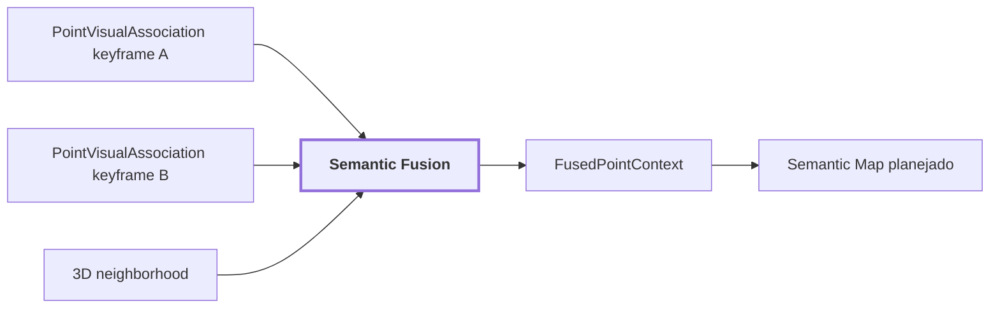

# 19. Semantic Fusion

## Onde estamos na pipeline



## Objetivo

Fundir múltiplas contribuições semânticas associadas à mesma geometria persistente, preservando concorrência, proveniência e sinais de suporte.

## Entrada

```text
SemanticContribution
{
    observation_id
    timestamp_ns
    region_id
    label
    confidence?
    calibrated_confidence?
    support_state?
    visual_support?
    region_quality?
}
```

A política atual prioriza confiança calibrada quando existe, depois confiança bruta, `visual_support`, `region_quality` e desempates determinísticos. Os sinais não são somados como se compartilhassem uma calibração universal.

`measure_spatial_support` mede concordância da vizinhança 3D. Quando não há vizinhos suficientes, retorna `None`, não zero.

## Diagnóstico real de 30 s do corridor-02

O subconjunto de erro conhecido era composto por pontos `ceiling` abaixo da altura dos `ceiling tiles`.

| sinal | pontos marcados | erros alcançados | concentração |
| --- | ---: | ---: | ---: |
| suporte espacial `< 34%` | 20,3% | 35,2% | 1,73 |
| concordância keyframes `< 50%` | 12,3% | 34,4% | 2,80 |
| ambos `< 50%` | **9,7%** | **33,2%** | **3,42** |

Os sinais detectam falhas diferentes. Uma fronteira geométrica legítima pode ter suporte espacial baixo e ainda ser consistente entre keyframes. Vazamento/projeção errada tende a combinar suporte espacial baixo com discordância temporal.

## Próxima evolução contextual

A fusão deve evoluir para considerar embeddings 3D aprendidos como sinal independente de coerência. O objetivo não é substituir labels, mas permitir perguntas como: "estes pontos têm evidência visual de pallet, mas sua representação 3D é muito mais coerente com a superfície vizinha?".

## Limitação

Ainda não há um `semantic-map` persistente público consumindo `FusedPointContext`. A saída atual é ponto a ponto.