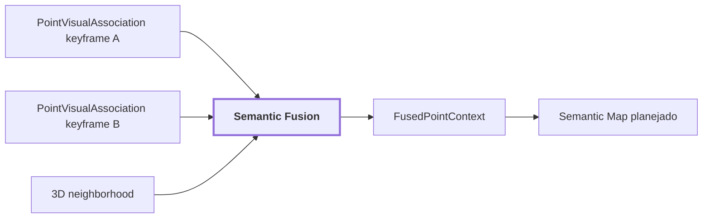

# 19. Semantic Fusion

## Onde estamos na pipeline



## Objetivo

Fundir múltiplas contribuições semânticas associadas à mesma geometria persistente, preservando concorrência, proveniência e sinais de suporte.

A pergunta desta etapa não é mais:

```text
"o que esta imagem diz?"
```

É:

```text
"considerando todas as observações que alcançaram este mesmo ponto,
qual hipótese deve ser tratada como primária agora?"
```

## Entrada

```text
SemanticContribution
{
    observation_id
    timestamp_ns
    region_id
    label
    confidence?
    calibrated_confidence?
    support_state?
    visual_support?
    region_quality?
}
```

Cada contribuição continua ligada ao frame e à região que a originaram.

## Exemplo conceitual

Suponha que o mesmo ponto 3D tenha sido visto em três keyframes:

```text
frame A:
    label = door
    calibrated_confidence = 0.84

frame B:
    label = door
    calibrated_confidence = 0.79

frame C:
    label = panel
    calibrated_confidence = 0.63
```

A fusão pode escolher `door` como primário, mas preserva todas as contribuições:

```text
FusedPointContext
├── primary label: door
├── agreement: 2 / 3 = 0.667
└── contributions
    ├── frame A -> door
    ├── frame B -> door
    └── frame C -> panel
```

O resultado não apaga a discordância do frame C.

## Regra de ranking atual

A política prioriza, nesta ordem:

```text
1. calibrated_confidence, quando existe
2. confidence bruta
3. visual_support
4. region_quality
5. timestamp / region_id para desempate determinístico
```

Os sinais não são somados em uma fórmula arbitrária porque ainda não compartilham uma calibração universal.

## Agreement

`agreement` mede quantas contribuições concordam com a label primária.

Exemplo:

```text
labels = [door, door, panel, door]
primary = door

agreement = 3 / 4 = 0.75
```

Isso diferencia:

```text
uma label sustentada por 4 de 4 observações
```

from:

```text
uma label sustentada por 2 de 4 observações
```

mesmo quando o vencedor é o mesmo.

## Suporte espacial 3D

Além da concordância temporal/multi-view, `measure_spatial_support` verifica se a vizinhança geométrica possui labels compatíveis.

Exemplo conceitual:

```text
ponto central: ceiling
vizinhos: wall, wall, wall, wall, ceiling
```

Mesmo que vários keyframes tenham repetido `ceiling`, a vizinhança 3D pode indicar que o ponto está deslocado para a superfície errada.

Quando não há vizinhos suficientes:

```text
spatial_support = None
```

Não `0.0`, porque ausência de evidência não é evidência contrária.

## Diagnóstico real de 30 s do corridor-02

O subconjunto de erro conhecido era composto por pontos `ceiling` abaixo da altura dos `ceiling tiles`.

| sinal | pontos marcados | erros alcançados | concentração |
| --- | ---: | ---: | ---: |
| suporte espacial `< 34%` | 20,3% | 35,2% | 1,73 |
| concordância keyframes `< 50%` | 12,3% | 34,4% | 2,80 |
| ambos `< 50%` | **9,7%** | **33,2%** | **3,42** |

Os sinais detectam falhas diferentes.

Uma fronteira legítima entre duas superfícies pode ter suporte espacial baixo, mas alta concordância entre keyframes.

Já um vazamento de projeção tende a produzir:

```text
baixo suporte espacial
+
baixa concordância temporal
```

## Relação com os estágios anteriores

```text
Qwen / CLIP
    -> claims por região 2D

sensor-association
    -> claims alcançam GeometryReference

semantic-fusion
    -> múltiplas observações da mesma GeometryReference são combinadas
```

Esta etapa não refaz percepção 2D e não reprojeta pontos.

## Próxima evolução contextual

A fusão pode incorporar embeddings 3D aprendidos como sinal independente.

Exemplo de pergunta futura:

```text
"as observações visuais dizem pallet,
mas a representação geométrica deste ponto é muito mais coerente
com a superfície plana vizinha?"
```

Isso não significa substituir labels por point embeddings. Significa adicionar outro canal de evidência.

## Limitação

Ainda não há um `semantic-map` persistente público consumindo `FusedPointContext`. A saída atual permanece ponto a ponto.

## Próxima leitura

- [20. Semantic Map / Semantic Memory](./20-semantic-map.md)
- [Documentação de `semantic-fusion`](../modules/semantic-fusion/docs/README.md)
- [18. PointVisualAssociation](./18-point-visual-association.md)