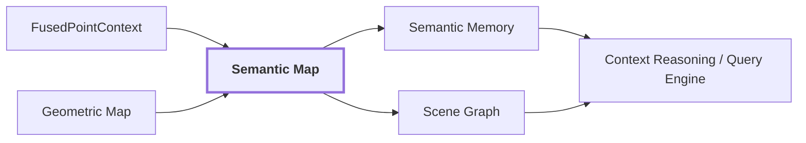

# 20. Semantic Map / Semantic Memory

## Onde estamos na pipeline



## Estado atual

`semantic-map`, `semantic-memory`, `scene-graph`, `context-reasoning` e `query-engine` são capacidades planejadas. Não existe ainda um schema público concreto que possa ser documentado como implementação atual.

## Objetivo

Transformar observações e fusões locais em conhecimento persistente do ambiente:

```text
observações 2D
 -> associações ponto/região
 -> fusão por geometria
 -> estado semântico persistente
 -> entidades / relações / memória
 -> consulta e raciocínio
```

Uma representação futura precisa continuar respondendo:

```text
qual posição ocupa?
quais pontos geométricos a sustentam?
quais frames observaram a hipótese?
quais regiões 2D a originaram?
quais labels concorreram?
quais evidências contradisseram?
qual calibração foi usada?
qual representação visual/3D sustentou a decisão?
```

## Direção para melhorar contexto

O mapa contextual não deve ser apenas `XYZ + label`. O estado alvo precisa combinar geometria persistente, claims semânticos, evidência visual, representações 3D aprendidas, concordância multi-view/temporal, relações e proveniência.

```text
SemanticEntity / MapContext
├── geometry support
├── semantic claims
├── visual evidence
├── point-representation support
├── multi-view agreement
├── spatial support
├── observations
├── relations
└── provenance
```

## Reference run

A run `20260910T115810Z` termina, para fins de artifact visual canônico, em `VisualObservation`. Diagnósticos 3D existem para associação e fusão, mas não há ainda uma entidade persistida de `semantic-map` que possa ser usada como exemplo real. Quando esse artifact existir, esta página deve ser atualizada com o mesmo fio de proveniência, sem criar exemplos fictícios.

## Próximos vínculos

O roadmap de melhorias de geração de contexto foi arquivado junto com a documentação anterior em `.old-docs/docs/context-generation-roadmap.md`. As issues abertas continuam sendo a fonte operacional para implementação até que estas capacidades passem de planejadas para implementadas.