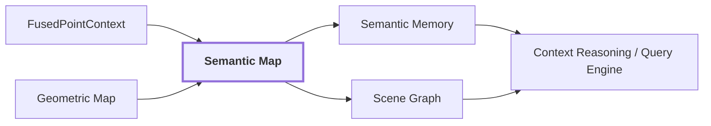

# 20. Semantic Map / Semantic Memory

## Onde estamos na pipeline



## Estado atual

`semantic-map`, `semantic-memory`, `scene-graph`, `context-reasoning` e `query-engine` são capacidades planejadas. Não existe ainda um schema público concreto que possa ser documentado como implementação atual.

Os diretórios vazios dessas capacidades foram removidos de `modules/`. Eles voltarão a existir quando houver contract, código, testes ou documentação concreta que justifique materializá-los.

## Objetivo

Transformar observações e fusões locais em conhecimento persistente do ambiente:

```text
observações 2D
 -> associações ponto/região
 -> fusão por geometria
 -> estado semântico persistente
 -> entidades / relações / memória
 -> consulta e raciocínio
```

O mapa contextual não deve ser apenas uma nuvem de pontos com uma string anexada.

```text
XYZ + "door"
```

é insuficiente para preservar por que o sistema acredita que aquele ponto pertence a uma porta.

## Exemplo conceitual do estado desejado

Este exemplo é deliberadamente conceitual porque o contract ainda não foi implementado.

```text
SemanticEntity: door-17
├── geometry_support
│   ├── point-101
│   ├── point-102
│   └── point-103
├── claims
│   ├── PRIMARY: door
│   └── ALTERNATIVE: wooden panel
├── observations
│   ├── frame-0042
│   ├── frame-0050
│   └── frame-0061
├── visual_evidence
│   ├── CLIP support
│   └── DINO references
├── multi_view_agreement: 0.82
├── spatial_support: 0.76
├── relations
│   └── adjacent_to -> wall-section-04
└── provenance
    ├── models
    ├── prompts
    ├── calibration
    └── source artifacts
```

A estrutura final pode ser diferente, mas precisa preservar esse tipo de rastreabilidade.

## Perguntas que o estado futuro precisa responder

```text
qual posição ocupa?
quais pontos geométricos a sustentam?
quais frames observaram a hipótese?
quais regiões 2D a originaram?
quais labels concorreram?
quais evidências contradisseram?
qual calibração foi usada?
qual representação visual/3D sustentou a decisão?
```

Essas perguntas são mais importantes que escolher antecipadamente um formato de banco ou uma classe específica.

## Relação com VLMaps e mapas de embeddings

Uma futura representação pode armazenar embeddings ligados à geometria, mas isso não obriga o sistema a reduzir todo o mapa a um único vetor por célula.

O pipeline atual já distingue:

```text
geometria persistente
DINO visual features
CLIP language-aligned evidence
Qwen semantic claims
multi-view fusion
```

O semantic map deverá decidir como persistir e indexar esses sinais sem apagar sua origem.

## Semantic Memory

`semantic-memory` deverá permitir recuperar conhecimento por semântica e espaço.

Exemplos de consulta futura:

```text
"onde existem sinais de dano estrutural?"
"quais portas foram observadas com baixa confiança?"
"mostre regiões próximas a blocked passage"
"já vimos algo visualmente semelhante a esta região antes?"
```

A última pergunta pode usar embeddings como índice de recuperação, mas similaridade visual não deve ser tratada automaticamente como identidade física.

## Scene Graph

`scene-graph` deverá promover relações persistentes entre entidades quando houver suporte suficiente.

É importante distinguir:

```text
relação observada em 2D
relação confirmada geometricamente em 3D
relação inferida por contexto
```

Exemplo:

```text
graffiti --ON--> wall

door --ADJACENT_TO--> corridor

rubble --BLOCKS--> passage
```

Cada relação deve manter proveniência e nível de suporte.

## Context Reasoning

A camada de raciocínio poderá combinar entidades, relações, memória e estado espacial para responder perguntas de nível mais alto.

Exemplo:

```text
"há uma rota navegável até a saída sem atravessar regiões bloqueadas?"
```

Isso depende de muito mais que uma label isolada: geometria, relações, navegabilidade, hazards e confiança precisam ser compostos.

## Reference run

A run `20260910T115810Z` termina, para fins de artifact visual canônico, em `VisualObservation`.

Diagnósticos 3D existem para associação e fusão, mas ainda não há uma entidade persistida de `semantic-map` que possa ser usada como exemplo real.

Quando esse artifact existir, esta página deve ser atualizada acompanhando uma entidade real do primeiro frame até o estado persistente.

## Critério para materializar o módulo

`semantic-map` deve voltar a existir fisicamente em `modules/semantic-map/` quando houver, no mínimo:

```text
contract público concreto
+
primeira implementação funcional
+
testes do contract
+
documentação local
```

Não apenas porque a capacidade aparece no diagrama arquitetural.

## Próxima leitura

- [Pipeline end-to-end](./README.md)
- [19. Semantic Fusion](./19-semantic-fusion.md)
- [Documentação dos módulos](../modules/README.md)